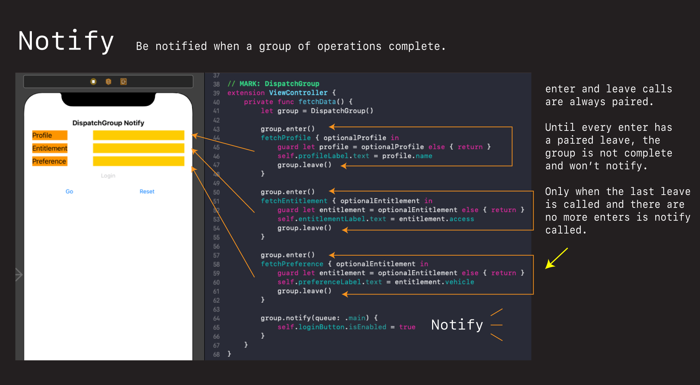
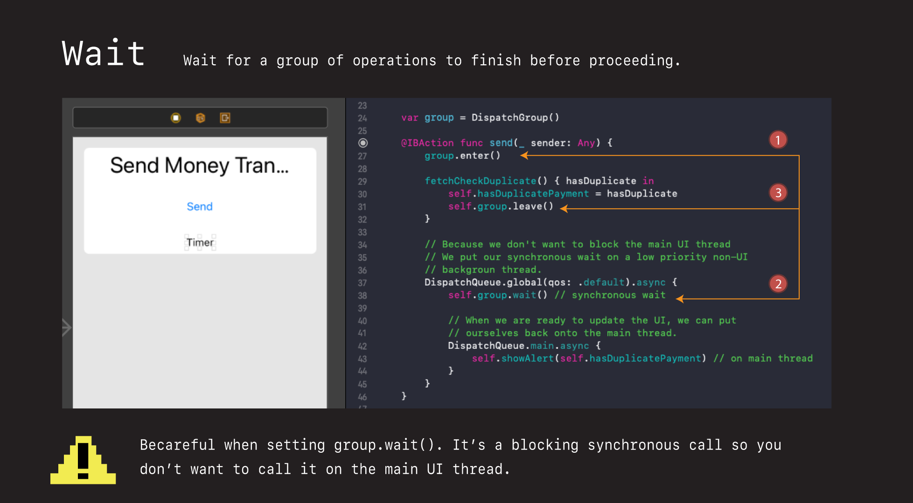

# DispatchGroup

Handy class for grouping related calls together and not proceeding until they complete.

Two typical use cases are:

- Notify - be notified when a group of operations complete
- Wait - wait for a group of operations to complete

## Notify



```swift
// MARK: DispatchGroup
extension ViewController {
    private func fetchData() {
        let group = DispatchGroup()
        
        group.enter()
        fetchProfile { optionalProfile in
            guard let profile = optionalProfile else { return }
            self.profileLabel.text = profile.name
            group.leave()
        }

        group.enter()
        fetchEntitlement { optionalEntitlement in
            guard let entitlement = optionalEntitlement else { return }
            self.entitlementLabel.text = entitlement.access
            group.leave()
        }

        group.enter()
        fetchPreference { optionalEntitlement in
            guard let entitlement = optionalEntitlement else { return }
            self.preferenceLabel.text = entitlement.vehicle
            group.leave()
        }

        group.notify(queue: .main) {
            self.loginButton.isEnabled = true
        }
    }
}
```

## Wait



Wait `wait` you create your group as normal, and then wait for some other action or event to happen. Useful if you want to ensure or check things before following through on some action.

Here for example we can check for duplicate depositions before completing our `send` operation. By using `wait`, we can wait for the duplication check to complete before continuing our processing.

### Watch your threads and queues

One thing to be wary of with `wait` is that it is a blocking synchronous call. Meaning if you call this on the main UI thread, your will freeze your app.

Which is why you always want to call `wait` non on the main UI thread, and then flip back to the main UI thread when you are ready to update the UI and do some processing.

```swift
@IBAction func send(_ sender: Any) {
    group.enter()
    
    fetchCheckDuplicate() { hasDuplicate in
        self.hasDuplicatePayment = hasDuplicate
        self.group.leave()
    }
    
    // Because we don't want to block the main UI thread
    // We put our synchronous wait on a low priority non-UI
    // backgroun thread.
    DispatchQueue.global(qos: .default).async {
        self.group.wait() // synchronous wait
        
        // When we are ready to update the UI, we can put
        // ourselves back onto the main thread.
        DispatchQueue.main.async {
            self.showAlert(self.hasDuplicatePayment) // on main thread
        }
    }
}
```

See directory for full examples.

### Links that help

- [Simple example](https://riptutorial.com/ios/example/28278/dispatch-group)
- [Simple stack overflow example](https://stackoverflow.com/questions/42484281/waiting-until-the-task-finishes)
- [Good video](https://www.youtube.com/watch?v=OanfpW0H_ok&ab_channel=maxcodes)
