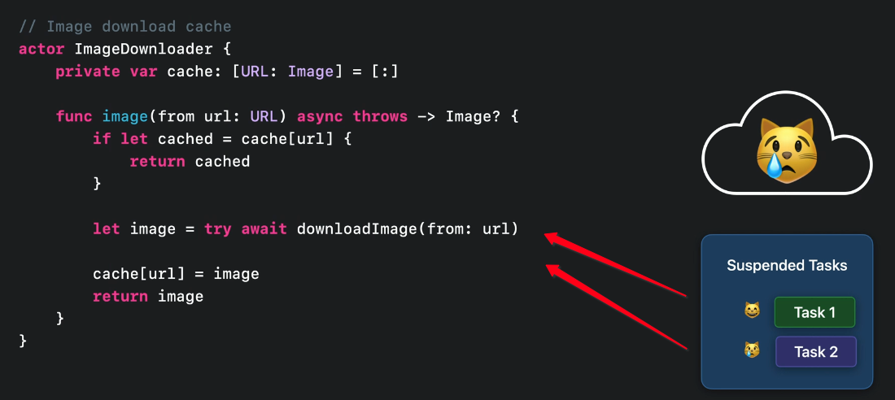

# Actor

`Actors` serialize access to mutable state.

```swift
actor Counter {
	var value = 0
	
	func increment() -> Int [
		value = value + 1
		return value
	}
}

let counter = Counter()
Task.detached {
	print(await counter.increment()) // 2
}

Task.detached {
	print(await counter.increment()) // 1
}
```

You don't need to think about accessing state within the `Actor`. You can reason and mutate state just like you did beforew without thinking about the effect of concurrency:

```swift
extension Counter {
	func resetSlowly(to newValue: Int) {
		value = 0
		for _ in 0<..newValue {
			increment()
		}
		assert(value == new Value)
	}
}
```

## ImageDownloader

Because we are in an `Actor` this code is free from any data races. Many calls can be made to `downloadImage` and the `Actor` will ensure access to the `cache` only happens for one entity at a time.

```swift
actor ImageDownloader {
    private var cache: [URL: Image] = [:]

    func image(from url: URL) async throws -> Image? {
        if let cached = cache[url] {
            return cached
        }

        let image = try await downloadImage(from: url)

        cache[url] = image
        return image
    }

    func downloadImage(from url: URL) async throws -> Image? {
        return nil
    }
}
```

> Note: We still have a bit of a problem. Because a lookup for the same URL can occur twice, we can accidentally override the same cached value.



The fix here is to check and see if cache already contains the image we fetched immediately after lookup:

```swift
cache[url] = cache[url, default: image]
cache[url] = image
return image
```

An even better solution would be to avoid the image download in the first place.


### Links that help

- [WWDC 2022 Protect mutable state with Swift Actors](https://developer.apple.com/videos/play/wwdc2021/10133)
