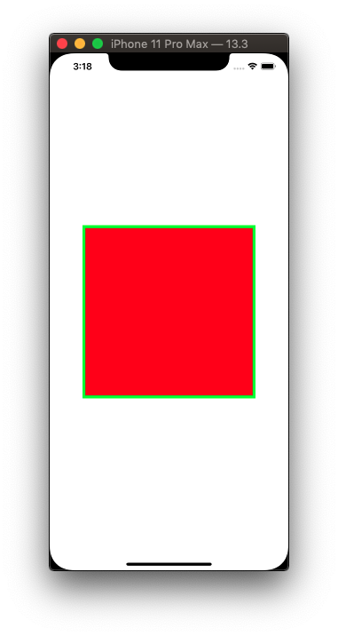

# Draw

There are many ways to draw in iOS. You've got _UIKit_, _CoreAnimation_, and _CoreGraphic_ librairies. When you see `drawRect` that usually means setting things up with frameworks and primitives using the _CoreGraphic_ library. 

_UIKit_ has bridges that will take your _CoreGraphics_ rectangles and turn them into `UIImages`. Once you have an image, you can convert it into a `UIImageView` and work with it in Auto Layout land.



```swift
import UIKit

class GraphView: UIView {
    
    let imageView = UIImageView()
    
    override init(frame: CGRect) {
        super.init(frame: .zero)
        backgroundColor = .systemYellow
        layout()
    }
    
    required init?(coder: NSCoder) {
        fatalError("init(coder:) has not been implemented")
    }

    func layout() {
        imageView.translatesAutoresizingMaskIntoConstraints = false
        
        drawRectangle()
        
        addSubview(imageView)
        
        NSLayoutConstraint.activate([
            imageView.centerXAnchor.constraint(equalTo: centerXAnchor),
            imageView.centerYAnchor.constraint(equalTo: centerYAnchor),
        ])
    }

    func drawRectangle() {
        // Gateway to CoreGraphics via UIKit
        let renderer = UIGraphicsImageRenderer(size: CGSize(width: 300, height: 300))
        
        let img = renderer.image { ctx in
            // Now we are in CG land
            let rectangle = CGRect(x: 0, y: 0, width: 300, height: 300)
            
            ctx.cgContext.setFillColor(UIColor.red.cgColor)
            ctx.cgContext.setStrokeColor(UIColor.green.cgColor)
            ctx.cgContext.setLineWidth(10)

            ctx.cgContext.addRect(rectangle)
            ctx.cgContext.drawPath(using: .fillStroke)
        }
    
        // tie to our imageView - now can do auto layout
        imageView.image = img
    }

    func drawCircle() {
        let renderer = UIGraphicsImageRenderer(size: CGSize(width: 50, height: 50))
        
        let img = renderer.image { ctx in
            ctx.cgContext.setFillColor(UIColor.red.cgColor)
            ctx.cgContext.setStrokeColor(UIColor.green.cgColor)
            ctx.cgContext.setLineWidth(10)

            let rectangle = CGRect(x: 0, y: 0, width: 50, height: 50)
            ctx.cgContext.addEllipse(in: rectangle)
            ctx.cgContext.drawPath(using: .fillStroke)
        }
    
        imageView.image = img
    }
}
```


### Links that help

- [Paul Hudson series](https://www.youtube.com/watch?v=vzXl0MhVXxY&feature=youtu.be)
