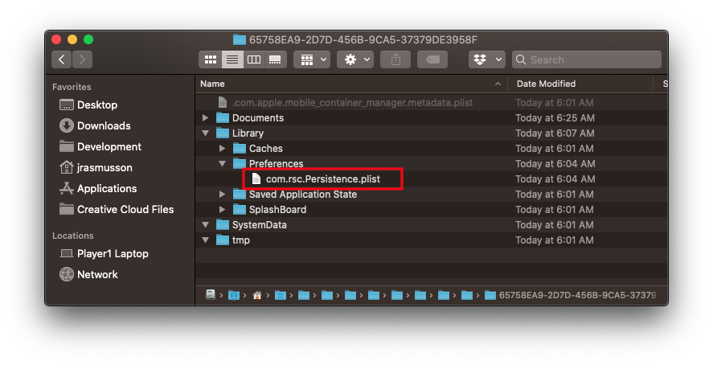

# NSUserDefaults

## A pattern

```swift
public class LocalState {
    
    private enum Keys: String {
        case hasSuccessfullyActivated
    }
    
    public static var hasSuccessfullyActivated: Bool {
        get {
            return UserDefaults.standard.bool(forKey: Keys.hasSuccessfullyActivated.rawValue)
        }
        set(newValue) {
            UserDefaults.standard.set(newValue, forKey: Keys.hasSuccessfullyActivated.rawValue)
            UserDefaults.standard.synchronize()
        }
    }
}
```

## What are they?

`NSUserDefaults` are temporary local storage you can use for storing data on the user's device.

```swift
UserDefaults.standard.bool(forKey: "OnboardingHasBeenViewed")
UserDefaults.standard.set(true, forKey: "OnboardingHasBeenViewed")
```

```swift
//
//  ViewController.swift
//  UserDefaults
//
//  Created by Jonathan Rasmusson Work Pro on 2018-08-10.
//  Copyright © 2018 Rasmusson Software Consulting. All rights reserved.
//

import UIKit

class ViewController: UIViewController {

    var array: [String]?
    let defaults = UserDefaults.standard
    
    override func viewDidLoad() {
        super.viewDidLoad()

        // How to safely unwrap Optional Array
        if let items = defaults.array(forKey: "Array") as? [String] {
            array = items
        }
        
        defaults.set(0.24, forKey: "Volmume")
        defaults.set(true, forKey: "MusicOn")
        defaults.set("Flynn", forKey: "PlayerName")
        defaults.set(Date(), forKey: "AppLastOpenedByUser")
        defaults.set(array, forKey: "Array")
        let myArray = [1, 2, 3]
        defaults.set(myArray, forKey: "MyArray")
        let dictionary = ["name" : "Flynn"]
        defaults.set(dictionary, forKey: "Dictionary")
        
        let volume = defaults.float(forKey: "Volume")
        let musicOn = defaults.bool(forKey: "MusicOn")
        let player = defaults.string(forKey: "PlayerName")
        let lastOpened = defaults.object(forKey: "AppListOpenedByUser")
        let myOtherArray = defaults.array(forKey: "MyArray")
        let myOtherDictionary = defaults.dictionary(forKey: "Dictionary")
        
        // NSUserDefauls are stored in plist files that you can see here
        // .../Library/Preferences/com.rsc.app.plist

        print(NSSearchPathForDirectoriesInDomains(.documentDirectory, .userDomainMask, true).last! as String)
    }

}
```




### Links that help
* [Apple Docs](https://developer.apple.com/documentation/foundation/nsuserdefaults)
