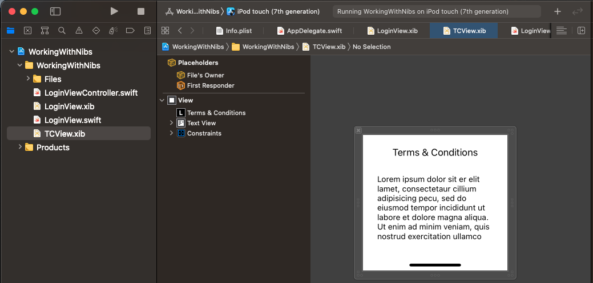
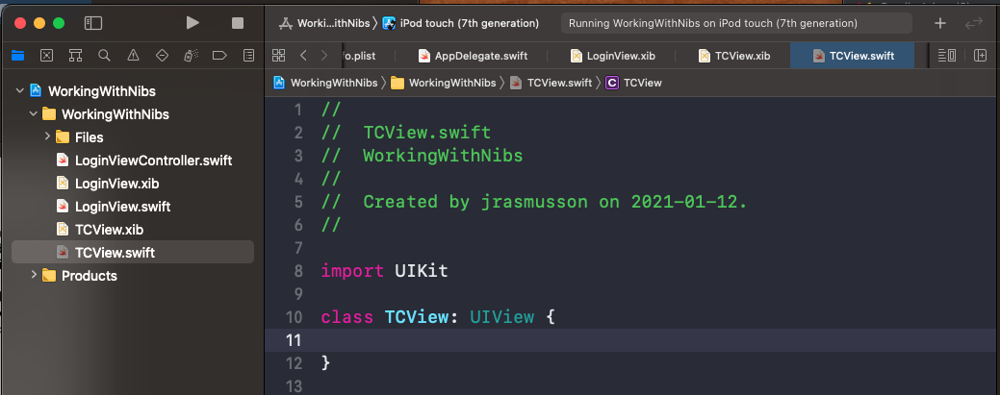
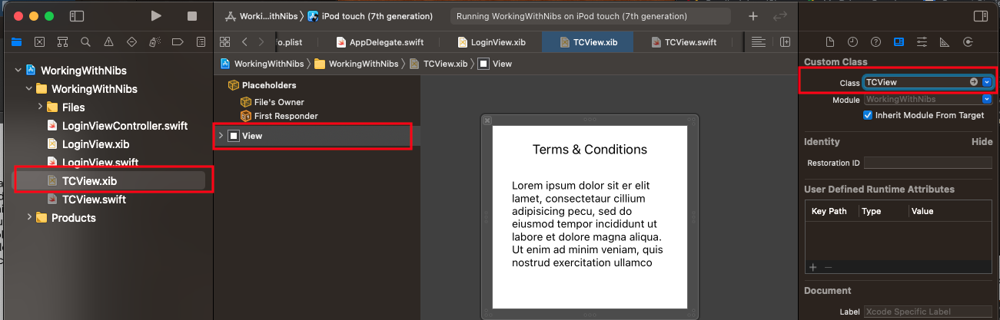
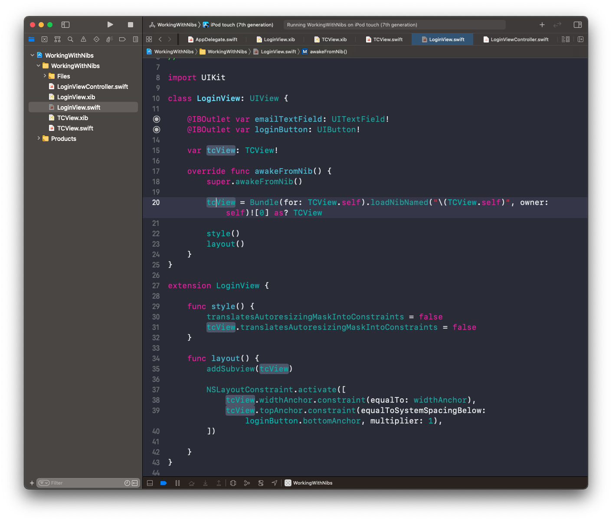
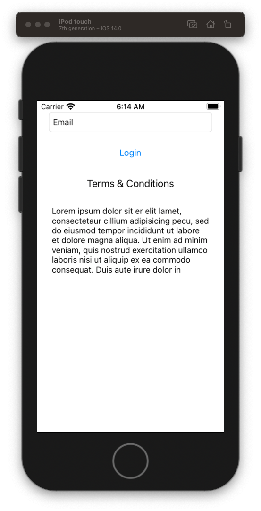
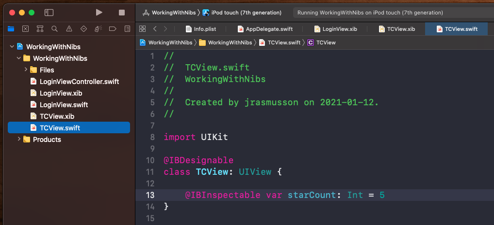
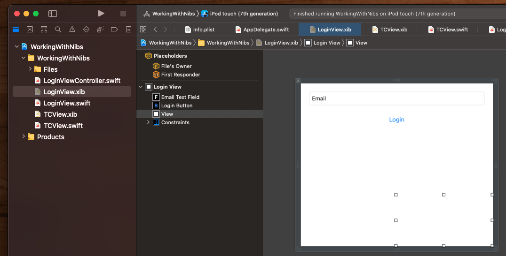
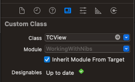
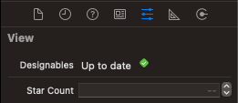

# Working with Nibs

## Loading Nib into View Controller

Simplest thing you can do is create a nib and then associated it with a View Controller.

- Create the nib (same name as view controller).
- Set it's File's Owner to the `ViewController`.
- Point the File's Owner `view` to the nib view

## Loading a Nib into a Nib

Two ways you can go about this:

1. Load the nib manually.
2. Make it `IBDesignable`.

## Nib loading manually

When you want to compose nibs into other nibs, you need to load them manually.

Create a new nib.

Create it's associated view (with the same name).

Associated the view with the nib.

Reference the nib from the parent nib view loading it via the `Bundle` and layout out with Auto Layout.

## How to make a nib IBDesignable

To make a control `@IBDesignable` you need to add a plain view first, then associated it with the nib you want to display (marked up as @IBDesignable).

### Make `IBDesignable` & `IBInspectable`

Make nib you want to display `@IBDesignable` and `IBInspectable`

Drag out a new view into the nib.

Associated the new view with the designable class. Xcode will update.

And you will now see attribute in inspector pane.

## Apple Documentation notes

Xibs

- designed for working with Views
- is an object graph 
- containing views and relationships

File's Owner

- this is a placeholder that you set when you load your nib
- it is the controller for the nib and it receives all the events
- typically you use outlets in the File's Owner to reference objects in the nib

References

- outlets to top level objects can be strong
- while outlets to subviews weak

Each View Controllers Manages its Own Nib File

- UIViewController support the automatically loading of their own associated nib file

Loading Nib Files Programmatically

- NSBundle supports loading of nib files
- loadNibNamed:owner:options: instance method

> Important: You are responsible for releasing the top-level objects of any nib files you load when you are finished with those objects. Failure to do so is a cause of memory leaks in many applications. After releasing the top-level objects, it is a good idea to clear any outlets pointing to objects in the nib file by setting them to nil. You should clear outlets associated with all of the nib file’s objects, not just the top-level objects.

### Links that help
* [Apple Docs Nib Files](https://developer.apple.com/library/archive/documentation/Cocoa/Conceptual/LoadingResources/CocoaNibs/CocoaNibs.html)
