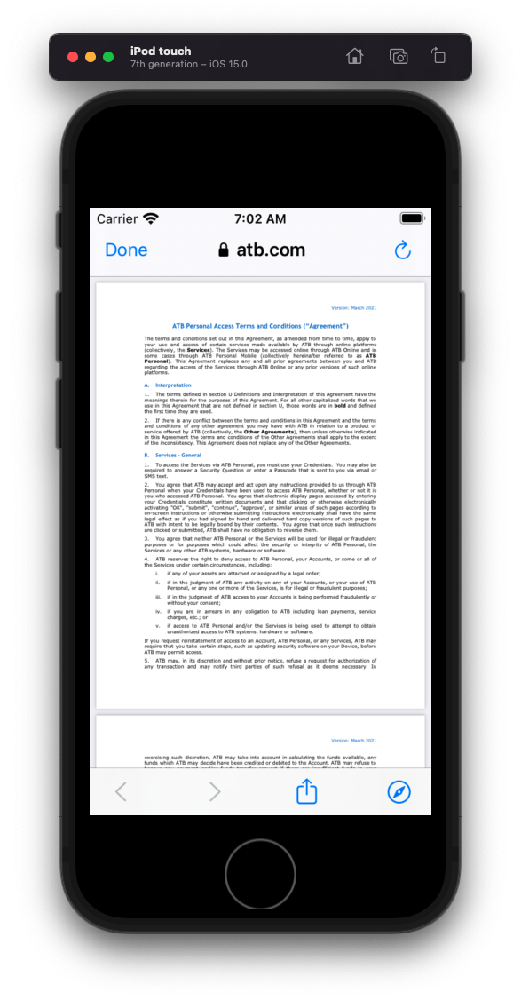
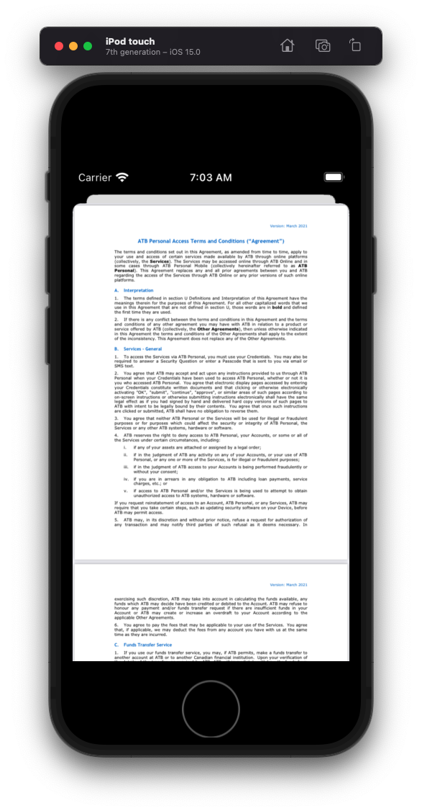

# PDFs

## SFSafari

Here you get many options for sharing etc from the browser.



**ViewController**

```swift
import UIKit
import SafariServices

class ViewController: UIViewController {
    let stackView = UIStackView()
    let safariButton = UIButton(type: .system)
    let pdfButton = UIButton(type: .system)

    override func viewDidLoad() {
        super.viewDidLoad()
        style()
        layout()
    }
}

extension ViewController {
    func style() {
        stackView.translatesAutoresizingMaskIntoConstraints = false
        stackView.axis = .vertical
        stackView.spacing = 20

        safariButton.translatesAutoresizingMaskIntoConstraints = false
        safariButton.translatesAutoresizingMaskIntoConstraints = false
        safariButton.configuration = .filled()
        safariButton.setTitle("Safari", for: [])
        safariButton.addTarget(self, action: #selector(safariTapped), for: .primaryActionTriggered)

        pdfButton.translatesAutoresizingMaskIntoConstraints = false
        pdfButton.translatesAutoresizingMaskIntoConstraints = false
        pdfButton.configuration = .filled()
        pdfButton.setTitle("PDFKit", for: [])
        pdfButton.addTarget(self, action: #selector(pdfTapped), for: .primaryActionTriggered)

    }

    func layout() {
        stackView.addArrangedSubview(safariButton)
        stackView.addArrangedSubview(pdfButton)

        view.addSubview(stackView)

        NSLayoutConstraint.activate([
            stackView.centerXAnchor.constraint(equalTo: view.centerXAnchor),
            stackView.centerYAnchor.constraint(equalTo: view.centerYAnchor)
        ])
    }
}

// MARK: Acctions
extension ViewController {
    @objc func safariTapped(sender: UIButton) {
        let safariVC = SFSafariViewController(url: URL(string: TermsConditions.termsURL)! as URL)
        self.present(safariVC, animated: true, completion: nil)
        safariVC.delegate = self
    }

    @objc func pdfTapped(sender: UIButton) {
        present(PDFViewController(), animated: true, completion: nil)
    }
}

// MARK: SFSafariViewControllerDelegate
extension ViewController: SFSafariViewControllerDelegate {

}

struct TermsConditions {
    static let termsURL = "https://www.atb.com/siteassets/pdf/personal/atb-online-access-terms-and-conditions/personal-online-terms-and-conditions.pdf"
}
```

## PDFKit

Here you just get a raw view of the pdf.



**PDFViewController**

```swift
import UIKit
import PDFKit

class PDFViewController: UIViewController {

    override func viewDidLoad() {
        super.viewDidLoad()

        // Add PDFView to view controller.
        let pdfView = PDFView(frame: self.view.bounds)
        self.view.addSubview(pdfView)

        // Fit content in PDFView.
        pdfView.autoScales = true

        // Load Sample.pdf file.
        let termsURLString = "https://www.atb.com/siteassets/pdf/personal/atb-online-access-terms-and-conditions/personal-online-terms-and-conditions.pdf"
        let termsURL = URL(string: termsURLString)!
        pdfView.document = PDFDocument(url: termsURL)
    }
}
```

### Links that help
* [Open PDF using Swift](https://stackoverflow.com/questions/26883816/open-pdf-file-using-swift)
