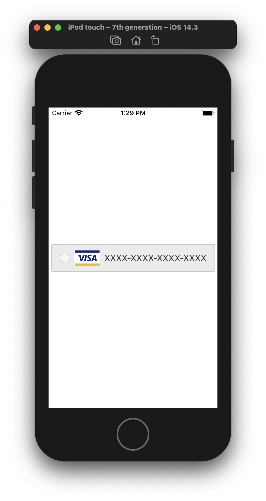
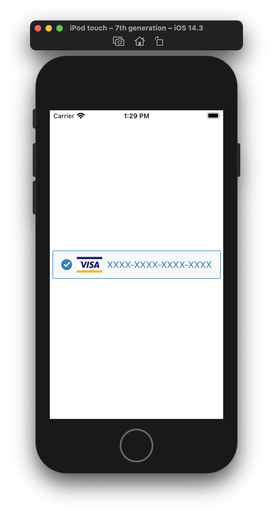

# Custom Radio Button Control

Note: You typically don't want to do this. What you want instead is a `UISwitch` which is basically a radio button.

But if for 'reasons' you need to create one, here is how you can do it.





**ViewController.swift**

```swift
import UIKit

class ViewController: UIViewController {

    let radioButton = CreditCardControl()
    
    override func viewDidLoad() {
        super.viewDidLoad()
    
        radioButton.translatesAutoresizingMaskIntoConstraints = false
        radioButton.addTarget(self, action: #selector(buttonTapped(_:)), for: .touchUpInside)
        
        view.addSubview(radioButton)
        
        NSLayoutConstraint.activate([
            radioButton.centerXAnchor.constraint(equalTo: view.centerXAnchor),
            radioButton.centerYAnchor.constraint(equalTo: view.centerYAnchor),
        ])
    }
    
    @objc func buttonTapped(_ sender: UIButton) {
        radioButton.isOn = !radioButton.isOn
        radioButton.title.text = "XXXX-XXXX-XXXX-XXXX"
    }
}
```

**CreditCardControl.swift**

```swift
import UIKit

public class CreditCardControl: UIControl {
    
    let stackView = UIStackView()
    
    let title = UILabel()
    let onOff = UIImageView()
    let ccIcon = UIImageView()
    
    var offBGColor = UIColor.radioButtonOff
    var onBGColor = UIColor.radioButtonOn
    
    var onBorderColor = UIColor.radioButtonBorderOn.cgColor
    var offBorderColor = UIColor.radioButtonBorderOff.cgColor
    
    let onImage = UIImage(named: "on")
    let offImage = UIImage(named: "off")
        
    @objc public var isOn = false {
        didSet {
            layer.borderColor = isOn ? onBorderColor : offBorderColor
            backgroundColor = isOn ? onBGColor : offBGColor
            title.textColor = isOn ? .primaryBlue : .almostBlack
            onOff.image = isOn ? onImage : offImage
        }
    }

     init() {
        super.init(frame: .zero)
        style()
        layout()
    }
    
    required public init?(coder aDecoder: NSCoder) {
        fatalError("init(coder:) has not been implemented")
    }
    
    private func style() {
        layer.borderWidth = 1
        layer.cornerRadius = 2

        title.textAlignment = .left
        contentHorizontalAlignment = .left
        
        isOn = false
        title.text = "YYYY-YYYY-YYYY-YYYY"
        ccIcon.image = UIImage(named: "visa")

        
        stackView.translatesAutoresizingMaskIntoConstraints = false
        stackView.alignment = .center
        stackView.spacing = 8
        stackView.isUserInteractionEnabled = false
        stackView.layoutMargins.left = 16
        stackView.layoutMargins.right = 16
        stackView.isLayoutMarginsRelativeArrangement = true
    }
    
    private func layout() {
        stackView.addArrangedSubview(onOff)
        stackView.addArrangedSubview(ccIcon)
        stackView.addArrangedSubview(title)
        
        addSubview(stackView)

        onOff.setContentHuggingPriority(UILayoutPriority.defaultHigh, for: .horizontal)
        ccIcon.setContentHuggingPriority(UILayoutPriority.defaultHigh, for: .horizontal)

        NSLayoutConstraint.activate([
            stackView.topAnchor.constraint(equalTo: topAnchor),
            stackView.leadingAnchor.constraint(equalTo: leadingAnchor),
            stackView.trailingAnchor.constraint(equalTo: trailingAnchor),
            stackView.bottomAnchor.constraint(equalTo: bottomAnchor),
            heightAnchor.constraint(equalToConstant: 52),
        ])

    }
}

public extension NSLayoutConstraint {
    @objc func setActiveBreakable(priority: UILayoutPriority = UILayoutPriority(900)) {
        self.priority = priority
        isActive = true
    }

    @objc func activeBreakable(priority: UILayoutPriority = UILayoutPriority(900)) -> NSLayoutConstraint {
        self.priority = priority
        isActive = true
        return self
    }
}

public extension UIColor {

    @objc class var almostBlack: UIColor {
        return UIColor(white: 51.0 / 255.0, alpha: 1.0)
    }

    @objc class var primaryBlue: UIColor {
        return UIColor(red: 0.0, green: 130.0 / 255.0, blue: 187.0 / 255.0, alpha: 1.0)
    }

    @objc class var radioButtonOn: UIColor {
        return UIColor(red: 245.0 / 255.0, green: 248.0 / 255.0, blue: 250.0 / 255.0, alpha: 1.0)
    }

    @objc class var radioButtonOff: UIColor {
        return UIColor(red: 235.0 / 255.0, green: 235.0 / 255.0, blue: 235.0 / 255.0, alpha: 1.0)
    }

    @objc class var radioButtonBorderOn: UIColor {
        return UIColor(red: 0.0, green: 130.0 / 255.0, blue: 187.0 / 255.0, alpha: 1.0)
    }

    @objc class var radioButtonBorderOff: UIColor {
        return UIColor(red: 200.0 / 255.0, green: 200.0 / 255.0, blue: 206.0 / 255.0, alpha: 1.0)
    }
}
```

