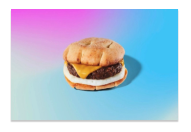
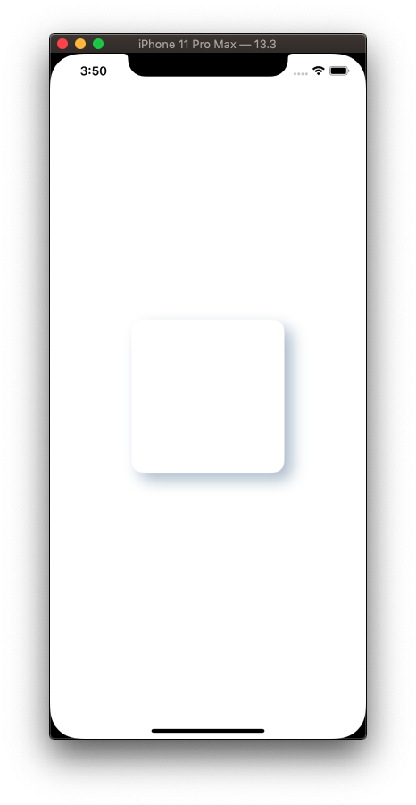
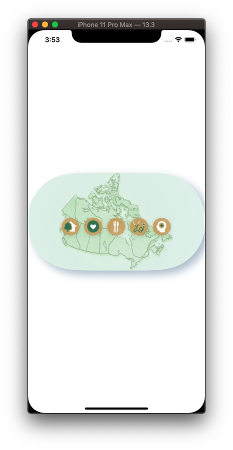

# Shadows

## Simple drop shadow



```swift
import UIKit

class ViewController: UIViewController {

    override func viewDidLoad() {
        super.viewDidLoad()
        setup()
    }

    func setup() {
        let width: CGFloat = 300
        let height: CGFloat = 200

        let vw = UIImageView(frame: CGRect(x: 0, y: 0, width: width, height: height))
        vw.image = UIImage(named: "meatless")
        vw.center = view.center
        view.addSubview(vw)
        
        vw.layer.shadowPath = UIBezierPath(rect: vw.bounds).cgPath
        vw.layer.shadowRadius = 1
        vw.layer.shadowOffset = CGSize(width: 0, height: 3)
        vw.layer.shadowOpacity = 0.2
    }
}
```

## Advanced drop shadow




**BaseView.swift**

```swift
import UIKit

class BaseView: UIView{
    var roundedShape = CAShapeLayer()
    var curvedPath: UIBezierPath!
    var shapeColor: UIColor!
    var circular: Bool!
    var shadow: Bool!
    var shadowLayer = CAShapeLayer()
    var borderColor: CGColor?
    var borderThickness: CGFloat?
    
    convenience init(with backgroundTheme: UIColor, circular: Bool, shadow: Bool,borderColor: UIColor?,borderThickness: Int?){
        self.init()
        shapeColor = backgroundTheme
        self.circular = circular
        self.shadow = shadow
        self.borderThickness = CGFloat(borderThickness ?? 0)
        self.borderColor = borderColor?.cgColor
    }
    
    override func didMoveToSuperview() {
        super.didMoveToSuperview()
    }
    
    func setColorToBaseView(color: UIColor){
        shapeColor = color
        layoutSubviews()
    }
    
    func setColors(color: UIColor,borderColor: UIColor){
        shapeColor = color
        self.borderColor = borderColor.cgColor
        layoutSubviews()
    }
    
    override func layoutSubviews() {
        super.layoutSubviews()
        if layer.sublayers?.contains(roundedShape) ?? false{
            roundedShape.removeFromSuperlayer()
        }
        if layer.sublayers?.contains(shadowLayer) ?? false{
            shadowLayer.removeFromSuperlayer()
        }
        
        curvedPath = UIBezierPath.init(roundedRect: self.bounds, cornerRadius: self.circular ? self.bounds.height / 2 : 15)
        roundedShape = CAShapeLayer()
        roundedShape.path = curvedPath.cgPath
        roundedShape.fillColor = shapeColor.cgColor
        self.layer.insertSublayer(roundedShape, at: 0)
        
        if let _ = self.borderColor, let _ = self.borderThickness{
            roundedShape.strokeColor = borderColor
            roundedShape.borderWidth = self.borderThickness!
        }
        
        if shadow{
            shadowLayer = CAShapeLayer()
            shadowLayer.shadowColor = UIColor.gray.cgColor
            shadowLayer.shadowRadius = 4
            shadowLayer.shadowOpacity = 0.6
            shadowLayer.shadowOffset = CGSize(width: 0, height: 6)
            shadowLayer.path = curvedPath.cgPath
            shadowLayer.fillColor = shapeColor.cgColor
            layer.insertSublayer(shadowLayer, below: roundedShape)
        }
    }
}
```

**BaseImageView**

```swift
import UIKit

class BaseImageView: UIView{
    
    var roundedShape = CAShapeLayer()
    var curvedPath: UIBezierPath!
    var shapeColor: UIColor!
    var circular: Bool!
    var shadow: Bool!
    var shadowLayer = CAShapeLayer()
    var borderColor: CGColor?
    var borderThickness: CGFloat?
    var image: UIImage?{
        didSet{
            imageView.image = image
        }
    }
    
    var imageView = UIImageView()
    
    convenience init(with backgroundTheme: UIColor, circular: Bool, shadow: Bool){
        self.init()
        shapeColor = backgroundTheme
        self.circular = circular
        self.shadow = shadow
    }

    convenience init(with backgroundTheme: UIColor, circular: Bool, shadow: Bool,borderColor: UIColor?,borderThickness: Int?){
        self.init()
        shapeColor = backgroundTheme
        self.circular = circular
        self.shadow = shadow
        self.borderThickness = CGFloat(borderThickness ?? 0)
        self.borderColor = borderColor?.cgColor
    }
    
    override init(frame: CGRect) {
        super.init(frame: frame)
        self.addSubview(imageView)
        imageView.layer.zPosition = .greatestFiniteMagnitude
    }
    
    required init?(coder: NSCoder) {
        super.init(coder: coder)
    }
    
    
    override func didMoveToSuperview() {
        super.didMoveToSuperview()
        
    }
    
    func setColorToBaseView(color: UIColor){
        shapeColor = color
        layoutSubviews()
    }
    
    override func layoutSubviews() {
        super.layoutSubviews()
        imageView.translatesAutoresizingMaskIntoConstraints = false
        [imageView.leftAnchor.constraint(equalTo: self.leftAnchor, constant: 0),
         imageView.rightAnchor.constraint(equalTo: self.rightAnchor, constant: 0),
         imageView.topAnchor.constraint(equalTo: self.topAnchor, constant: 0),
         imageView.bottomAnchor.constraint(equalTo: self.bottomAnchor, constant: 0)].forEach({$0.isActive = true})
        imageView.clipsToBounds = true
        imageView.contentMode = .scaleAspectFill
        
        if layer.sublayers?.contains(roundedShape) ?? false{
            roundedShape.removeFromSuperlayer()
        }
        if layer.sublayers?.contains(shadowLayer) ?? false{
            shadowLayer.removeFromSuperlayer()
        }

        curvedPath = UIBezierPath.init(roundedRect: self.bounds, cornerRadius: self.circular ? self.bounds.height / 2 : 15)
        roundedShape = CAShapeLayer()
        roundedShape.path = curvedPath.cgPath
        roundedShape.fillColor = shapeColor.cgColor
        self.layer.insertSublayer(roundedShape, at: 0)

        if let _ = self.borderColor, let _ = self.borderThickness{
            roundedShape.strokeColor = borderColor
            roundedShape.borderWidth = self.borderThickness!
        }

        if shadow{
            shadowLayer = CAShapeLayer()
            shadowLayer.fillColor = shapeColor.cgColor
            shadowLayer.shadowColor = UIColor(red: 0.64, green: 0.71, blue: 0.78, alpha: 1.00).cgColor
            shadowLayer.shadowRadius = 10
            shadowLayer.shadowOpacity = 0.8
            shadowLayer.shadowOffset = CGSize(width: 10, height: 10)
            shadowLayer.path = curvedPath.cgPath
            shadowLayer.fillColor = (backgroundColor ?? UIColor.white).cgColor
            layer.insertSublayer(shadowLayer, below: roundedShape)
        }
        
        imageView.layer.mask = roundedShape
    }
}
```

**ViewController.swift**

``swift
import UIKit

class ViewController: UIViewController {

    let imageView = UIImageView(image: UIImage(named: "communities"))
    
    override func viewDidLoad() {
        super.viewDidLoad()
        layout()
    }

    func layout() {
        let baseImageView = BaseImageView(with: .systemRed, circular: true, shadow: true)
        baseImageView.translatesAutoresizingMaskIntoConstraints = false
        baseImageView.image = UIImage(named: "communities")

        view.addSubview(baseImageView)

        NSLayoutConstraint.activate([
            baseImageView.centerXAnchor.constraint(equalTo: view.centerXAnchor),
            baseImageView.centerYAnchor.constraint(equalTo: view.centerYAnchor),
        ])
        
//        let baseView = BaseImageView(with: .systemRed, circular: false, shadow: true)
//        baseView.translatesAutoresizingMaskIntoConstraints = false
//
//        view.addSubview(baseView)
//
//        NSLayoutConstraint.activate([
//            baseView.centerXAnchor.constraint(equalTo: view.centerXAnchor),
//            baseView.centerYAnchor.constraint(equalTo: view.centerYAnchor),
//            baseView.heightAnchor.constraint(equalToConstant: 200),
//            baseView.widthAnchor.constraint(equalToConstant: 200),
//        ])
    }
}
```

- [Reddit](https://www.reddit.com/r/swift/comments/hukfwn/uiview_with_shadow_curved_corner_and_stroke/)

### Links that help

- [Advanced UIView shadow effects using shadowPath](https://www.hackingwithswift.com/articles/155/advanced-uiview-shadow-effects-using-shadowpath)
- [Swift Tip: Adding Rounded Corners and Shadows to a UIView](https://medium.com/bytes-of-bits/swift-tips-adding-rounded-corners-and-shadows-to-a-uiview-691f67b83e4a)
