# UIButton

## New UIButton

```swift
let button = UIButton(type: .system)
button.translatesAutoresizingMaskIntoConstraints = false
button.configuration = .filled()
button.setTitle("Sign In", for: [])
button.addTarget(self, action: #selector(signInTapped), for: .primaryActionTriggered)

@objc func signInTapped(sender: UIButton) {
}
```

## Symbol Button

```swift
func makeSymbolButton(systemName: String, target: Any, selector: Selector) -> UIButton {
    let configuration = UIImage.SymbolConfiguration(scale: .large)
    let image = UIImage(systemName: systemName, withConfiguration: configuration)

    let button = UIButton()
    button.translatesAutoresizingMaskIntoConstraints = false
    button.addTarget(target, action: selector, for: .primaryActionTriggered)
    button.setImage(image, for: .normal)
    button.imageView?.contentMode = .scaleAspectFit

    return button
}
```

## Symbol Button Large

```swift
playPauseButton.translatesAutoresizingMaskIntoConstraints = false
let configuration = UIImage.SymbolConfiguration(pointSize: 100, weight: .bold, scale: .large)
let image = UIImage(systemName: "play.circle.fill", withConfiguration: configuration)
playPauseButton.setImage(image, for: .normal)
playPauseButton.backgroundColor = .systemOrange
playPauseButton.addTarget(self, action: #selector(didTapPauseOrPlay), for: .primaryActionTriggered)
```

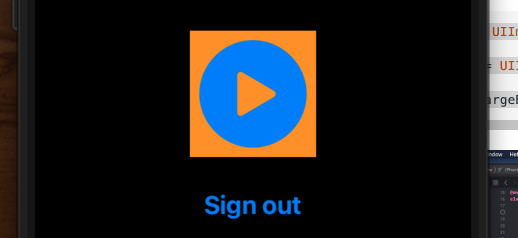

# Button types

```swift
let custom = UIButton(type: .custom)
let system = UIButton(type: .system)
let detailDisclosure = UIButton(type: .detailDisclosure)
let infoLight = UIButton(type: .infoLight)
let infoDark = UIButton(type: .infoDark)
let contactAdd = UIButton(type: .contactAdd)
let close = UIButton(type: .close)

custom.setTitle("Custom", for: .normal)
system.setTitle("System", for: .normal)
detailDisclosure.setTitle("Detail Disclosure", for: .normal)
infoLight.setTitle("Info Light", for: .normal)
infoDark.setTitle("Info Dark", for: .normal)
contactAdd.setTitle("Contact Add", for: .normal)
close.setTitle("Close", for: .normal)
```

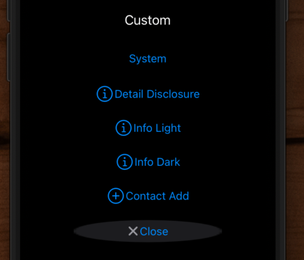

> Note: Custom doesn't handle dark mode

## Styles

```swift
let plain = UIButton(type: .system)
let gray = UIButton(type: .system)
let tinted = UIButton(type: .system)
let filled = UIButton(type: .system)

plain.configuration = .plain()
gray.configuration = .gray()
tinted.configuration = .tinted()
filled.configuration = .filled()

```

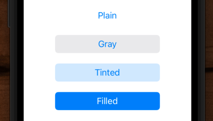

## Customizing

### Titles and subtitles

```swift
var config = UIButton.Configuration.filled()
config.title = "Start"
config.subtitle = "Both Engines"
```

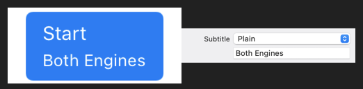

### Title alignment and padding

```swift
config.titleAlignment = .center
config.titlePadding = 4.0
```

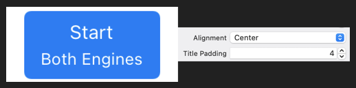

### Base foreground and background

The button may change these base colors when in different states (for example when highlighted).

```swift
config.baseBackgroundColor = .green
config.baseForegroundColor = .black
```

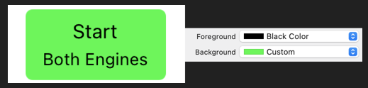

### Background configuration

For greater control of the background, `UIButton` supports the `UIBackgroundConfiguration` introduced in iOS 14 for table and collection view cells.

```swift
config.background.backgroundColor = .systemYellow
config.background.strokeColor = .systemRed
config.background.strokeWidth = 4.0
```

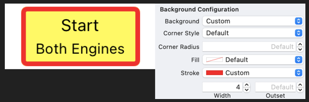

> Remember: This isn't the cell. These are buttons appearing in cells.

### Corner style

The default corner style is `dynamic` which adjust the corner radius for the dynamic type size. You can also choose `fixed`, `small`, `medium`, `large` and `capsule`.

`config.cornerStyle = .capsule`

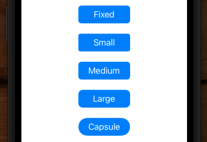

### Image placement

When you add a foreground image to the button you can control the padding to the title, the placement (top, trailing, bottom, leading) and the symbol configuration.

```swift
config.image = UIImage(systemName: "car",
  withConfiguration: UIImage.SymbolConfiguration(scale: .large))
config.imagePlacement = .trailing
config.imagePadding = 8.0
```

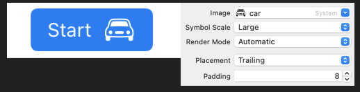

### Activity indicator

```swift
config.showsActivityIndicator = true
```

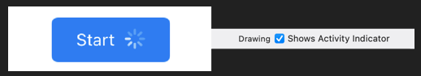

### Button size

You can request a preferred size for the button. Interface Builder hides this in the size inspector.

```swift
config.buttonSize = .large
```

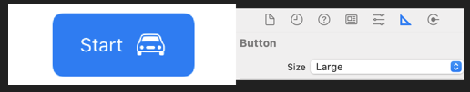

### Content inserts

The content insets give you padding between the bounds of the button and the content (title and image).

```swift
config.contentInsets = NSDirectionalEdgeInsets(top: 10,
  leading: 20, bottom: 10, trailing: 20)
```

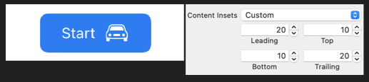


### Attributed strings

```swift
func makeSpotifyButton(withText title: String) -> UIButton {
    let button = UIButton(type: .system)
    button.translatesAutoresizingMaskIntoConstraints = false
    
    var config = UIButton.Configuration.filled()
    config.baseBackgroundColor = .spotifyGreen
    config.cornerStyle = .capsule
    config.contentInsets = NSDirectionalEdgeInsets(top: 10, leading: buttonHeight, bottom: 10, trailing: buttonHeight)
    button.configuration = config
    
    let attributedText = NSMutableAttributedString(string: title, attributes: [
        NSAttributedString.Key.font: UIFont.boldSystemFont(ofSize: 16),
        NSAttributedString.Key.foregroundColor: UIColor.white,
        NSAttributedString.Key.kern: 1
        ])

    button.setAttributedTitle(attributedText, for: .normal) // Note how not button.setTitle()
    
    return button
}
```

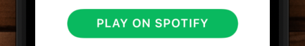

### Configuration update handler

To change the appearance of the button in response to a change in state register a configuration update handler. For example, to switch between a filled and outline image when the button is in a highlighted state.

```swift
button.configurationUpdateHandler = { button in
  var config = button.configuration
  config?.image = button.isHighlighted ?
    UIImage(systemName: "car.fill") :
    UIImage(systemName: "car")
  button.configuration = config
}
```

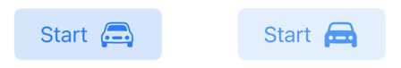

To extend the example, suppose I have a property on my button holding the range of my car that I want to show in the button subtitle

```swift
class RangeButton: UIButton {
   var range = Measurement(value: 100,
                                 unit: UnitLength.miles)
   lazy var formatter = MeasurementFormatter()
}
```

Adding the subtitle to my configuration update handler.

```swift
button.configurationUpdateHandler = { [unowned self] button in
  var config = button.configuration
  ...            
  config?.subtitle = self.formatter.string(from: self.range) // here
  button.configuration = config
}
```

Then we call `setNeedsUpdateConfiguration` on the button in the `didSet` property observer to update the subtitle whenever the range changes:

```swift
var range = Measurement(value: 100,
  unit: UnitLength.miles) {
  didSet {
    button.setNeedsUpdateConfiguration()
  }
}
```

[Use your loaf](https://useyourloaf.com/blog/button-configuration-in-ios-15/)

# Old

## How to make a button with rounded corners


```swift
    var label: UILabel = {
        let label = UILabel()
        label.translatesAutoresizingMaskIntoConstraints = false
        label.backgroundColor = .systemGray
        label.text = "?"
        label.font = UIFont.preferredFont(forTextStyle: .title1)
        label.textAlignment = .center
        return label
    }()
    
    var button: UIButton = {
        let button = UIButton()
        button.translatesAutoresizingMaskIntoConstraints = false
        button.setTitle("Get weather", for: .normal)
        button.setTitleColor(.white, for: .normal)
        button.titleLabel?.font = UIFont.preferredFont(forTextStyle: .title1)
        button.backgroundColor = .systemBlue
        button.contentEdgeInsets = UIEdgeInsets(top: 8, left: 16, bottom: 8, right: 16)
        
        return button
    }()

    func setupViews() {
        view.addSubview(label)
        view.addSubview(button)
        
        label.centerXAnchor.constraint(equalTo: view.centerXAnchor).isActive = true
        label.centerYAnchor.constraint(equalTo: view.centerYAnchor).isActive = true
        button.topAnchor.constraint(equalTo: label.bottomAnchor, constant: 8).isActive = true
        button.centerXAnchor.constraint(equalTo: view.centerXAnchor).isActive = true
        button.widthAnchor.constraint(equalTo: label.widthAnchor).isActive = true
        button.heightAnchor.constraint(equalTo: label.heightAnchor).isActive = true
    }
```


```swift
func makeRoundCornerButton(title: String) -> UIButton {
    let button = UIButton()
    button.translatesAutoresizingMaskIntoConstraints = false
    button.setTitle(title, for: .normal)
    button.titleLabel?.minimumScaleFactor = 0.5
    button.titleLabel?.font = UIFont.systemFont(ofSize: 16)
    button.titleLabel?.adjustsFontSizeToFitWidth = true
    button.backgroundColor = .blue
    button.setTitleColor(.white, for: .normal)
    button.layer.cornerRadius = 40 / 2
    
    return button
}
```

## How to make a text only button


```swift
func makeButton(title: String) -> UIButton {
    let button = UIButton()
    button.translatesAutoresizingMaskIntoConstraints = false
    button.setTitle(title, for: .normal)
    button.titleLabel?.font = UIFont.systemFont(ofSize: 16)
    button.backgroundColor = .white
    button.setTitleColor(.blue, for: .normal)
    button.titleLabel?.numberOfLines = 0
    button.titleLabel?.lineBreakMode = .byWordWrapping
    button.contentHorizontalAlignment = .left

    return button
}
```
## How to set image on button

```swift
    let progressButton: UIButton = {
        let button = makeButton(title: "")

        let imageView = UIImageView()
        let image = UIImage(named: "loading_dots_large_white1")
        button.setImage(image, for: .normal)

        return button
    }()
```


```swift
import UIKit

class ViewController: UIViewController {

    let button: UIButton = {
        let button = UIButton()
        button.translatesAutoresizingMaskIntoConstraints = false
        button.backgroundColor = .green
        button.setTitle("GOT IT", for: .normal)
        button.setTitleColor(.black, for: .normal)
        button.contentEdgeInsets = UIEdgeInsets(top: 10, left: 10, bottom: 10, right: 10)
        button.addTarget(self, action: #selector(buttonPressed), for: .touchUpInside)

        return button
    }()
    
    override func viewDidLoad() {
        super.viewDidLoad()

        view.backgroundColor = .white
        view.addSubview(button)

        button.centerXAnchor.constraint(equalTo: view.centerXAnchor).isActive = true
        button.centerYAnchor.constraint(equalTo: view.centerYAnchor).isActive = true
    }

    @objc func buttonPressed(sender: UIButton!) {
        print("Button tapped")
    }
    
}
```

## How to make button text dynamically fit the size of the button

```swift
    func makeButton(title: String) -> UIButton {
        let button = UIButton()
        button.translatesAutoresizingMaskIntoConstraints = false
        button.setTitle(title, for: .normal)
        button.titleLabel?.adjustsFontSizeToFitWidth = true
        button.contentEdgeInsets = UIEdgeInsets.init(top: 8, left: 16, bottom: 8, right: 16)
        button.backgroundColor = .blue
        
        return button
    }
```

## How to nudge a button around

```swift
button.contentEdgeInsets = UIEdgeInsets(top: 12, left: Spacing.margin, bottom: Spacing.margin, right: Spacing.margin)
```

## How to pad button text and image


### contentEdgeInsets & imageEdgeInsets

The simplest is to add you text and image to the button, and then whatever padding you give the `imageEdgeInsets` on the image, give the same corresponding padding to the `contentEdgeInsets` on the button.

```swift
let padding = 20
button.imageEdgeInsets = UIEdgeInsets(top: 0, left: padding, bottom: 0, right: 0)
button.contentEdgeInsets = UIEdgeInsets(top: 0, left: 0, bottom: 0, right: padding)
```

This avoids having to calculate the width of the button manually, and set any kind of constraints based off that.

	> Note: If you want the image to the right of the text, you need to set the _semanticContentAttribute_ in order to get it showing up on the right.
	
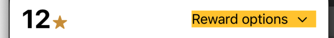

```swift
let configuration = UIImage.SymbolConfiguration(scale: .small)
let image = UIImage(systemName: "chevron.down", withConfiguration: configuration)

let rewardsButton = UIButton()
rewardsButton.translatesAutoresizingMaskIntoConstraints = false
rewardsButton.addTarget(target, action: #selector(rewardOptionsTapped), for: .primaryActionTriggered)
rewardsButton.setImage(image, for: .normal)
rewardsButton.imageView?.contentMode = .scaleAspectFit

rewardsButton.setTitle("Reward options", for: .normal)
rewardsButton.setTitleColor(.label, for: .normal)
rewardsButton.semanticContentAttribute = .forceRightToLeft
rewardsButton.backgroundColor = .systemYellow
rewardsButton.imageView?.tintColor = .label
    
rewardsButton.imageEdgeInsets = UIEdgeInsets(top: 2, left: 20, bottom: 0, right: 0)
rewardsButton.contentEdgeInsets = UIEdgeInsets(top: 0, left: 0, bottom: 0, right: 20)
```

### NSAttributed string

Another way to do this is with `NSAttributedImage` string and add the image to that text. Nice thing about this is you still get left to right localization (unlike other method). Note how you need to set the width constraint on the `titleLabel` inside the button after calculating the width and not on the button itself (near bottom of method).

```swift
    func makePaymentExtensionButton() -> UIButton {
        performPaymentExtensionButton = UIButton()
        performPaymentExtensionButton.translatesAutoresizingMaskIntoConstraints = false

        let title = loc("paymentExtension.homeBanner.delinquent.button")
        let font = UIFont.systemFont(ofSize: 14.0)

        performPaymentExtensionButton.setTitleColor(.shawHighlightBlue, for: .normal)
        performPaymentExtensionButton.titleLabel?.font = font

        var attributes = [NSAttributedString.Key: AnyObject]()
        attributes[.foregroundColor] = UIColor.shawHighlightBlue

        let attributedString = NSMutableAttributedString(string: title, attributes: attributes)

        let image = UIImage(named: "iconDisclosureBlue")!
        let imageAttachment = NSTextAttachment()

        imageAttachment.bounds = CGRect(x: LocalSpacing.buttonPaddingRight, y: -1, width: image.size.width, height: image.size.height) // 8
        imageAttachment.image = image

        let attributedImage = NSAttributedString(attachment: imageAttachment)
        attributedString.append(attributedImage)

        performPaymentExtensionButton.setAttributedTitle(attributedString, for: .normal)

        let width = buttonWidth(forText: title, font: font)
        performPaymentExtensionButton.titleLabel?.widthAnchor.constraint(equalToConstant: width).isActive = true // important titleLabel - not button

        return performPaymentExtensionButton
    }

    func buttonWidth(forText text: String, font: UIFont) -> CGFloat {
        let fontAttributes = [NSAttributedString.Key.font: font]
        var width = (text as NSString).size(withAttributes: fontAttributes).width
        width += LocalSpacing.buttonPaddingRight + LocalSizing.buttonImageWidth // 8 + 10

        return width
    }
```

Good article [here](https://noahgilmore.com/blog/uibutton-padding/).

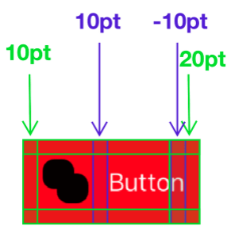


## Buttons on UINavigationBar


```swift
import UIKit

extension HomeController {

    func setupNavigationBarItems() {
        let titleImageView = UIImageView(image: #imageLiteral(resourceName: "title_icon"))
        titleImageView.frame = CGRect(x: 0, y: 0, width: 34, height: 34)
        titleImageView.contentMode = .scaleAspectFit

        navigationItem.titleView = titleImageView

        let followButton = UIButton(type: .system)
        followButton.setImage(#imageLiteral(resourceName: "follow").withRenderingMode(.alwaysOriginal), for: .normal) // alwaysOriginal keeps the original color of the button
        followButton.frame = CGRect(x: 0, y: 0, width: 34, height: 34)
        navigationItem.leftBarButtonItem = UIBarButtonItem(customView: followButton)

        let searchButton = UIButton(type: .system)
        searchButton.setImage(#imageLiteral(resourceName: "search").withRenderingMode(.alwaysOriginal), for: .normal)
        searchButton.frame = CGRect(x: 0, y: 0, width: 34, height: 34)
        navigationItem.rightBarButtonItem = UIBarButtonItem(customView: searchButton)

        let composeButton = UIButton(type: .system)
        composeButton.setImage(#imageLiteral(resourceName: "compose").withRenderingMode(.alwaysOriginal), for: .normal)
        composeButton.frame = CGRect(x: 0, y: 0, width: 34, height: 34)

        navigationItem.rightBarButtonItems = [UIBarButtonItem(customView: searchButton), UIBarButtonItem(customView: composeButton)]

        navigationController?.navigationBar.backgroundColor = .white
        navigationController?.navigationBar.isTranslucent = false

        // how to adjust navigationBar bottom line (it's actually a shadow)

        // remove the bottom line of navbar
        navigationController?.navigationBar.shadowImage = UIImage()
        navigationController?.navigationBar.setBackgroundImage(UIImage(), for: .default)

        // and replace with custom
        let navBarSeparatorView = UIView()
        navBarSeparatorView.translatesAutoresizingMaskIntoConstraints = false
        navBarSeparatorView.backgroundColor = UIColor(red: 230/255, green: 230/255, blue: 230/255, alpha: 1)

        view.addSubview(navBarSeparatorView)

        navBarSeparatorView.topAnchor.constraint(equalTo: view.topAnchor).isActive = true // NOTE: top not bottom (I don't know why)
        navBarSeparatorView.leadingAnchor.constraint(equalTo: view.leadingAnchor).isActive = true
        navBarSeparatorView.trailingAnchor.constraint(equalTo: view.trailingAnchor).isActive = true
        navBarSeparatorView.heightAnchor.constraint(equalToConstant: 0.5).isActive = true

    }
    
}
```

### How to pass a selector as an argument to a function

Define

```swift
struct PaymentSection {
    static func makeWarning(showHintSelector: Selector) -> UIStackView {
        let button = UIButton(frame: .zero)
        ButtonStyle.mediumDarkHint.apply(to: button)
        button.addTarget(self, action: showHintSelector, for: .primaryActionTriggered)
        ...
    }
}
```

Call

```swift
let makeWarning = PaymentSection.makeWarning(showHintSelector: #selector(showHint))

@objc func showHint(sender: UIButton) {
       delegate?.savePaymentToolTipWasTapped(sender)
}
```

### How to make a button or view clear and transparent

```swift
termsTextView.backgroundColor = .clear
termsTextView.isOpaque = false
```

### How to trigger a button inside a unit test

```swift
viewController.planDetailsButton.sendActions(for: .touchUpInside) // .primaryActionTriggered
```

## How to make a custom button

```swift
import Foundation
import UIKit

public class BrandedButton: UIButton {

    public enum Style {
        case primary
        case primaryReversed
        case secondary
        case secondaryReversed
    }

    public var style: Style {
        didSet {
            styleButton()
        }
    }

    public init(text: String = "", style: Style = .primary) {
        self.style = style

        super.init(frame: .zero)

        translatesAutoresizingMaskIntoConstraints = false
        setTitle(text, for: .normal)
        styleButton()

        heightAnchor.constraint(equalToConstant: 8 * 6.0).isActive = true
    }

    required init?(coder: NSCoder) {
        fatalError("init(coder:) has not been implemented")
    }

    private func styleButton() {
        titleLabel?.font = // some font
        titleLabel?.adjustsFontSizeToFitWidth = true
        titleLabel?.minimumScaleFactor = 0.5

        switch style {
        case .primary:
            layer.borderWidth = 0.0
            layer.borderColor = UIColor.clear.cgColor
            setTitleColor(.systemBlue, for: .normal)
            backgroundColor = systemWhite
        case .primaryReversed:
            layer.borderWidth = 0.0
            layer.borderColor = UIColor.clear.cgColor
            setTitleColor(.systemRed, for: .normal)
            backgroundColor = .white
        case .secondary:
            layer.borderWidth = 2.0
            layer.borderColor = .clear
            setTitleColor(.systemOrange, for: .normal)
            backgroundColor = .systemWhite
        case .secondaryReversed:
            layer.borderWidth = 2.0
            layer.borderColor = .clear
            setTitleColor(.systemWhite, for: .normal)
            backgroundColor = .clear
        }

        layer.cornerRadius = 8 * 3.0
    }
}


#if canImport(SwiftUI) && DEBUG
import SwiftUI

@available(iOS 13, *)
struct BrandedButtonPreview: PreviewProvider {

    static var previews: some View {
        Group {
            UIViewPreview {
                BrandedButton(text: "Primary", style: .primary)
            }
            UIViewPreview {
                BrandedButton(text: "Primary Reversed", style: .primaryReversed)
            }
            UIViewPreview {
                BrandedButton(text: "Secondary Secondary", style: .secondary)
            }
            UIViewPreview {
                BrandedButton(text: "Secondary Reversed", style: .secondaryReversed)
            }
        }
        .previewLayout(.fixed(width: 320.0, height: 200))
        .padding(10)
    }
}
#endif
```
