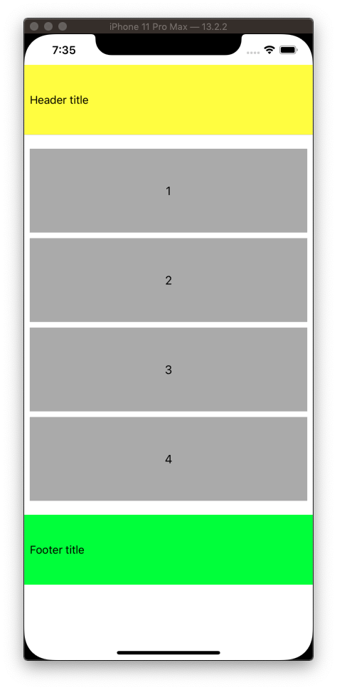

# UICollectionViews

There are x2 types of concrete collection views.

- Flow layout
- Compositional layout 

## Flow Layout


UICollectionViews

- Don't come with cells. You need to create your own.
- Have a layout delegates you override to stylize.
- Backgrounds are implemented as Supplemental Views

## Simple


```swift
import UIKit

class ViewController: UIViewController {

    var collectionView = UICollectionView(frame: .zero, collectionViewLayout: UICollectionViewFlowLayout())

    override func loadView() {
        super.loadView()
        view = collectionView
    }

    override func viewDidLoad() {
        super.viewDidLoad()

        collectionView.backgroundColor = .white
        collectionView.dataSource = self
        collectionView.delegate = self

        collectionView.register(MyCell.self, forCellWithReuseIdentifier: "MyCell")
    }
}

extension ViewController: UICollectionViewDataSource {

    func numberOfSections(in collectionView: UICollectionView) -> Int {
        return 1
    }

    func collectionView(_ collectionView: UICollectionView, numberOfItemsInSection section: Int) -> Int {
        return 10
    }

    func collectionView(_ collectionView: UICollectionView, cellForItemAt indexPath: IndexPath) -> UICollectionViewCell {
        let cell = collectionView.dequeueReusableCell(withReuseIdentifier: "MyCell", for: indexPath) as! MyCell
        cell.textLabel.text = String(indexPath.row + 1)
        return cell
    }
}

extension ViewController: UICollectionViewDelegate {

    func collectionView(_ collectionView: UICollectionView, didSelectItemAt indexPath: IndexPath) {
        print(indexPath.row + 1)
    }
}

class MyCell: UICollectionViewCell {

    weak var textLabel: UILabel!

    override init(frame: CGRect) {
        super.init(frame: frame)

        let label = UILabel()
        label.translatesAutoresizingMaskIntoConstraints = false
        contentView.addSubview(label)
        NSLayoutConstraint.activate([
            label.topAnchor.constraint(equalTo: contentView.topAnchor),
            label.bottomAnchor.constraint(equalTo: contentView.bottomAnchor),
            label.leadingAnchor.constraint(equalTo: contentView.leadingAnchor),
            label.trailingAnchor.constraint(equalTo: contentView.trailingAnchor),
        ])
        textLabel = label

        contentView.backgroundColor = .lightGray
        textLabel.textAlignment = .center
    }

    required init?(coder: NSCoder) {
        fatalError("init(coder:) has not been implemented")
    }
}
```

## Column


You can turn a simple flow layout into a column by overriding the `UICollectionViewDelegateFlowLayout` methods. Add these to the above example.

```swift
extension ViewController: UICollectionViewDelegateFlowLayout {

    func collectionView(_ collectionView: UICollectionView,
                        layout collectionViewLayout: UICollectionViewLayout,
                        sizeForItemAt indexPath: IndexPath) -> CGSize {

        return CGSize(width: collectionView.bounds.size.width - 16, height: 120)
    }

    func collectionView(_ collectionView: UICollectionView,
                        layout collectionViewLayout: UICollectionViewLayout,
                        minimumLineSpacingForSectionAt section: Int) -> CGFloat {
        return 8
    }

    func collectionView(_ collectionView: UICollectionView,
                        layout collectionViewLayout: UICollectionViewLayout,
                        minimumInteritemSpacingForSectionAt section: Int) -> CGFloat {
        return 0
    }

    func collectionView(_ collectionView: UICollectionView,
                        layout collectionViewLayout: UICollectionViewLayout,
                        insetForSectionAt section: Int) -> UIEdgeInsets {
        return UIEdgeInsets.init(top: 8, left: 8, bottom: 8, right: 8)
    }
}
```

## Headers & Footers

Key thing to remember with headers & footers is you need to give them height. Else they won't show.


```swift
    override func viewDidLoad() {
        super.viewDidLoad()

        /// Register
        collectionView.register(HeaderCell.self, forSupplementaryViewOfKind: UICollectionView.elementKindSectionHeader, withReuseIdentifier: HeaderCell.identifier)

        collectionView.register(FooterCell.self, forSupplementaryViewOfKind: UICollectionView.elementKindSectionFooter, withReuseIdentifier: FooterCell.identifier)
    }

/// Data Source
extension ViewController: UICollectionViewDataSource {

    func collectionView(_ collectionView: UICollectionView, viewForSupplementaryElementOfKind kind: String, at indexPath: IndexPath) -> UICollectionReusableView {

        if kind == "UICollectionElementKindSectionHeader" {
            let header = collectionView.dequeueReusableSupplementaryView(ofKind: kind, withReuseIdentifier: HeaderCell.identifier, for: indexPath)
            header.backgroundColor = .yellow
            return header
        }

        let footer = collectionView.dequeueReusableSupplementaryView(ofKind: kind, withReuseIdentifier: FooterCell.identifier, for: indexPath)
        footer.backgroundColor = .green
        return footer
    }

}

/// Cells
class HeaderCell: UICollectionViewCell {

    static let identifier = "SupportArticleHeaderCell"

    override init(frame: CGRect) {
        super.init(frame: frame)

        setupViews()
    }

    required init?(coder aDecoder: NSCoder) {
        fatalError("init(coder:) has not been implemented")
    }

    let textLabel: UILabel = {
        let label = UILabel()
        label.translatesAutoresizingMaskIntoConstraints = false
        label.text = "Header title"
        label.font = UIFont.systemFont(ofSize: 16)

        return label
    }()

    let separatorLineView: UIView = {
        let view = UIView()
        view.translatesAutoresizingMaskIntoConstraints = false
        view.backgroundColor = .lightGray

        return view
    }()

    func setupViews() {
        backgroundColor = .white

        addSubview(textLabel)
        addSubview(separatorLineView)

        textLabel.centerYAnchor.constraint(equalTo: self.centerYAnchor).isActive = true
        textLabel.leadingAnchor.constraint(equalTo: self.leadingAnchor, constant: 8).isActive = true

        separatorLineView.leadingAnchor.constraint(equalTo: self.leadingAnchor).isActive = true
        separatorLineView.trailingAnchor.constraint(equalTo: self.trailingAnchor).isActive = true
        separatorLineView.bottomAnchor.constraint(equalTo: self.bottomAnchor).isActive = true
        separatorLineView.heightAnchor.constraint(equalToConstant: 0.5).isActive = true
    }
}

class FooterCell: UICollectionViewCell {

    static let identifier = "SupportArticleFooterCell"

    override init(frame: CGRect) {
        super.init(frame: frame)

        setupViews()
    }

    required init?(coder aDecoder: NSCoder) {
        fatalError("init(coder:) has not been implemented")
    }

    let textLabel: UILabel = {
        let label = UILabel()
        label.translatesAutoresizingMaskIntoConstraints = false
        label.text = "Footer title"
        label.font = UIFont.systemFont(ofSize: 16)

        return label
    }()

    func setupViews() {
        backgroundColor = .white

        addSubview(textLabel)

        textLabel.centerYAnchor.constraint(equalTo: self.centerYAnchor).isActive = true
        textLabel.leadingAnchor.constraint(equalTo: self.leadingAnchor, constant: 8).isActive = true
    }
}
```

## Section Insets




The size may override the left and right. But this way you can apply some spacing at top and bottom.

```swift
extension ViewController: UICollectionViewDelegateFlowLayout {
    func collectionView(_ collectionView: UICollectionView,
                        layout collectionViewLayout: UICollectionViewLayout,
                        insetForSectionAt section: Int) -> UIEdgeInsets {
        return UIEdgeInsets.init(top: 100, left: -20, bottom: 80, right: -20)
    }
}
```


## Compositional Layout


## Custom Layout


First define a custom column flow layout that specifies the width, height, and insets of each item in your collection.


```swift
//
//  ColumnFlowLayout.swift
//  UICollectionViewTableFlowLayout
//
//  Created by Jonathan Rasmusson (Contractor) on 2019-01-10.
//  Copyright © 2019 Jonathan Rasmusson. All rights reserved.
//

import UIKit

class ColumnFlowLayout: UICollectionViewFlowLayout {

    override func prepare() {
        super.prepare()

        guard let cv = collectionView else { return }

        // set our width x height
        itemSize = CGSize(width: cv.bounds.inset(by: cv.layoutMargins).size.width, height: 70.0)

        // set inset
        sectionInset = UIEdgeInsets(top: minimumInteritemSpacing, left: 0.0, bottom: 0.0, right: 0.0)

        // set inset reference
        sectionInsetReference = .fromSafeArea
    }
}

```

Then create a `UIViewContoller` extending `UICollectionViewController`. Here we fetch our data, populate of collection view cell, and call `reload()` which loads the collection view.

Note: When you do this by extending the `UICollectionViewController` you don't have to specifiy any autolayout. The `UIViewController` is the view and it automatically instantiates a `UICollectionView` for you, and sets up up as the `dataSource` and `delegate`.

```swift
//
//  ViewController.swift
//  UICollectionViewTableFlowLayout
//
//  Created by Jonathan Rasmusson on 2019-01-10.
//  Copyright © 2019 Jonathan Rasmusson. All rights reserved.
//

import UIKit

class ViewController: UICollectionViewController {

    var articles = [SupportArticle]()

    override func viewDidLoad() {
        super.viewDidLoad()

        setupViews()
        fetchArticles()
    }

    func setupViews() {
        collectionView?.backgroundColor = .red
        collectionView?.register(SupportArticleCell.self, forCellWithReuseIdentifier: SupportArticleCell.identifier)
    }

    func fetchArticles() {
        let article1 = SupportArticle(name: "Foo", url: "http://foo")
        let article2 = SupportArticle(name: "Bar", url: "http://bar")
        let article3 = SupportArticle(name: "Baz", url: "http://baz")

        articles =  [article1, article2, article3]

        collectionView?.reloadData()
    }

}

// MARK: - DataSource

extension ViewController {

    override func collectionView(_ collectionView: UICollectionView, numberOfItemsInSection section: Int) -> Int {
        return articles.count
    }

    override func collectionView(_ collectionView: UICollectionView, cellForItemAt indexPath: IndexPath) -> UICollectionViewCell {

        let cell = collectionView.dequeueReusableCell(withReuseIdentifier: SupportArticleCell.identifier, for: indexPath) as! SupportArticleCell
        cell.article = articles[indexPath.item]

        return cell
    }

}
```

Then define your data struct of the item you would have loaded as part of a json request.

```swift
//
//  SupportArticle.swift
//  UICollectionViewTableFlowLayout
//
//  Created by Jonathan Rasmusson (Contractor) on 2019-01-10.
//  Copyright © 2019 Jonathan Rasmusson. All rights reserved.
//

struct SupportArticle: Codable {
    let name: String?
    let url: String?
}
```

Define a customer cell. Here you do have to do autolayout and setup your rules.

```swift
//
//  SupportArticleCell.swift
//  UICollectionViewTableFlowLayout
//
//  Created by Jonathan Rasmusson (Contractor) on 2019-01-10.
//  Copyright © 2019 Jonathan Rasmusson. All rights reserved.
//

import UIKit

class SupportArticleCell: UICollectionViewCell {

    static let identifier = "SupportArticleCell"

    let nameLabel: UILabel = {
        let label = UILabel()
        label.translatesAutoresizingMaskIntoConstraints = false
        label.text = "Article 1"
        label.font = UIFont.systemFont(ofSize: 16)

        return label
    }()

    let separatorLineView: UIView = {
        let view = UIView()
        view.translatesAutoresizingMaskIntoConstraints = false
        view.backgroundColor = .lightGray

        return view
    }()

    var article: SupportArticle? {

        didSet {
            guard let article = article else { return }
            nameLabel.text = article.name
        }
    }

    override init(frame: CGRect) {

        super.init(frame: frame)

        setupViews()
    }

    required init?(coder aDecoder: NSCoder) {
        fatalError("init(coder:) has not been implemented")
    }

    func setupViews() {

        backgroundColor = .blue

        addSubview(nameLabel)
        addSubview(separatorLineView)

        nameLabel.topAnchor.constraint(equalTo: self.topAnchor, constant: 12).isActive = true
        nameLabel.leadingAnchor.constraint(equalTo: self.leadingAnchor, constant: 8).isActive = true
        nameLabel.trailingAnchor.constraint(equalTo: self.trailingAnchor, constant: -8).isActive = true

        separatorLineView.leadingAnchor.constraint(equalTo: self.leadingAnchor).isActive = true
        separatorLineView.trailingAnchor.constraint(equalTo: self.trailingAnchor).isActive = true
        separatorLineView.bottomAnchor.constraint(equalTo: self.bottomAnchor).isActive = true
        separatorLineView.heightAnchor.constraint(equalToConstant: 0.5).isActive = true
    }

}
```

Finally hook it up and instantiate with your custom `ColumnFlowLayout()`.

```swift
    func application(_ application: UIApplication, didFinishLaunchingWithOptions launchOptions: [UIApplication.LaunchOptionsKey: Any]?) -> Bool {
        window = UIWindow(frame: UIScreen.main.bounds)
        window?.makeKeyAndVisible()
        window?.rootViewController = ViewController(collectionViewLayout: ColumnFlowLayout())

        return true
    }
```

### An alternative way

Another way to get the table column flow is to use a standard `UICollectionViewFlowLayout` 

```swift
   let homeController = HomeController(collectionViewLayout: UICollectionViewFlowLayout())
   window?.rootViewController = UINavigationController(rootViewController: homeController)
```

And then override the size via the `delegate`.

```swift
extension HomeController: UICollectionViewDelegateFlowLayout { 

    func collectionView(_ collectionView: UICollectionView, layout collectionViewLayout: UICollectionViewLayout, sizeForItemAt indexPath: IndexPath) -> CGSize {

        // User Section
        if indexPath.section == 0 {

            let user = users[indexPath.item]
            let estimatedHeight = estimatedHeightForText(user.bioText)

            return CGSize(width: view.frame.width, height: estimatedHeight + 20 + 20 + 12 + 14 + 16)

        } else if indexPath.section == 1 {

            let tweet = tweets[indexPath.item]
            let estimatedHeight = estimatedHeightForText(tweet.message)

            return CGSize(width: view.frame.width, height: estimatedHeight + 20 + 20 + 12 + 14 + 16)
        }

        return CGSize(width: view.frame.width, height: 200)
    }

    private func estimatedHeightForText(_ text: String) -> CGFloat {

        // calculate estimated height of cell based on the bioTextView because it is the dynamic part of our cell
        // basically need to measure height of everything individually and just add it up...no magic except for the textView

        let approxWidth = view.frame.width - 12 - 50 - 12
        let approxHeight = CGFloat(1000) // just a guess
        let size = CGSize(width: approxWidth, height: approxHeight)
        let attributes = [NSAttributedString.Key.font: UIFont.systemFont(ofSize: 15)]

        let estimatedFrame = NSString(string: text).boundingRect(with: size, options: .usesLineFragmentOrigin, attributes: attributes, context: nil)

        return estimatedFrame.height
    }
```

### Adding a header

Adding a header is pretty easy. The main gotcha if your are using your own custom layout is you need to give the header an initial size. Else the header callback methods in your ViewController never get called.


```swift
class ColumnFlowLayout: UICollectionViewFlowLayout {

    override func prepare() {
        super.prepare()

        // important!
        headerReferenceSize = CGSize(width: collectionView.frame.size.width, height: 100);
    }
}
```

Then you can define your own customer head and use in ViewController as follows.

```swift
import UIKit

class SupportArticleHeaderCell: UICollectionViewCell {

    static let identifier = "SupportArticleHeaderCell"

    override init(frame: CGRect) {
        super.init(frame: frame)

        setupViews()
    }

    required init?(coder aDecoder: NSCoder) {
        fatalError("init(coder:) has not been implemented")
    }

    let textLabel: UILabel = {
        let label = UILabel()
        label.translatesAutoresizingMaskIntoConstraints = false
        label.text = "Header title"
        label.font = UIFont.systemFont(ofSize: 16)

        return label
    }()

    let separatorLineView: UIView = {
        let view = UIView()
        view.translatesAutoresizingMaskIntoConstraints = false
        view.backgroundColor = .lightGray

        return view
    }()

    func setupViews() {
        backgroundColor = .white

        addSubview(textLabel)
        addSubview(separatorLineView)

        textLabel.centerYAnchor.constraint(equalTo: self.centerYAnchor).isActive = true
        textLabel.leadingAnchor.constraint(equalTo: self.leadingAnchor, constant: 8).isActive = true

        separatorLineView.leadingAnchor.constraint(equalTo: self.leadingAnchor).isActive = true
        separatorLineView.trailingAnchor.constraint(equalTo: self.trailingAnchor).isActive = true
        separatorLineView.bottomAnchor.constraint(equalTo: self.bottomAnchor).isActive = true
        separatorLineView.heightAnchor.constraint(equalToConstant: 0.5).isActive = true
    }
}
```

```swift
class ViewController: UICollectionViewController {

    override func viewDidLoad() {
        super.viewDidLoad()

        setupViews()
    }

    func setupViews() {
        ...
        collectionView?.register(SupportArticleHeaderCell.self, forSupplementaryViewOfKind: UICollectionView.elementKindSectionHeader, withReuseIdentifier: SupportArticleHeaderCell.identifier)
        ...
    }
    
        // MARK: - Header

    override func collectionView(_ collectionView: UICollectionView, viewForSupplementaryElementOfKind kind: String, at indexPath: IndexPath) -> UICollectionReusableView {
        let header = collectionView.dequeueReusableSupplementaryView(ofKind: kind, withReuseIdentifier: SupportArticleHeaderCell.identifier, for: indexPath)
        header.backgroundColor = .yellow
        return header
    }
```


