# UICollectionViews

There are x2 types of concrete collection views.

- Flow layout
- Compositional layout 

## Flow Layout

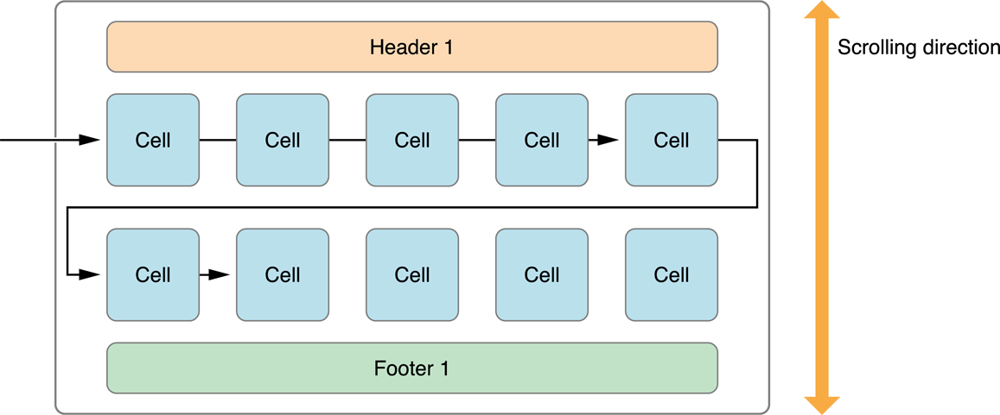

UICollectionViews

- Don't come with cells. You need to create your own.
- Have a layout delegates you override to stylize.
- Backgrounds are implemented as Supplemental Views

### Simple Flow Layout

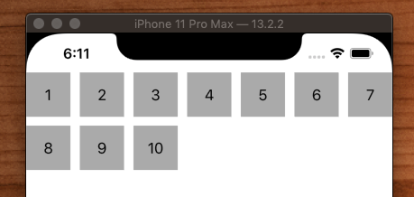

```swift
import UIKit

class ViewController: UIViewController {

    var collectionView = UICollectionView(frame: .zero, collectionViewLayout: UICollectionViewFlowLayout())

    override func loadView() {
        super.loadView()
        view = collectionView
    }

    override func viewDidLoad() {
        super.viewDidLoad()

        collectionView.backgroundColor = .white
        collectionView.dataSource = self
        collectionView.delegate = self

        collectionView.register(MyCell.self, forCellWithReuseIdentifier: "MyCell")
    }
}

extension ViewController: UICollectionViewDataSource {

    func numberOfSections(in collectionView: UICollectionView) -> Int {
        return 1
    }

    func collectionView(_ collectionView: UICollectionView, numberOfItemsInSection section: Int) -> Int {
        return 10
    }

    func collectionView(_ collectionView: UICollectionView, cellForItemAt indexPath: IndexPath) -> UICollectionViewCell {
        let cell = collectionView.dequeueReusableCell(withReuseIdentifier: "MyCell", for: indexPath) as! MyCell
        cell.textLabel.text = String(indexPath.row + 1)
        return cell
    }
}

extension ViewController: UICollectionViewDelegate {

    func collectionView(_ collectionView: UICollectionView, didSelectItemAt indexPath: IndexPath) {
        print(indexPath.row + 1)
    }
}

class MyCell: UICollectionViewCell {

    weak var textLabel: UILabel!

    override init(frame: CGRect) {
        super.init(frame: frame)

        let label = UILabel()
        label.translatesAutoresizingMaskIntoConstraints = false
        contentView.addSubview(label)
        NSLayoutConstraint.activate([
            label.topAnchor.constraint(equalTo: contentView.topAnchor),
            label.bottomAnchor.constraint(equalTo: contentView.bottomAnchor),
            label.leadingAnchor.constraint(equalTo: contentView.leadingAnchor),
            label.trailingAnchor.constraint(equalTo: contentView.trailingAnchor),
        ])
        textLabel = label

        contentView.backgroundColor = .lightGray
        textLabel.textAlignment = .center
    }

    required init?(coder: NSCoder) {
        fatalError("init(coder:) has not been implemented")
    }
}
```

### Column Flow Layout

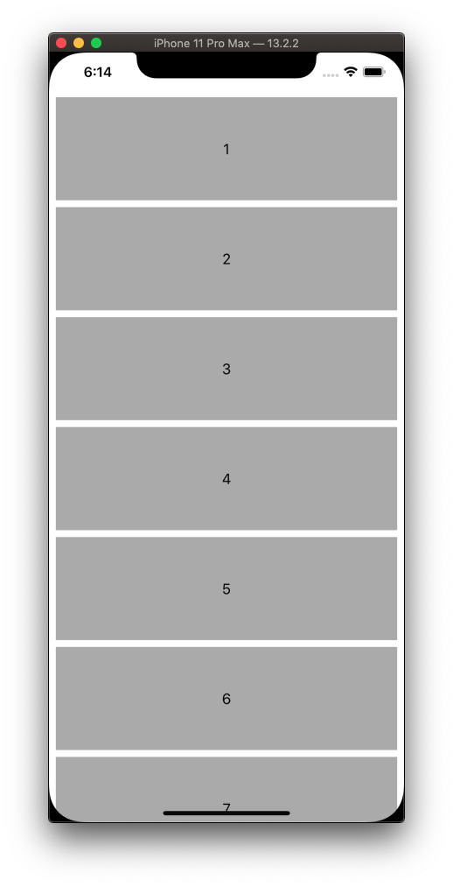

You can turn a simple flow layout into a column by overriding the `UICollectionViewDelegateFlowLayout` methods. Add these to the above example.

```swift
extension ViewController: UICollectionViewDelegateFlowLayout {

    func collectionView(_ collectionView: UICollectionView,
                        layout collectionViewLayout: UICollectionViewLayout,
                        sizeForItemAt indexPath: IndexPath) -> CGSize {

        return CGSize(width: collectionView.bounds.size.width - 16, height: 120)
    }

    func collectionView(_ collectionView: UICollectionView,
                        layout collectionViewLayout: UICollectionViewLayout,
                        minimumLineSpacingForSectionAt section: Int) -> CGFloat {
        return 8
    }

    func collectionView(_ collectionView: UICollectionView,
                        layout collectionViewLayout: UICollectionViewLayout,
                        minimumInteritemSpacingForSectionAt section: Int) -> CGFloat {
        return 0
    }

    func collectionView(_ collectionView: UICollectionView,
                        layout collectionViewLayout: UICollectionViewLayout,
                        insetForSectionAt section: Int) -> UIEdgeInsets {
        return UIEdgeInsets.init(top: 8, left: 8, bottom: 8, right: 8)
    }
}
```

### Headers & Footers

Key thing to remember with headers & footers is you need to give them height. Else they won't show.

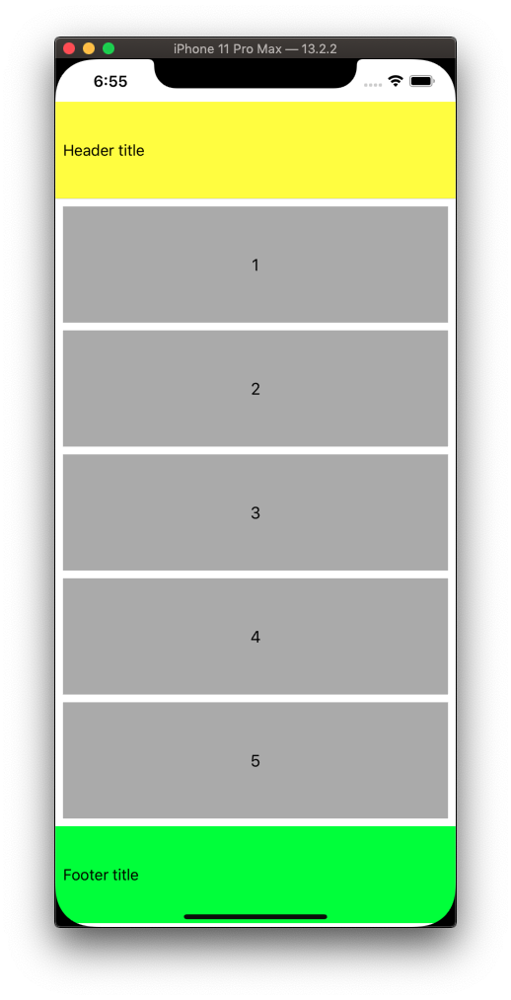

### Section Insets

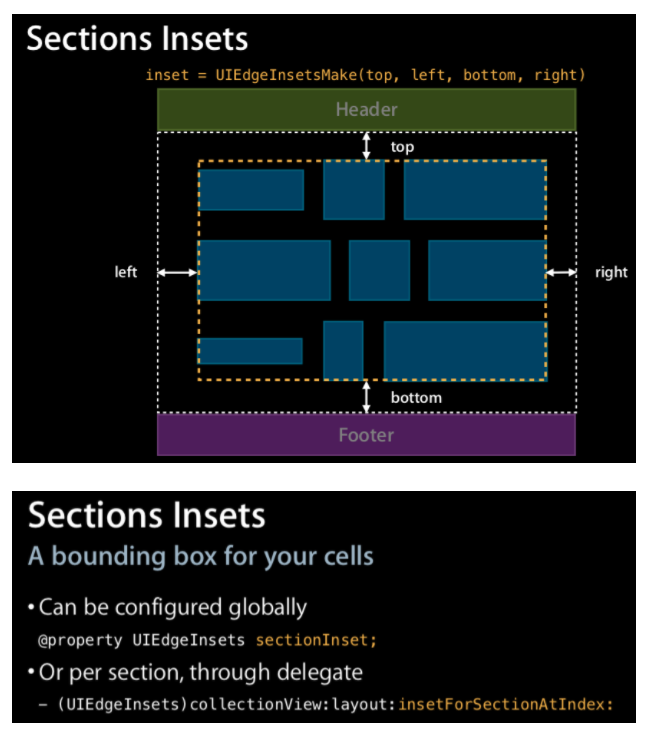

```swift
extension ViewController: UICollectionViewDelegateFlowLayout {
    func collectionView(_ collectionView: UICollectionView,
                        layout collectionViewLayout: UICollectionViewLayout,
                        insetForSectionAt section: Int) -> UIEdgeInsets {
        return UIEdgeInsets.init(top: 20, left: 0, bottom: 20, right: 0)
    }
}
```

### Full Example

```swift
//
//  ViewController.swift
//  FlowLayout
//
//  Created by Jonathan Rasmusson (Contractor) on 2020-05-17.
//  Copyright © 2020 Jonathan Rasmusson. All rights reserved.
//

import UIKit

class ViewController: UIViewController {

    var collectionView: UICollectionView!
    var flowLayout: UICollectionViewFlowLayout!

    override func loadView() {
        super.loadView()

        flowLayout = UICollectionViewFlowLayout()
        flowLayout.headerReferenceSize = CGSize(width: 100, height: 100)
        flowLayout.footerReferenceSize = CGSize(width: 100, height: 100)

        collectionView = UICollectionView(frame: .zero, collectionViewLayout: flowLayout)
        collectionView.translatesAutoresizingMaskIntoConstraints = false

        self.view.addSubview(collectionView)
        NSLayoutConstraint.activate([
            collectionView.topAnchor.constraint(equalTo: view.safeAreaLayoutGuide.topAnchor),
            collectionView.bottomAnchor.constraint(equalTo: view.safeAreaLayoutGuide.bottomAnchor),
            collectionView.leadingAnchor.constraint(equalTo: view.leadingAnchor),
            collectionView.trailingAnchor.constraint(equalTo: view.trailingAnchor),
        ])
    }

    override func viewDidLoad() {
        super.viewDidLoad()

        collectionView.backgroundColor = .white
        collectionView.dataSource = self
        collectionView.delegate = self

        collectionView.register(MyCell.self, forCellWithReuseIdentifier: "MyCell")

        collectionView.register(HeaderCell.self, forSupplementaryViewOfKind: UICollectionView.elementKindSectionHeader, withReuseIdentifier: HeaderCell.identifier)
        collectionView.register(FooterCell.self, forSupplementaryViewOfKind: UICollectionView.elementKindSectionFooter, withReuseIdentifier: FooterCell.identifier)
    }
}

extension ViewController: UICollectionViewDataSource {

    func numberOfSections(in collectionView: UICollectionView) -> Int {
        return 1
    }

    func collectionView(_ collectionView: UICollectionView, numberOfItemsInSection section: Int) -> Int {
        return 4
    }

    func collectionView(_ collectionView: UICollectionView, cellForItemAt indexPath: IndexPath) -> UICollectionViewCell {
        let cell = collectionView.dequeueReusableCell(withReuseIdentifier: "MyCell", for: indexPath) as! MyCell
        cell.textLabel.text = String(indexPath.row + 1)
        return cell
    }

    func collectionView(_ collectionView: UICollectionView, viewForSupplementaryElementOfKind kind: String, at indexPath: IndexPath) -> UICollectionReusableView {

        if kind == "UICollectionElementKindSectionHeader" {
            let header = collectionView.dequeueReusableSupplementaryView(ofKind: kind, withReuseIdentifier: HeaderCell.identifier, for: indexPath)
            header.backgroundColor = .yellow
            return header
        }

        let footer = collectionView.dequeueReusableSupplementaryView(ofKind: kind, withReuseIdentifier: FooterCell.identifier, for: indexPath)
        footer.backgroundColor = .green
        return footer
    }

}

extension ViewController: UICollectionViewDelegate {

    func collectionView(_ collectionView: UICollectionView, didSelectItemAt indexPath: IndexPath) {
        print(indexPath.row + 1)
    }
}

extension ViewController: UICollectionViewDelegateFlowLayout {

    func collectionView(_ collectionView: UICollectionView,
                        layout collectionViewLayout: UICollectionViewLayout,
                        sizeForItemAt indexPath: IndexPath) -> CGSize {

        return CGSize(width: collectionView.bounds.size.width - 16, height: 120)
    }

    func collectionView(_ collectionView: UICollectionView,
                        layout collectionViewLayout: UICollectionViewLayout,
                        minimumLineSpacingForSectionAt section: Int) -> CGFloat {
        return 8
    }

    func collectionView(_ collectionView: UICollectionView,
                        layout collectionViewLayout: UICollectionViewLayout,
                        minimumInteritemSpacingForSectionAt section: Int) -> CGFloat {
        return 0
    }

    func collectionView(_ collectionView: UICollectionView,
                        layout collectionViewLayout: UICollectionViewLayout,
                        insetForSectionAt section: Int) -> UIEdgeInsets {
        return UIEdgeInsets.init(top: 20, left: 0, bottom: 20, right: 0)
    }
}


class MyCell: UICollectionViewCell {

    weak var textLabel: UILabel!

    override init(frame: CGRect) {
        super.init(frame: frame)

        let label = UILabel()
        label.translatesAutoresizingMaskIntoConstraints = false
        contentView.addSubview(label)
        NSLayoutConstraint.activate([
            label.topAnchor.constraint(equalTo: contentView.topAnchor),
            label.bottomAnchor.constraint(equalTo: contentView.bottomAnchor),
            label.leadingAnchor.constraint(equalTo: contentView.leadingAnchor),
            label.trailingAnchor.constraint(equalTo: contentView.trailingAnchor),
        ])
        textLabel = label

        contentView.backgroundColor = .lightGray
        textLabel.textAlignment = .center
    }

    required init?(coder: NSCoder) {
        fatalError("init(coder:) has not been implemented")
    }
}


class HeaderCell: UICollectionViewCell {

    static let identifier = "SupportArticleHeaderCell"

    override init(frame: CGRect) {
        super.init(frame: frame)

        setupViews()
    }

    required init?(coder aDecoder: NSCoder) {
        fatalError("init(coder:) has not been implemented")
    }

    let textLabel: UILabel = {
        let label = UILabel()
        label.translatesAutoresizingMaskIntoConstraints = false
        label.text = "Header title"
        label.font = UIFont.systemFont(ofSize: 16)

        return label
    }()

    let separatorLineView: UIView = {
        let view = UIView()
        view.translatesAutoresizingMaskIntoConstraints = false
        view.backgroundColor = .lightGray

        return view
    }()

    func setupViews() {
        backgroundColor = .white

        addSubview(textLabel)
        addSubview(separatorLineView)

        textLabel.centerYAnchor.constraint(equalTo: self.centerYAnchor).isActive = true
        textLabel.leadingAnchor.constraint(equalTo: self.leadingAnchor, constant: 8).isActive = true

        separatorLineView.leadingAnchor.constraint(equalTo: self.leadingAnchor).isActive = true
        separatorLineView.trailingAnchor.constraint(equalTo: self.trailingAnchor).isActive = true
        separatorLineView.bottomAnchor.constraint(equalTo: self.bottomAnchor).isActive = true
        separatorLineView.heightAnchor.constraint(equalToConstant: 0.5).isActive = true
    }
}

class FooterCell: UICollectionViewCell {

    static let identifier = "SupportArticleFooterCell"

    override init(frame: CGRect) {
        super.init(frame: frame)

        setupViews()
    }

    required init?(coder aDecoder: NSCoder) {
        fatalError("init(coder:) has not been implemented")
    }

    let textLabel: UILabel = {
        let label = UILabel()
        label.translatesAutoresizingMaskIntoConstraints = false
        label.text = "Footer title"
        label.font = UIFont.systemFont(ofSize: 16)

        return label
    }()

    func setupViews() {
        backgroundColor = .white

        addSubview(textLabel)

        textLabel.centerYAnchor.constraint(equalTo: self.centerYAnchor).isActive = true
        textLabel.leadingAnchor.constraint(equalTo: self.leadingAnchor, constant: 8).isActive = true
    }
}
```


## Compositional Layout

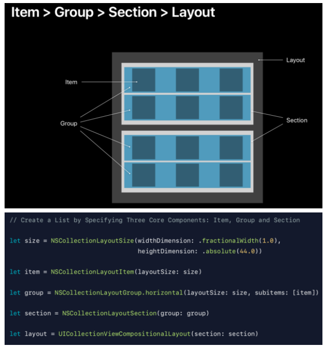

Compositional layouts use composition over inheritance to build composing views within views. There are four key concepts you need to understand.

- Size - NSCollectionLayoutSize 
- Item - NSCollectionLayoutItem 
- Group - NSCollectionLayoutGroup 
- Section - NSCollectionLayoutSection

### Size

Everything has a size. A height and a width dimension.

```swift
class NSCollectionLayoutSize {
	init(widthDimension: NSCollectionLayoutDimension, heightDimension: NSCollectionLayoutDimension)
}

let itemSize = NSCollectionLayoutSize(widthDimension: .fractionalWidth(1.0), heightDimension: .fractionalHeight(1.0))
```

_ NSCollectionLayoutDimension_ is a axis independent way of defining size.

```swift
class NSCollectionLayoutDimension {
	class func fractionalWidth(_ fractionalWidth: CGFloat) -> Self 
	class func fractionalHeight(_ fractionalHeight: CGFloat) -> Self 
	class func absolute(_ absoluteDimension: CGFloat) -> Self
	class func estimated(_ estimatedDimension: CGFloat) -> Self
}

let widthDimension = NSCollectionLayoutDimension.fractionalWidth(0.5)
let heightDimension = NSCollectionLayoutDimension.fractionalHeight(0.3)

let size = NSCollectionLayoutDimension(widthDimension: .fractionalWidth(0.25), heightDimension: .fractionalWidth(0.25))

let heightDimension = NSCollectionLayoutDimension.absolute(200)
let heightDimension = NSCollectionLayoutDimension.estimated(200)

```

### Item

_NSCollectionLayoutItem_ is a cell or supplementary item. It takes a _size_ as an input.

```swift
class NSCollectionLayoutItem {
   convenience init(layoutSize: NSCollectionLayoutSize) 
   var contentInsets: NSDirectionalEdgeInsets
}
```

### Group

Basic unit of layout. This is our workhorse for laying things out. Will override or take precendence over what we say in _size_.

```swift
class NSCollectionLayoutGroup: NSCollectionLayoutItem { 
   class func horizontal(layoutSize: NSCollectionLayoutSize, subitems: [NSCollectionLayoutItem]) -> Self 
   class func vertical(layoutSize: NSCollectionLayoutSize,\ subitems: [NSCollectionLayoutItem]) -> Self 
   class func custom(layoutSize: NSCollectionLayoutSize, itemProvider: NSCollectionLayoutGroupCustomItemProvider) -> Self
}

```

### Section

The layout for the section. Takes a group.

```swift
class NSCollectionLayoutSection {
   convenience init(layoutGroup: NSCollectionLayoutGroup) 
   var contentInsets: NSDirectionalEdgeInsets
}
```

### Layout

The layout of the view. Repeating per section.

```swift
class UICollectionViewCompositionalLayout: UICollectionViewLayout { 
   init(section: NSCollectionLayoutSection)
   init(sectionProvider: @escaping SectionProvider)
}
```

### All together

Bringing it all together looks something like this.

```swift
    private func createLayout() -> UICollectionViewLayout {

        // item
        let itemSize = NSCollectionLayoutSize(widthDimension: .fractionalWidth(1.0),
                                             heightDimension: .fractionalHeight(1.0))
        let item = NSCollectionLayoutItem(layoutSize: itemSize)

        // group
        let groupSize = NSCollectionLayoutSize(widthDimension: .fractionalWidth(1.0),
                                              heightDimension: .absolute(44))
        let group = NSCollectionLayoutGroup.horizontal(layoutSize: groupSize, subitems: [item])

        let section = NSCollectionLayoutSection(group: group)

        let layout = UICollectionViewCompositionalLayout(section: section)

        return layout
    }
```

### ListView

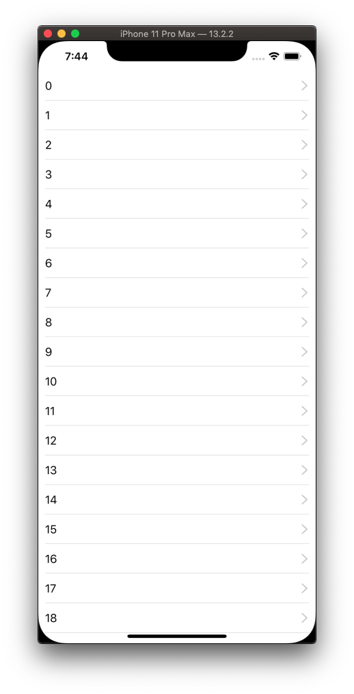

```swift
    private func createLayout() -> UICollectionViewLayout {

        // item
        let itemSize = NSCollectionLayoutSize(widthDimension: .fractionalWidth(1.0),
                                             heightDimension: .fractionalHeight(1.0))
        let item = NSCollectionLayoutItem(layoutSize: itemSize)

        // group
        let groupSize = NSCollectionLayoutSize(widthDimension: .fractionalWidth(1.0),
                                              heightDimension: .absolute(44))
        let group = NSCollectionLayoutGroup.horizontal(layoutSize: groupSize, subitems: [item])

        let section = NSCollectionLayoutSection(group: group)

        let layout = UICollectionViewCompositionalLayout(section: section)

        return layout
    }
```

The _itemSize_ describes how much the item should fill the group it is contained in.

### GridView

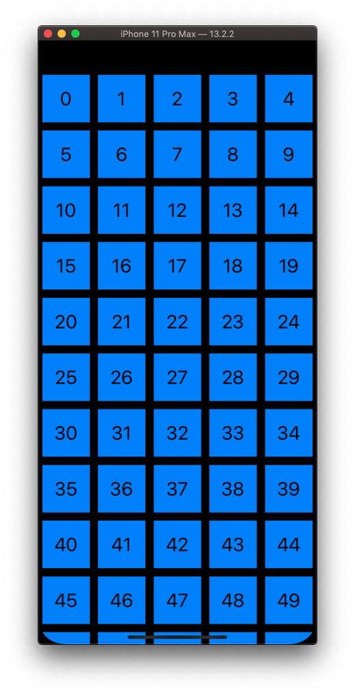

```swift
    private func createLayout() -> UICollectionViewLayout {

        // itemWidth is 20% of group container - .fractionalWidth(0.2)
        //
        let itemSize = NSCollectionLayoutSize(widthDimension: .fractionalWidth(0.2),
                                             heightDimension: .fractionalHeight(1.0))
        let item = NSCollectionLayoutItem(layoutSize: itemSize)

        // add some inset spacing
        item.contentInsets = NSDirectionalEdgeInsets(top: 5, leading: 5, bottom: 5, trailing: 5)

        // Still want the group to span the entire width of the collection view - .fractionalWidth(1.0)
        // Height of each group or row will be 20% of the width of the groups container.
        //  This is what makes it square. The fact the height and width are the same value.
        //  So it is the combination of itemSize (0.2, 1) and group height (0.2) that gives us the square.

        let groupSize = NSCollectionLayoutSize(widthDimension: .fractionalWidth(1.0),
                                              heightDimension: .fractionalWidth(0.2))
        let group = NSCollectionLayoutGroup.horizontal(layoutSize: groupSize,
                                                         subitems: [item])

        let section = NSCollectionLayoutSection(group: group)

        let layout = UICollectionViewCompositionalLayout(section: section)
        return layout
    }
```

### Two Column Grid

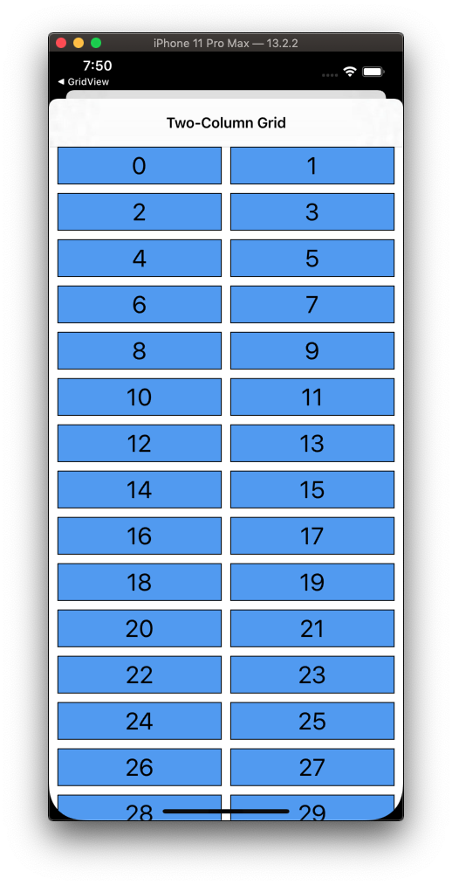

```swift
    func createLayout() -> UICollectionViewLayout {
        let itemSize = NSCollectionLayoutSize(widthDimension: .fractionalWidth(1.0),
                                             heightDimension: .fractionalHeight(1.0))
        let item = NSCollectionLayoutItem(layoutSize: itemSize)

        let groupSize = NSCollectionLayoutSize(widthDimension: .fractionalWidth(1.0),
                                              heightDimension: .absolute(44))
                                              
                                              
        // Group overrides item. Here we are saying lay these items out in a horizontal group, but 
        // make it a repeating group of x2. Note - group layout will override item layout.
        // So even though itemSize is 1x1, group will override it and stretch it out to meet
        // the repeating requirements of the group.
        
        let group = NSCollectionLayoutGroup.horizontal(layoutSize: groupSize, subitem: item, count: 2)
        let spacing = CGFloat(10)
        group.interItemSpacing = .fixed(spacing)

        let section = NSCollectionLayoutSection(group: group)
        section.interGroupSpacing = spacing
        section.contentInsets = NSDirectionalEdgeInsets(top: 0, leading: 10, bottom: 0, trailing: 10)

        let layout = UICollectionViewCompositionalLayout(section: section)
        return layout
    }
```

## Supplementary Items

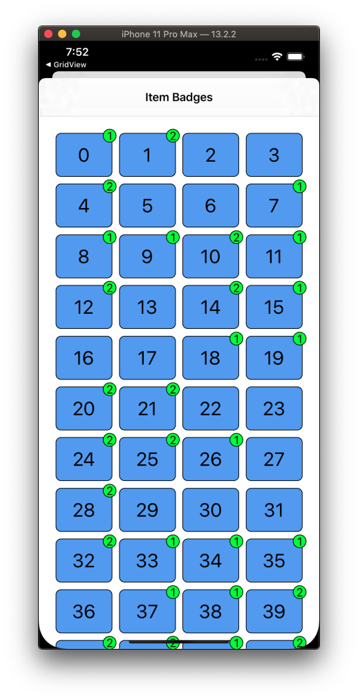

[Supplementary Items](https://developer.apple.com/documentation/uikit/nscollectionlayoutsupplementaryitem?language=objc) are views such as a badges or a frames you can add to an item in a collection view.

You create them by extending `UICollectionReusableView`.

```swift
class BadgeSupplementaryView: UICollectionReusableView {

    static let reuseIdentifier = "badge-reuse-identifier"
    let label = UILabel()

    override init(frame: CGRect) {
        super.init(frame: frame)
        configure()
    }

    override var frame: CGRect {
        didSet {
            configureBorder()
        }
    }
    override var bounds: CGRect {
        didSet {
            configureBorder()
        }
    }

    required init?(coder: NSCoder) {
        fatalError("Not implemented")
    }
}

extension BadgeSupplementaryView {
    func configure() {
        label.translatesAutoresizingMaskIntoConstraints = false
        label.adjustsFontForContentSizeCategory = true
        addSubview(label)
        NSLayoutConstraint.activate([
            label.centerXAnchor.constraint(equalTo: centerXAnchor),
            label.centerYAnchor.constraint(equalTo: centerYAnchor)
            ])
        label.font = UIFont.preferredFont(forTextStyle: .body)
        label.textAlignment = .center
        label.textColor = .black
        backgroundColor = .green
        configureBorder()
    }
    func configureBorder() {
        let radius = bounds.width / 2.0
        layer.cornerRadius = radius
        layer.borderColor = UIColor.black.cgColor
        layer.borderWidth = 1.0
    }
}
```

Register them with the collection.


```swift
    func configureHierarchy() {
        ...
        collectionView.register(BadgeSupplementaryView.self,
                    forSupplementaryViewOfKind: ItemBadgeSupplementaryViewController.badgeElementKind,
                    withReuseIdentifier: BadgeSupplementaryView.reuseIdentifier)
        ...
    }
    
    import UIKit
```

And then you give it its own set of anchors and size to be positioned relative to each cell, created as a `NSCollectionLayoutSupplementaryItem`. 

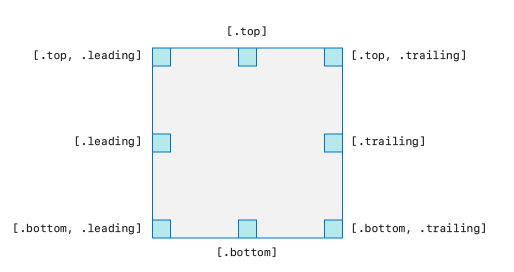

```swift
        let badgeAnchor = NSCollectionLayoutAnchor(edges: [.top, .trailing], fractionalOffset: CGPoint(x: 0.3, y: -0.3))
        let badgeSize = NSCollectionLayoutSize(widthDimension: .absolute(20),
                                              heightDimension: .absolute(20))
        let badge = NSCollectionLayoutSupplementaryItem(
            layoutSize: badgeSize,
            elementKind: ItemBadgeSupplementaryViewController.badgeElementKind,
            containerAnchor: badgeAnchor)
```
Then when you create your item, you add it as a supplementary item.

```swift
        let item = NSCollectionLayoutItem(layoutSize: itemSize, supplementaryItems: [badge])
```

Full layout looks like this.

```swift
extension ItemBadgeSupplementaryViewController {
    func createLayout() -> UICollectionViewLayout {
        let badgeAnchor = NSCollectionLayoutAnchor(edges: [.top, .trailing], fractionalOffset: CGPoint(x: 0.3, y: -0.3))
        let badgeSize = NSCollectionLayoutSize(widthDimension: .absolute(20),
                                              heightDimension: .absolute(20))
        let badge = NSCollectionLayoutSupplementaryItem(
            layoutSize: badgeSize,
            elementKind: ItemBadgeSupplementaryViewController.badgeElementKind,
            containerAnchor: badgeAnchor)

        let itemSize = NSCollectionLayoutSize(widthDimension: .fractionalWidth(0.25),
                                             heightDimension: .fractionalHeight(1.0))
        let item = NSCollectionLayoutItem(layoutSize: itemSize, supplementaryItems: [badge])
        item.contentInsets = NSDirectionalEdgeInsets(top: 5, leading: 5, bottom: 5, trailing: 5)

        let groupSize = NSCollectionLayoutSize(widthDimension: .fractionalWidth(1.0),
                                              heightDimension: .fractionalWidth(0.2))
        let group = NSCollectionLayoutGroup.horizontal(layoutSize: groupSize, subitems: [item])

        let section = NSCollectionLayoutSection(group: group)
        section.contentInsets = NSDirectionalEdgeInsets(top: 20, leading: 20, bottom: 20, trailing: 20)

        let layout = UICollectionViewCompositionalLayout(section: section)
        return layout
    }
}
```

## Boundary Items

Headers and footers are implemented as `NSCollectionLayoutBoundarySupplementaryItem`.

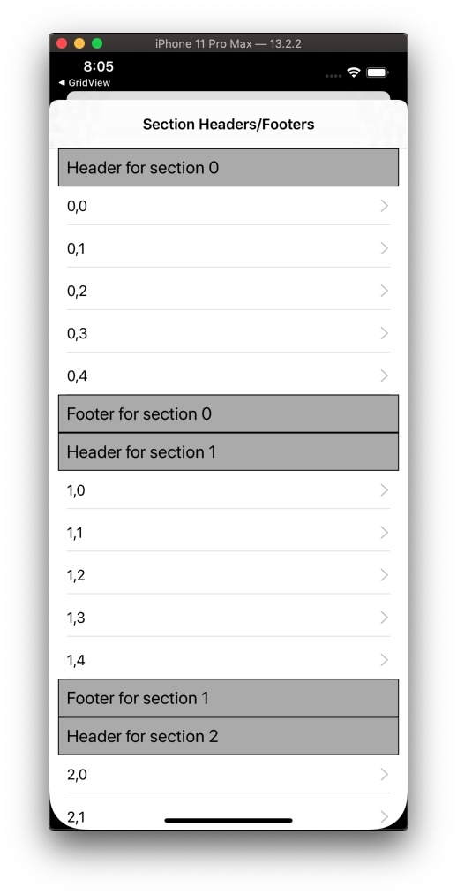

First your register.

```swift
    func configureHierarchy() {
        collectionView.register(
            TitleSupplementaryView.self,
            forSupplementaryViewOfKind: SectionHeadersFootersViewController.sectionHeaderElementKind,
            withReuseIdentifier: TitleSupplementaryView.reuseIdentifier)
        collectionView.register(
            TitleSupplementaryView.self,
            forSupplementaryViewOfKind: SectionHeadersFootersViewController.sectionFooterElementKind,
            withReuseIdentifier: TitleSupplementaryView.reuseIdentifier)
    }
```

Then you layout and add as boundary supplementary items.

```swift
        let headerFooterSize = NSCollectionLayoutSize(widthDimension: .fractionalWidth(1.0),
                                                     heightDimension: .estimated(44))
        let sectionHeader = NSCollectionLayoutBoundarySupplementaryItem(
            layoutSize: headerFooterSize,
            elementKind: SectionHeadersFootersViewController.sectionHeaderElementKind, alignment: .top)
        let sectionFooter = NSCollectionLayoutBoundarySupplementaryItem(
            layoutSize: headerFooterSize,
            elementKind: SectionHeadersFootersViewController.sectionFooterElementKind, alignment: .bottom)
        section.boundarySupplementaryItems = [sectionHeader, sectionFooter]
```

### Pin header

You can pin a header like this.

```swift
    func createLayout() -> UICollectionViewLayout {
        let sectionHeader = NSCollectionLayoutBoundarySupplementaryItem(
            layoutSize: NSCollectionLayoutSize(widthDimension: .fractionalWidth(1.0),
                                              heightDimension: .estimated(44)),
            elementKind: PinnedSectionHeaderFooterViewController.sectionHeaderElementKind,
            alignment: .top)
        sectionHeader.pinToVisibleBounds = true
        sectionHeader.zIndex = 2
        section.boundarySupplementaryItems = [sectionHeader, sectionFooter]
    }
```

## Decoration Items

Backgrounds can be added as decoration items.

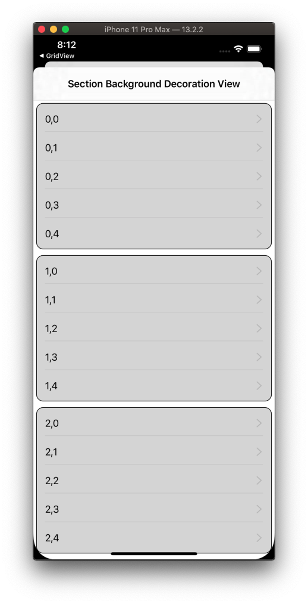

Create a view.

```swift
class SectionBackgroundDecorationView: UICollectionReusableView {

    override init(frame: CGRect) {
        super.init(frame: frame)
        configure()
    }
    required init?(coder: NSCoder) {
        fatalError("not implemented")
    }
}

extension SectionBackgroundDecorationView {
    func configure() {
        backgroundColor = UIColor.lightGray.withAlphaComponent(0.5)
        layer.borderColor = UIColor.black.cgColor
        layer.borderWidth = 1
        layer.cornerRadius = 12
    }
}
```

Register it.

```swift
        layout.register(
            SectionBackgroundDecorationView.self,
            forDecorationViewOfKind: SectionDecorationViewController.sectionBackgroundDecorationElementKind)
```

Add it as a decoration to the section.

```swift
    func createLayout() -> UICollectionViewLayout {
        let sectionBackgroundDecoration = NSCollectionLayoutDecorationItem.background(
            elementKind: SectionDecorationViewController.sectionBackgroundDecorationElementKind)
        sectionBackgroundDecoration.contentInsets = NSDirectionalEdgeInsets(top: 5, leading: 5, bottom: 5, trailing: 5)
        section.decorationItems = [sectionBackgroundDecoration]
    }
```

## Orthogonal Scrolling

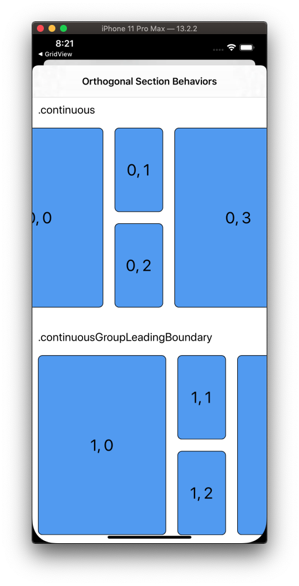

You can create orthogonal layouts that scroll like this:

```swift
    func createLayout() -> UICollectionViewLayout {
    	section.orthogonalScrollingBehavior = .continuous // Boom!
    }
```

And then choose from one of these scrolling types:

```swift
public enum UICollectionLayoutSectionOrthogonalScrollingBehavior : Int {
    case continuous
    case continuousGroupLeadingBoundary
    case paging
    case groupPaging
    case groupPagingCentered
}
```


## Custom Layout

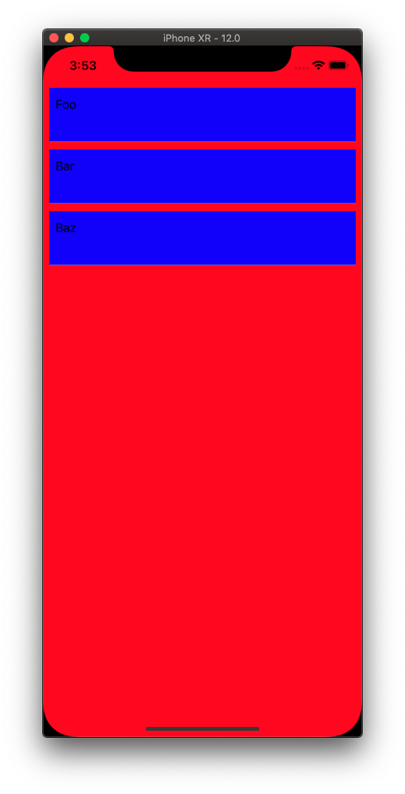

First define a custom column flow layout that specifies the width, height, and insets of each item in your collection.


```swift
//
//  ColumnFlowLayout.swift
//  UICollectionViewTableFlowLayout
//
//  Created by Jonathan Rasmusson (Contractor) on 2019-01-10.
//  Copyright © 2019 Jonathan Rasmusson. All rights reserved.
//

import UIKit

class ColumnFlowLayout: UICollectionViewFlowLayout {

    override func prepare() {
        super.prepare()

        guard let cv = collectionView else { return }

        // set our width x height
        itemSize = CGSize(width: cv.bounds.inset(by: cv.layoutMargins).size.width, height: 70.0)

        // set inset
        sectionInset = UIEdgeInsets(top: minimumInteritemSpacing, left: 0.0, bottom: 0.0, right: 0.0)

        // set inset reference
        sectionInsetReference = .fromSafeArea
    }
}

```

Then create a `UIViewContoller` extending `UICollectionViewController`. Here we fetch our data, populate of collection view cell, and call `reload()` which loads the collection view.

Note: When you do this by extending the `UICollectionViewController` you don't have to specifiy any autolayout. The `UIViewController` is the view and it automatically instantiates a `UICollectionView` for you, and sets up up as the `dataSource` and `delegate`.

```swift
//
//  ViewController.swift
//  UICollectionViewTableFlowLayout
//
//  Created by Jonathan Rasmusson on 2019-01-10.
//  Copyright © 2019 Jonathan Rasmusson. All rights reserved.
//

import UIKit

class ViewController: UICollectionViewController {

    var articles = [SupportArticle]()

    override func viewDidLoad() {
        super.viewDidLoad()

        setupViews()
        fetchArticles()
    }

    func setupViews() {
        collectionView?.backgroundColor = .red
        collectionView?.register(SupportArticleCell.self, forCellWithReuseIdentifier: SupportArticleCell.identifier)
    }

    func fetchArticles() {
        let article1 = SupportArticle(name: "Foo", url: "http://foo")
        let article2 = SupportArticle(name: "Bar", url: "http://bar")
        let article3 = SupportArticle(name: "Baz", url: "http://baz")

        articles =  [article1, article2, article3]

        collectionView?.reloadData()
    }

}

// MARK: - DataSource

extension ViewController {

    override func collectionView(_ collectionView: UICollectionView, numberOfItemsInSection section: Int) -> Int {
        return articles.count
    }

    override func collectionView(_ collectionView: UICollectionView, cellForItemAt indexPath: IndexPath) -> UICollectionViewCell {

        let cell = collectionView.dequeueReusableCell(withReuseIdentifier: SupportArticleCell.identifier, for: indexPath) as! SupportArticleCell
        cell.article = articles[indexPath.item]

        return cell
    }

}
```

Then define your data struct of the item you would have loaded as part of a json request.

```swift
//
//  SupportArticle.swift
//  UICollectionViewTableFlowLayout
//
//  Created by Jonathan Rasmusson (Contractor) on 2019-01-10.
//  Copyright © 2019 Jonathan Rasmusson. All rights reserved.
//

struct SupportArticle: Codable {
    let name: String?
    let url: String?
}
```

Define a customer cell. Here you do have to do autolayout and setup your rules.

```swift
//
//  SupportArticleCell.swift
//  UICollectionViewTableFlowLayout
//
//  Created by Jonathan Rasmusson (Contractor) on 2019-01-10.
//  Copyright © 2019 Jonathan Rasmusson. All rights reserved.
//

import UIKit

class SupportArticleCell: UICollectionViewCell {

    static let identifier = "SupportArticleCell"

    let nameLabel: UILabel = {
        let label = UILabel()
        label.translatesAutoresizingMaskIntoConstraints = false
        label.text = "Article 1"
        label.font = UIFont.systemFont(ofSize: 16)

        return label
    }()

    let separatorLineView: UIView = {
        let view = UIView()
        view.translatesAutoresizingMaskIntoConstraints = false
        view.backgroundColor = .lightGray

        return view
    }()

    var article: SupportArticle? {

        didSet {
            guard let article = article else { return }
            nameLabel.text = article.name
        }
    }

    override init(frame: CGRect) {

        super.init(frame: frame)

        setupViews()
    }

    required init?(coder aDecoder: NSCoder) {
        fatalError("init(coder:) has not been implemented")
    }

    func setupViews() {

        backgroundColor = .blue

        addSubview(nameLabel)
        addSubview(separatorLineView)

        nameLabel.topAnchor.constraint(equalTo: self.topAnchor, constant: 12).isActive = true
        nameLabel.leadingAnchor.constraint(equalTo: self.leadingAnchor, constant: 8).isActive = true
        nameLabel.trailingAnchor.constraint(equalTo: self.trailingAnchor, constant: -8).isActive = true

        separatorLineView.leadingAnchor.constraint(equalTo: self.leadingAnchor).isActive = true
        separatorLineView.trailingAnchor.constraint(equalTo: self.trailingAnchor).isActive = true
        separatorLineView.bottomAnchor.constraint(equalTo: self.bottomAnchor).isActive = true
        separatorLineView.heightAnchor.constraint(equalToConstant: 0.5).isActive = true
    }

}
```

Finally hook it up and instantiate with your custom `ColumnFlowLayout()`.

```swift
    func application(_ application: UIApplication, didFinishLaunchingWithOptions launchOptions: [UIApplication.LaunchOptionsKey: Any]?) -> Bool {
        window = UIWindow(frame: UIScreen.main.bounds)
        window?.makeKeyAndVisible()
        window?.rootViewController = ViewController(collectionViewLayout: ColumnFlowLayout())

        return true
    }
```

### An alternative way

Another way to get the table column flow is to use a standard `UICollectionViewFlowLayout` 

```swift
   let homeController = HomeController(collectionViewLayout: UICollectionViewFlowLayout())
   window?.rootViewController = UINavigationController(rootViewController: homeController)
```

And then override the size via the `delegate`.

```swift
extension HomeController: UICollectionViewDelegateFlowLayout { 

    func collectionView(_ collectionView: UICollectionView, layout collectionViewLayout: UICollectionViewLayout, sizeForItemAt indexPath: IndexPath) -> CGSize {

        // User Section
        if indexPath.section == 0 {

            let user = users[indexPath.item]
            let estimatedHeight = estimatedHeightForText(user.bioText)

            return CGSize(width: view.frame.width, height: estimatedHeight + 20 + 20 + 12 + 14 + 16)

        } else if indexPath.section == 1 {

            let tweet = tweets[indexPath.item]
            let estimatedHeight = estimatedHeightForText(tweet.message)

            return CGSize(width: view.frame.width, height: estimatedHeight + 20 + 20 + 12 + 14 + 16)
        }

        return CGSize(width: view.frame.width, height: 200)
    }

    private func estimatedHeightForText(_ text: String) -> CGFloat {

        // calculate estimated height of cell based on the bioTextView because it is the dynamic part of our cell
        // basically need to measure height of everything individually and just add it up...no magic except for the textView

        let approxWidth = view.frame.width - 12 - 50 - 12
        let approxHeight = CGFloat(1000) // just a guess
        let size = CGSize(width: approxWidth, height: approxHeight)
        let attributes = [NSAttributedString.Key.font: UIFont.systemFont(ofSize: 15)]

        let estimatedFrame = NSString(string: text).boundingRect(with: size, options: .usesLineFragmentOrigin, attributes: attributes, context: nil)

        return estimatedFrame.height
    }
```

### Adding a header

Adding a header is pretty easy. The main gotcha if your are using your own custom layout is you need to give the header an initial size. Else the header callback methods in your ViewController never get called.


```swift
class ColumnFlowLayout: UICollectionViewFlowLayout {

    override func prepare() {
        super.prepare()

        // important!
        headerReferenceSize = CGSize(width: collectionView.frame.size.width, height: 100);
    }
}
```

Then you can define your own customer head and use in ViewController as follows.

```swift
import UIKit

class SupportArticleHeaderCell: UICollectionViewCell {

    static let identifier = "SupportArticleHeaderCell"

    override init(frame: CGRect) {
        super.init(frame: frame)

        setupViews()
    }

    required init?(coder aDecoder: NSCoder) {
        fatalError("init(coder:) has not been implemented")
    }

    let textLabel: UILabel = {
        let label = UILabel()
        label.translatesAutoresizingMaskIntoConstraints = false
        label.text = "Header title"
        label.font = UIFont.systemFont(ofSize: 16)

        return label
    }()

    let separatorLineView: UIView = {
        let view = UIView()
        view.translatesAutoresizingMaskIntoConstraints = false
        view.backgroundColor = .lightGray

        return view
    }()

    func setupViews() {
        backgroundColor = .white

        addSubview(textLabel)
        addSubview(separatorLineView)

        textLabel.centerYAnchor.constraint(equalTo: self.centerYAnchor).isActive = true
        textLabel.leadingAnchor.constraint(equalTo: self.leadingAnchor, constant: 8).isActive = true

        separatorLineView.leadingAnchor.constraint(equalTo: self.leadingAnchor).isActive = true
        separatorLineView.trailingAnchor.constraint(equalTo: self.trailingAnchor).isActive = true
        separatorLineView.bottomAnchor.constraint(equalTo: self.bottomAnchor).isActive = true
        separatorLineView.heightAnchor.constraint(equalToConstant: 0.5).isActive = true
    }
}
```

```swift
class ViewController: UICollectionViewController {

    override func viewDidLoad() {
        super.viewDidLoad()

        setupViews()
    }

    func setupViews() {
        ...
        collectionView?.register(SupportArticleHeaderCell.self, forSupplementaryViewOfKind: UICollectionView.elementKindSectionHeader, withReuseIdentifier: SupportArticleHeaderCell.identifier)
        ...
    }
    
        // MARK: - Header

    override func collectionView(_ collectionView: UICollectionView, viewForSupplementaryElementOfKind kind: String, at indexPath: IndexPath) -> UICollectionReusableView {
        let header = collectionView.dequeueReusableSupplementaryView(ofKind: kind, withReuseIdentifier: SupportArticleHeaderCell.identifier, for: indexPath)
        header.backgroundColor = .yellow
        return header
    }
```


