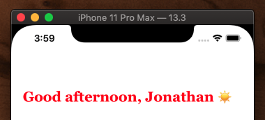
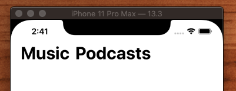
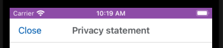

# UINavigationController

## Setting back button text

```swift
let vc = ViewConttoller()
navigationItem.backBarButtonItem = UIBarButtonItem(title: "Back", style: .plain, target: nil, action: nil)
navigationController?.pushViewController(vc, animated: true)
```

## How to hide the navigation bar on swipe

```swift
navigationController?.hidesBarsOnSwipe = true
```

## How to large titles

```
navigationController?.navigationBar.prefersLargeTitles = true
```


## How to style large titles

```swift
func application(_ application: UIApplication, didFinishLaunchingWithOptions launchOptions: [UIApplication.LaunchOptionsKey: Any]?) -> Bool {
        window = UIWindow(frame: UIScreen.main.bounds)
        window?.makeKeyAndVisible()
        window?.backgroundColor = .systemBackground
        
        let navigationController = UINavigationController(rootViewController: HomeController())
        window?.rootViewController = navigationController
        
        navigationController.navigationBar.prefersLargeTitles = true
        
        let attrs = [
            NSAttributedString.Key.foregroundColor: UIColor.label,
            NSAttributedString.Key.font: UIFont.preferredFont(forTextStyle: .title1).withTraits(traits: .traitBold)
        ]

        navigationController.navigationBar.largeTitleTextAttributes = attrs
        
        return true
    }
```



## How to create a title bar button item



You basically create a `UIBarButtonItem` and set the font via `NSAttributedString`. Note how the color also adapts for dark mode.

```swift
import UIKit

class ViewController: UIViewController {
    
    lazy var leftBarButtonItem: UIBarButtonItem = {
        let barButtonItem = UIBarButtonItem(title: "Music", style: .plain, target: self, action: #selector(leftTapped))
        
        barButtonItem.setTitleTextAttributes([
            NSAttributedString.Key.font: UIFont.preferredFont(forTextStyle: .largeTitle).withTraits(traits: [.traitBold]),
            NSAttributedString.Key.foregroundColor: UIColor.label],
                                             for: .normal)

        return barButtonItem
    }()
    
    lazy var rightBarButtonItem: UIBarButtonItem = {
        let barButtonItem = UIBarButtonItem(title: "Podcasts", style: .plain, target: self, action: #selector(leftTapped))
        
        barButtonItem.setTitleTextAttributes([
            NSAttributedString.Key.font: UIFont.preferredFont(forTextStyle: .largeTitle).withTraits(traits: [.traitBold]),
            NSAttributedString.Key.foregroundColor: UIColor.label],
                                             for: .normal)
        
        return barButtonItem
    }()
    
    override func viewDidLoad() {
        super.viewDidLoad()
        setupNavBar()
    }

    func setupNavBar() {
        navigationController?.navigationBar.prefersLargeTitles = true
        navigationController?.hidesBarsOnSwipe = true
        
        navigationItem.leftBarButtonItems = [leftBarButtonItem, rightBarButtonItem]
    }
    
    @objc func leftTapped() {}
    @objc func rightTapped() {}
}

extension UIFont {
    func withTraits(traits: UIFontDescriptor.SymbolicTraits) -> UIFont {
        let descriptor = fontDescriptor.withSymbolicTraits(traits)
        return UIFont(descriptor: descriptor!, size: 0) //size 0 means keep the size as it is
    }

    func bold() -> UIFont {
        return withTraits(traits: .traitBold)
    }

    func italic() -> UIFont {
        return withTraits(traits: .traitItalic)
    }
}
```

## How to make status bar white

```swift
extension UINavigationController {
    override open var preferredStatusBarStyle: UIStatusBarStyle {
        return .lightContent
    }
}
```


## How to set the styling for the entire app - Appearance Proxy

Instead of styling your navigation bar like this in a ViewController

```swift
navigationController?.navigationBar.titleTextAttributes = [NSAttributedString.Key.foregroundColor: UIColor.white]

navigationController?.navigationBar.isTranslucent = false
navigationController?.navigationBar.barTintColor = .lightRed
navigationController?.navigationBar.prefersLargeTitles = true
navigationController?.navigationBar.largeTitleTextAttributes = [NSAttributedString.Key.foregroundColor: UIColor.white]
```

Goto your AppDelegate and in didFinishLoading change it for all nav bars in your application like this

```swift
UINavigationBar.appearance().titleTextAttributes = [NSAttributedString.Key.foregroundColor: UIColor.white]

UINavigationBar.appearance().isTranslucent = false
UINavigationBar.appearance().barTintColor = .lightRed
UINavigationBar.appearance().backgroundColor = .systemTeal
UINavigationBar.appearance().prefersLargeTitles = true
UINavigationBar.appearance().largeTitleTextAttributes = [NSAttributedString.Key.foregroundColor: UIColor.white]
```


## Basics

Here is a simple example of how to embed your whole application in a `UINavigationController` and have it present a single screen.

AppDelegate

```swift
     func application(_ application: UIApplication, didFinishLaunchingWithOptions launchOptions: [UIApplication.LaunchOptionsKey: Any]?) -> Bool {
        window = UIWindow(frame: UIScreen.main.bounds)
        window?.makeKeyAndVisible()

        let navigatorController = UINavigationController(rootViewController: ViewController())
        window?.rootViewController = navigatorController

        return true
    }
```

### Push

Since we are already in a `UINavigationController` in our mainVC, we can either `push` a new `UIViewController` and get a free back button.

```swift
   @objc func nextPressed(sender: UIButton!) {
        self.navigationController?.pushViewController(Page1ViewController(), animated: true)
    }
```

Just remember that because we are on the stack, we need to pop ourselves off to return to root.

```swift
    @objc func dismissPressed(sender: UIButton!) {
        self.navigationController?.popViewController(animated: true)
    }
```


### Present

Or we can present modally and manually dismiss ourselves in the presented viewcontroller.

```swift
    @objc func nextPressed(sender: UIButton!) {
        self.navigationController?.present(Page1ViewController(), animated: true)
    }
```

```swift
    @objc func dismissPressed(sender: UIButton!) {
        dismiss(animated: true, completion: nil)
    }
```

Note: When your present yourself modally, you lose the navigationController you were originally in. If you wanted to present yourself within a navigationBar again, you would need to create a new one, and add yourself to that. You may need to do this if you are unable to style the original or override something unavaabile (like the content style).

```swift
    @objc func handleNexzt() {

        let createCompanyController = CreateCompanyController()
        createCompanyController.delegate = self

        let navController = CustomNavigationController(rootViewController: createCompanyController)

        present(navController, animated: true, completion: nil)
    }
```


## NavigationBar Attributes

Working with the `UINavigationBar` can be confusing. Some APIs, like the background color are on the bar, the text title attributes are set on the `UINavigationBar.appearance(), and things like the title can only be set from the `UIViewController` being displayed.

Here is a rundown on how to set the most popular attributes on the `UINavigationBar`.

### How to set the background color

```swift
navigatorController.navigationBar.barTintColor = .blue
```

### How to set the text attributes on the title

This is done app wide by setting them on the `UINavigationBar.appearance()`.

```swift
        let navigatorController = UINavigationController(rootViewController: ViewController())
        window?.rootViewController = navigatorController

        navigatorController.navigationBar.barTintColor = .blue
        
        let color = UIColor.white
        let font = UIFont(name: "CourierNewPS-BoldMT", size: 24)!

        let attributes: [NSAttributedString.Key: AnyObject] = [
            NSAttributedString.Key.font: font,
            NSAttributedString.Key.foregroundColor: color
        ]

        UINavigationBar.appearance().titleTextAttributes = attributes
```


Note: These need to be set as a group, else the last attribute set will override what was previously there.

## Custom BarButton Items

So there are back bar button items were you can set the text of the back button with the back chevron like this:

```swift
navigationItem.backBarButtonItem = UIBarButtonItem(title: "Close", style: .plain, target: nil, action: nil)
```

But if you don't the chevron, you can override by placing a left bar button item in its place:

```swift
navigationItem.hidesBackButton = true
let closeButton = UIBarButtonItem(title: "Close", style: .plain, target: self, action: #selector(closeTapped))
closeButton.tintColor = .systemBlue
navigationItem.leftBarButtonItem = closeButton
```



Do this in the view controller that is getting loaded.

We can add `UIBarButtonItem`s to our navigation bar.

```swift
    lazy var leftBarButtonItem: UIBarButtonItem = {
        let barButtonItem = UIBarButtonItem(title: "Left Item", style: .plain, target: self, action: #selector(leftTapped))
        barButtonItem.tintColor = UIColor.red
        return barButtonItem
    }()

    lazy var rightBarButtonItem: UIBarButtonItem = {
        let barButtonItem = UIBarButtonItem(title: "Right Item", style: .plain, target: self, action: #selector(rightTapped))
        barButtonItem.tintColor = UIColor.blue
        return barButtonItem
    }()
    
    ...
    
    func setupNavigationBar() {
        self.title = "Login"
        self.navigationItem.rightBarButtonItem = rightBarButtonItem
        self.navigationItem.leftBarButtonItem = leftBarButtonItem
    }

```

## How to change the color of the built in back button

```swift
    @objc func buttonPressed(sender: UIButton!) {
        let navigationController = UINavigationController(rootViewController: Page1ViewController())
        navigationController.navigationBar.tintColor = customBlue()
        present(navigationController, animated: true)
    }
```

## How to hide the bottom pixel on navigation bar

That bottom pixel border you see on the navigation bar is a shadow image. You can make it go away by doing this.

```swift
        let img = UIImage()
        self.navigationController?.navigationBar.shadowImage = img
        self.navigationController?.navigationBar.setBackgroundImage(img, for: .default)
        self.navigationController?.navigationBar.isTranslucent = false
```


## How to change the title of back button

The title of the back button belongs to the viewController that pushed the current VC onto the stack. Not the viewController you are currently on. So to set the back button title, you need to do it before you push on the previous viewController.

```swift
    @objc func gettingStartedPressed(sender: UIButton!) {
        let backItem = UIBarButtonItem()
        backItem.title = "Foo"
        navigationItem.backBarButtonItem = backItem

        self.navigationController?.pushViewController(Page2ViewController(), animated: true)
    }
 ```
 
 If you want to blank out the text on the back button just set the above title to "".
 
 ## How to hide the back button
 
 This will hide the back button on the `ViewController` you are currently on.
 
 ```swift
 navigationItem.hidesBackButton = true
 ```
 
## How to add an action to a UIBarButtonItem

If you create a `UIBarButtonItem` like this

```swift
    let rightBarButtonItem: UIBarButtonItem = {
        let barButtonItem = UIBarButtonItem(title: "X", style: .plain, target: self, action: nil)
        barButtonItem.tintColor = shawBlue()

        return barButtonItem
    }()
```

Beware that you need to add an `target` and `action` to it like this

```swift
    func setupNavigationBar() {
        rightBarButtonItem.target = self
        rightBarButtonItem.action = #selector(Page1ViewController.dismissPressed(sender: ))
        self.navigationItem.rightBarButtonItem = rightBarButtonItem
    }
    
    @objc func dismissPressed(sender: Any?) {
        print("dismissPressed")
        dismiss(animated: true, completion: nil)
    }
```

That's because when the computed property is created, self is not yet set into a state that can respond to that target in the responder chain. So it never gets fired. But I am not really sure why. Maybe someone can confirm. 

`target: self` pulls you out of the responder chain, but nil passes it on. 

Todo: Google Cocoa Core Competencies - and read about responder chain and delegate.

## How to detect back button pressed

```swift
    override func viewWillDisappear(_ animated: Bool) {
        super.viewWillDisappear(animated)

        if self.isMovingFromParent {
           // back button pressed
        }
    }

```

### Links that help

* [Programmatic UINavigation Controller](https://medium.com/whoknows-swift/swift-the-hierarchy-of-uinavigationcontroller-programmatically-91631990f495)
