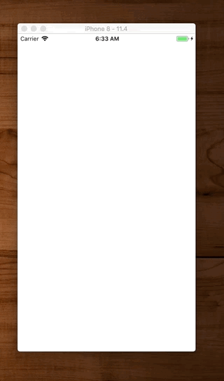
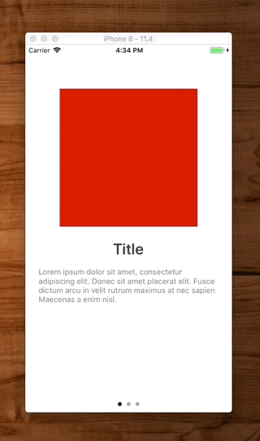

# UIPageViewController

`UIPageViewController` consists of a main content page, followed by a series of `UIViewController`s you stick inside it.

## Using UIPageViewController as child view controller



With this technique you are embedding the `UIPageViewController` into your view controller as a child view controller.

Advantage here is you get the `UIPageControl` setup and enabled for free. Simpler and less code.

```swift
import UIKit

class ViewController: UIViewController {

    let pageViewController: UIPageViewController
    var pages = [UIViewController]()
    var currentVC: UIViewController {
        didSet {
//            guard let index = pages.firstIndex(of: currentVC) else { return }
//            nextButton.isHidden = index == pages.count - 1
//            backButton.isHidden = index == 0
//            doneButton.isHidden = !(index == pages.count - 1)
        }
    }
    
    override init(nibName nibNameOrNil: String?, bundle nibBundleOrNil: Bundle?) {
        self.pageViewController = UIPageViewController(transitionStyle: .scroll, navigationOrientation: .horizontal, options: nil)
        
        let page1 = ViewController1()
        let page2 = ViewController2()
        let page3 = ViewController3()
        
        self.pages.append(page1)
        self.pages.append(page2)
        self.pages.append(page3)
        
        self.currentVC = pages.first!
        
        super.init(nibName: nibNameOrNil, bundle: nibBundleOrNil)
    }
    
    required init?(coder: NSCoder) {
        fatalError("init(coder:) has not been implemented")
    }
    
    override func viewDidLoad() {
        super.viewDidLoad()
        
        view.backgroundColor = .systemPurple
        
        addChild(pageViewController)
        view.addSubview(pageViewController.view)
        pageViewController.didMove(toParent: self)
        
        pageViewController.dataSource = self
        pageViewController.view.translatesAutoresizingMaskIntoConstraints = false
        
        NSLayoutConstraint.activate([
            view.topAnchor.constraint(equalTo: pageViewController.view.topAnchor),
            view.leadingAnchor.constraint(equalTo: pageViewController.view.leadingAnchor),
            view.trailingAnchor.constraint(equalTo: pageViewController.view.trailingAnchor),
            view.bottomAnchor.constraint(equalTo: pageViewController.view.bottomAnchor),
        ])
        
        pageViewController.setViewControllers([pages.first!], direction: .forward, animated: false, completion: nil)
        currentVC = pages.first!
    }
}

// MARK: - UIPageViewControllerDataSource

extension ViewController: UIPageViewControllerDataSource {

    func pageViewController(_ pageViewController: UIPageViewController, viewControllerBefore viewController: UIViewController) -> UIViewController? {
        return getPreviousViewController(from: viewController)
    }

    func pageViewController(_ pageViewController: UIPageViewController, viewControllerAfter viewController: UIViewController) -> UIViewController? {
        return getNextViewController(from: viewController)
    }

    private func getPreviousViewController(from viewController: UIViewController) -> UIViewController? {
        guard let index = pages.firstIndex(of: viewController), index - 1 >= 0 else { return nil }
        self.currentVC = pages[index - 1]
        return pages[index - 1]
    }

    private func getNextViewController(from viewController: UIViewController) -> UIViewController? {
        guard let index = pages.firstIndex(of: viewController), index + 1 < pages.count else { return nil }
        self.currentVC = pages[index + 1]
        return pages[index + 1]
    }

    func presentationCount(for pageViewController: UIPageViewController) -> Int {
        return pages.count
    }

    func presentationIndex(for pageViewController: UIPageViewController) -> Int {
        return pages.firstIndex(of: self.currentVC) ?? 0
    }
}

// MARK: - ViewControllers
class ViewController1: UIViewController {
    override func viewDidLoad() {
        super.viewDidLoad()
        view.backgroundColor = .systemRed
    }
}

class ViewController2: UIViewController {
    override func viewDidLoad() {
        super.viewDidLoad()
        view.backgroundColor = .systemGreen
    }
}

class ViewController3: UIViewController {
    override func viewDidLoad() {
        super.viewDidLoad()
        view.backgroundColor = .systemBlue
    }
}
```


## Extending UIPageViewController



Here you extend `UIPageViewController`. 

Pros:

- Inherit access to delegates
- Manual control over location of `UIPageControl`

Cons:

- Must manually update state of `UIPageControl`
- Must track extra variables in order to do that (i.e. `previousIndex`).

```swift
import UIKit

/*
 Simple example of UIPageViewController.
*/

class ViewController: UIPageViewController {

    var pages = [UIViewController]()
    let pageControl = UIPageControl()
    let initialPage = 0
    var previousIndex = 0
    
    override func viewDidLoad() {
        super.viewDidLoad()
        
        setup()
        style()
        layout()
    }
}

extension ViewController {
    
    func setup() {
        dataSource = self
        delegate = self
        
        pageControl.addTarget(self, action: #selector(pageControlTapped(_:)), for: .valueChanged)

        // add the individual viewControllers to the pageViewController
        let page1 = ViewController1()
        let page2 = ViewController2()
        let page3 = ViewController3()

        pages.append(page1)
        pages.append(page2)
        pages.append(page3)
        setViewControllers([pages[initialPage]], direction: .forward, animated: true, completion: nil)
    }
    
    func style() {
        pageControl.translatesAutoresizingMaskIntoConstraints = false
        pageControl.currentPageIndicatorTintColor = .black
        pageControl.pageIndicatorTintColor = .systemGray2
        pageControl.numberOfPages = pages.count
        pageControl.currentPage = initialPage
    }
    
    func layout() {
        view.addSubview(pageControl)
        
        NSLayoutConstraint.activate([
            pageControl.widthAnchor.constraint(equalTo: view.widthAnchor),
            pageControl.heightAnchor.constraint(equalToConstant: 20),
            view.bottomAnchor.constraint(equalToSystemSpacingBelow: pageControl.bottomAnchor, multiplier: 1),
        ])
    }
}

// MARK: - Actions

extension ViewController {
    
    // How we change page when pageControl tapped. Can only skip ahead one page at a time.
    @objc func pageControlTapped(_ sender: UIPageControl) {
        let newIndex = sender.currentPage
                
        // compare with previous to set direction
        let direction: UIPageViewController.NavigationDirection
        if previousIndex < newIndex {
            direction = .forward
        } else {
            direction = .reverse
        }
        setViewControllers([pages[sender.currentPage]], direction: direction, animated: true, completion: nil)
        
        previousIndex = newIndex
    }
}

// MARK: - DataSources

extension ViewController: UIPageViewControllerDataSource {
    
    func pageViewController(_ pageViewController: UIPageViewController, viewControllerBefore viewController: UIViewController) -> UIViewController? {
        guard let currentIndex = pages.firstIndex(of: viewController) else { return nil }
        previousIndex = currentIndex
        
        if currentIndex == 0 {
            return pages.last               // wrap to last
        } else {
            return pages[currentIndex - 1]  // go previous
        }
    }
    
    func pageViewController(_ pageViewController: UIPageViewController, viewControllerAfter viewController: UIViewController) -> UIViewController? {
        guard let currentIndex = pages.firstIndex(of: viewController) else { return nil }
        previousIndex = currentIndex

        if currentIndex < pages.count - 1 {
            return pages[currentIndex + 1]  // go next
        } else {
            return pages.first              // wrap to first
        }
    }
}

// MARK: - Delegates

extension ViewController: UIPageViewControllerDelegate {
    
    // How we keep our pageControl in sync with viewControllers
    func pageViewController(_ pageViewController: UIPageViewController, didFinishAnimating finished: Bool, previousViewControllers: [UIViewController], transitionCompleted completed: Bool) {
        
        guard let viewControllers = pageViewController.viewControllers else { return }
        guard let currentIndex = pages.firstIndex(of: viewControllers[0]) else { return }
        
        pageControl.currentPage = currentIndex
    }
}

// MARK: - ViewControllers

class ViewController1: UIViewController {
    override func viewDidLoad() {
        super.viewDidLoad()
        view.backgroundColor = .systemRed
    }
}

class ViewController2: UIViewController {
    override func viewDidLoad() {
        super.viewDidLoad()
        view.backgroundColor = .systemGreen
    }
}

class ViewController3: UIViewController {
    override func viewDidLoad() {
        super.viewDidLoad()
        view.backgroundColor = .systemBlue
    }
}
```

## TransitionStyle

There are two types of transitions files. `.pageCurl` was you saw at the top. The other is `.scroll`.

```swift
window?.rootViewController = PageViewController(transitionStyle: .scroll, navigationOrientation: .horizontal, options: nil)
```


## Adding animations


To add animations to `UIPageViewController`s there are three things you need to look up for

- `UIViewController` lifecycle
- setting and reusing constraints
- manually calling for autolayout needs layout

Basically you need to break your setting up of constraints into three stages

- static
- preAnimate
- animate

Otherwise you will get conflicting constraints and the animation and static constraints try to clobber each other.

Secondly, for constraints you want to animate, you want to create them once and then reuse them. Simply change the constant to the pre and post animate values and let the animation do it's thing.

Thridly, and this is big, you need to call `layoutIfNeeded` at the right time to get the animation to render on top of the static views correctly. This one is confusing because without `UIPageViewController` you may not need to do this. But with it you do.

```swift
//
//  ViewController.swift
//  UIPageViewContoller
//
//  Created by Jonathan Rasmusson (Contractor) on 2018-09-13.
//  Copyright © 2018 Jonathan Rasmusson (Contractor). All rights reserved.
//

import UIKit

class ViewController1: UIViewController {

    var titleLabelTopConstraint : NSLayoutConstraint? // 1
    var bodyLabelTopConstraint : NSLayoutConstraint?

    let billImageView: UIImageView = {
        let imageView = UIImageView()
        imageView.translatesAutoresizingMaskIntoConstraints = false
        imageView.backgroundColor = .red

        return imageView
    }()

    let titleLabel: UILabel = {
        let label = UILabel()
        label.translatesAutoresizingMaskIntoConstraints = false
        label.text = "Title1"
        label.font = UIFont.boldSystemFont(ofSize: 28)
        label.textAlignment = .center
        label.textColor = UIColor(red:0.2, green:0.26, blue:0.31, alpha:1)

        return label
    }()

    let bodyLabel: UILabel = {
        let label = UILabel()
        label.translatesAutoresizingMaskIntoConstraints = false
        label.text = "Lorem ipsum dolor sit amet, consectetur adipiscing elit. Donec sit amet placerat elit. Fusce dictum arcu in velit rutrum maximus at nec sapien. Maecenas a enim nisl."
        label.numberOfLines = 0
        label.lineBreakMode = .byWordWrapping
        label.font = UIFont.systemFont(ofSize: 14)
        label.textColor = UIColor.gray
        label.textAlignment = .center

        return label
    }()

    override func viewDidLoad() {
        super.viewDidLoad()

        setupStaticConstraints()
    }

    override func viewWillAppear(_ animated: Bool) {
        super.viewWillAppear(animated)

        prepForAnimation()
    }

    override func viewDidAppear(_ animated: Bool) {
        super.viewDidAppear(animated)

        animate()
    }

    func setupStaticConstraints() {
        view.backgroundColor = .white

        view.addSubview(billImageView)
        view.addSubview(titleLabel)
        view.addSubview(bodyLabel)

        billImageView.topAnchor.constraint(equalTo: view.safeAreaLayoutGuide.topAnchor, constant: 80).isActive = true
        billImageView.centerXAnchor.constraint(equalTo: view.centerXAnchor).isActive = true
        billImageView.heightAnchor.constraint(equalToConstant: 250).isActive = true
        billImageView.widthAnchor.constraint(equalToConstant: 250).isActive = true

        titleLabelTopConstraint = titleLabel.topAnchor.constraint(equalTo: billImageView.bottomAnchor, constant: 120) // 2
        titleLabelTopConstraint?.isActive = true
        titleLabel.centerXAnchor.constraint(equalTo: view.centerXAnchor).isActive = true

        bodyLabelTopConstraint = bodyLabel.topAnchor.constraint(equalTo: billImageView.bottomAnchor, constant: 120)
        bodyLabelTopConstraint?.isActive = true
        bodyLabel.centerXAnchor.constraint(equalTo: view.centerXAnchor).isActive = true
        bodyLabel.heightAnchor.constraint(equalToConstant: 250).isActive = true
        bodyLabel.widthAnchor.constraint(equalToConstant: 250).isActive = true

    }

    func prepForAnimation() {
        self.titleLabelTopConstraint?.constant = 60
        titleLabel.alpha = 0.0

        self.bodyLabelTopConstraint?.constant = 80
        bodyLabel.alpha = 0.0
    }

    func animate() {

        view.layoutIfNeeded() // forces pending layouts to complete before starting this animation

        UIView.animate(withDuration: 3) {
            self.titleLabelTopConstraint?.constant = 20 // 3
            self.titleLabel.alpha = 1
            self.view.layoutIfNeeded()
        }

        UIView.animate(withDuration: 3) {
            self.bodyLabelTopConstraint?.constant = -20
            self.bodyLabel.alpha = 1
            self.view.layoutIfNeeded()
        }
    }
}
```

