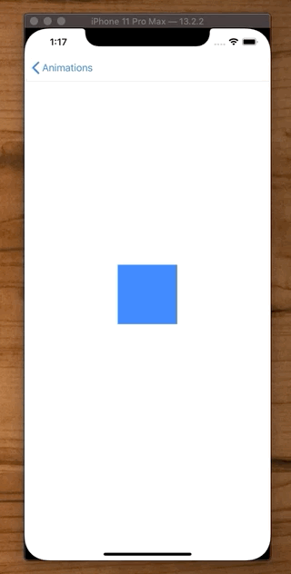

# UIPanGestureRecognizer

## Moving Block



```swift
//
//  MovingBox
//
//  Created by Jonathan Rasmusson Work Pro on 2020-04-13.
//  Copyright © 2020 Rasmusson Software Consulting. All rights reserved.
//

/*
 Moving Block
   This demo shows how to drag a block around the screen with your finger using a UIPanGestureRecognizer.
 */

import UIKit

class MovingBlock: UIViewController {
    
    var myView = UIView()
    var animator = UIViewPropertyAnimator()
    
    lazy var panRecognizer: UIPanGestureRecognizer = {
        let recognizer = UIPanGestureRecognizer()
        recognizer.addTarget(self, action: #selector(handlePan(recognizer:)))
        return recognizer
    }()
    
    override func viewDidLoad() {
        super.viewDidLoad()
        setup()
        layout()
        myView.addGestureRecognizer(panRecognizer)
    }
    
    func setup() {
        view.backgroundColor = .white
    }
    
    func layout() {
        myView = makeView()
        view.addSubview(myView)
        
        myView.heightAnchor.constraint(equalToConstant: 100).isActive = true
        myView.widthAnchor.constraint(equalToConstant: 100).isActive = true
        myView.centerYAnchor.constraint(equalTo: view.centerYAnchor).isActive = true
        myView.centerXAnchor.constraint(equalTo: view.centerXAnchor).isActive = true
    }
    
    func makeView() -> UIView {
        let myView = UIView()
        myView.translatesAutoresizingMaskIntoConstraints = false
        myView.backgroundColor = .systemBlue
        
        return myView
    }
    
    var initialCenter = CGPoint()  // The initial center point of the view.
    
    @objc private func handlePan(recognizer: UIPanGestureRecognizer) {
        guard let piece = recognizer.view else { return }
        
        let translation = recognizer.translation(in: piece.superview)
        let velocity = recognizer.velocity(in: piece.superview)
        
        switch recognizer.state {
        case .began:
            print("began translation:\(translation) \(velocity)")
            self.initialCenter = piece.center
        case .changed:
            print("changed translation:\(translation) \(velocity)")
            let newCenter = CGPoint(x: initialCenter.x + translation.x, y: initialCenter.y + translation.y)
            piece.center = newCenter
        case .ended:
            print("ended translation:\(translation) \(velocity)")
        default:
            print("default")
        }
    }
}
```


