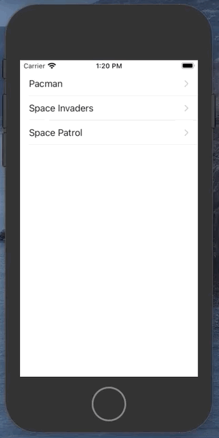

# UIRefresh

This is a control you can attach to any `UIScrollView`, including table views and collection views. It gives your users a standard way to refresh their contents. When the user drags the top of the scrollable content area downward, the scroll view reveals the refresh control, begings animating its progress indicator, and notifies your app. Use that notification to update your content and dismiss the refresh control



```swift
//
//  ViewController.swift
//  UIRefreshControl
//
//  Created by Rasmusson, Jonathan on 2021-03-05.
//

import UIKit

class ViewController: UIViewController {
        
    var games = [
        "Pacman",
        "Space Invaders",
        "Space Patrol",
    ]
    
    let cellId = "cellId"
    
    var tableView = UITableView()
    let refreshControl = UIRefreshControl()
    
    override func viewDidLoad() {
        super.viewDidLoad()
        setupViews()
    }
    
    func setupViews() {
        tableView.dataSource = self
        tableView.register(UITableViewCell.self, forCellReuseIdentifier: cellId)
        tableView.tableFooterView = UIView()

        refreshControl.tintColor = .systemRed
        refreshControl.addTarget(self, action: #selector(refreshContent), for: .valueChanged)
        tableView.refreshControl = refreshControl

        view = tableView
    }
    
    @objc func refreshContent() {
        games = [
            "Galaga",
            "Discs of Tron",
            "Defender",
        ]
        
        DispatchQueue.main.async {
            self.tableView.reloadData()
            self.tableView.refreshControl?.endRefreshing()
        }
    }
}

extension ViewController: UITableViewDataSource {
    func tableView(_ tableView: UITableView, cellForRowAt indexPath: IndexPath) -> UITableViewCell {
        let cell = tableView.dequeueReusableCell(withIdentifier: cellId, for: indexPath)

        cell.textLabel?.text = games[indexPath.row]
        cell.accessoryType = UITableViewCell.AccessoryType.disclosureIndicator

        return cell
    }

    func tableView(_ tableView: UITableView, numberOfRowsInSection section: Int) -> Int {
        return games.count
    }

    func tableView(_ tableView: UITableView, didSelectRowAt indexPath: IndexPath) {

    }
}
```

### Links that help

- [UIRefreshControl](https://developer.apple.com/documentation/uikit/uirefreshcontrol)