# UIScrollView

`UIScrollView`s aren't that bad so long as you remember that there are two sets of constraints:

1. The outer constraints between the `UIScrollView` and the outside world.
2. And the inner constraints between the inner content and the insides of the `UIScrollView` itself.

## View with a label

Scroll views work well when you:

- Add a view
- Pin it to the edges of the scroll view
- Set the views width equal to the parent of the scroll view width

### Setting up the view

- Add a view, set it's background to orange, and rename it `Content View`.

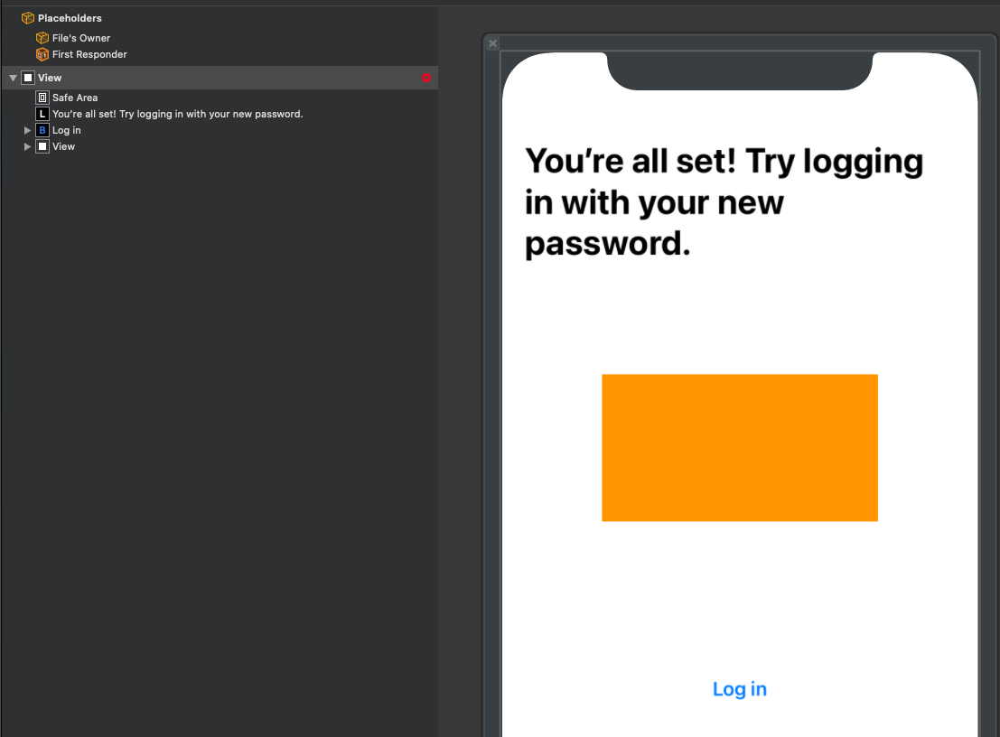

- Embed it in a scroll view.
- Pin the scroll view to the `Safe Area` of the parent view.
- And then drag the scroll view out to the safe area edges of the view.

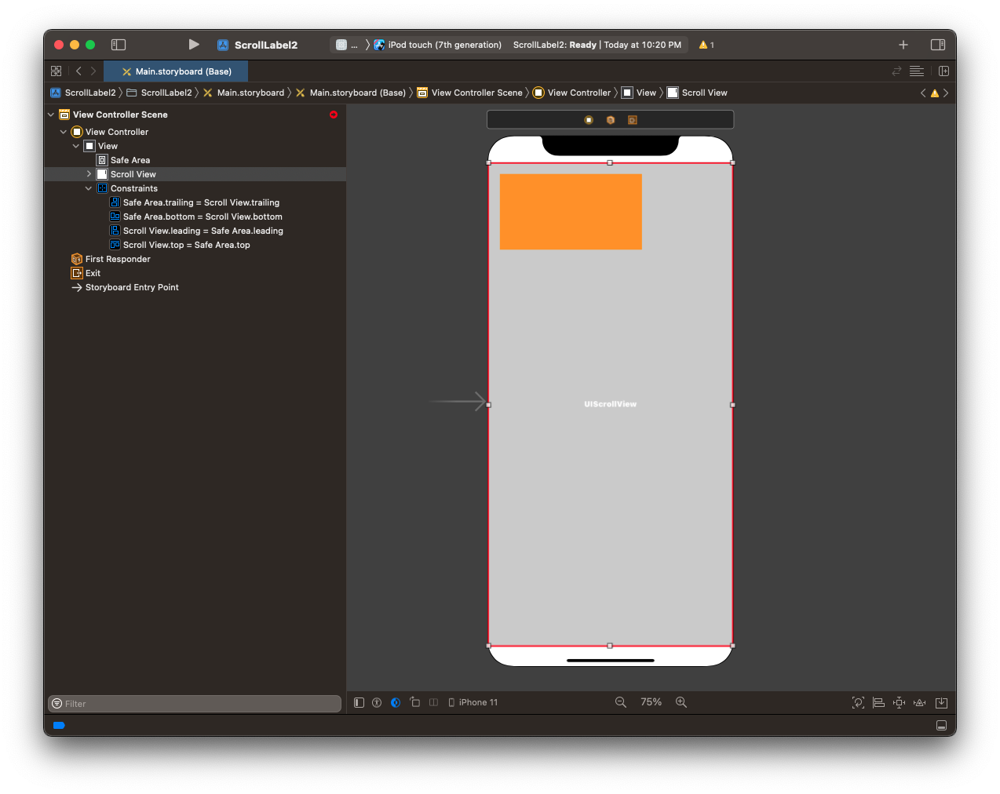

- Stretch the `Content View` to the edges of the scroll view.

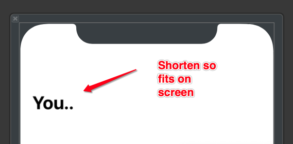

- Pin the `Content View` to the `Content Layout Guide` of the scroll view.
- Don't use the attribute tool in the bottom.
- Instead drag each one one-at-a-time like this.

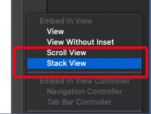

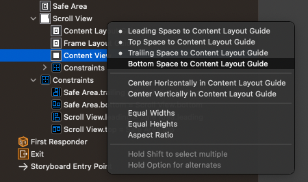

- Set the width of the `Content View` = width of the parent view of the scroll view (not the scroll view itself)

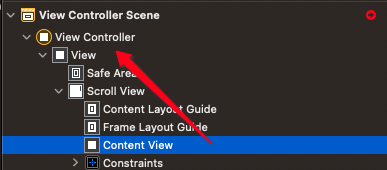

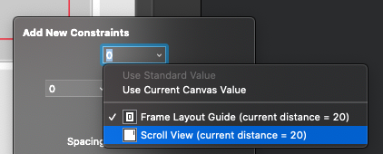

- At this point your embedded view is good to go. We still have an ambiguity error because there is nothing inside our view.

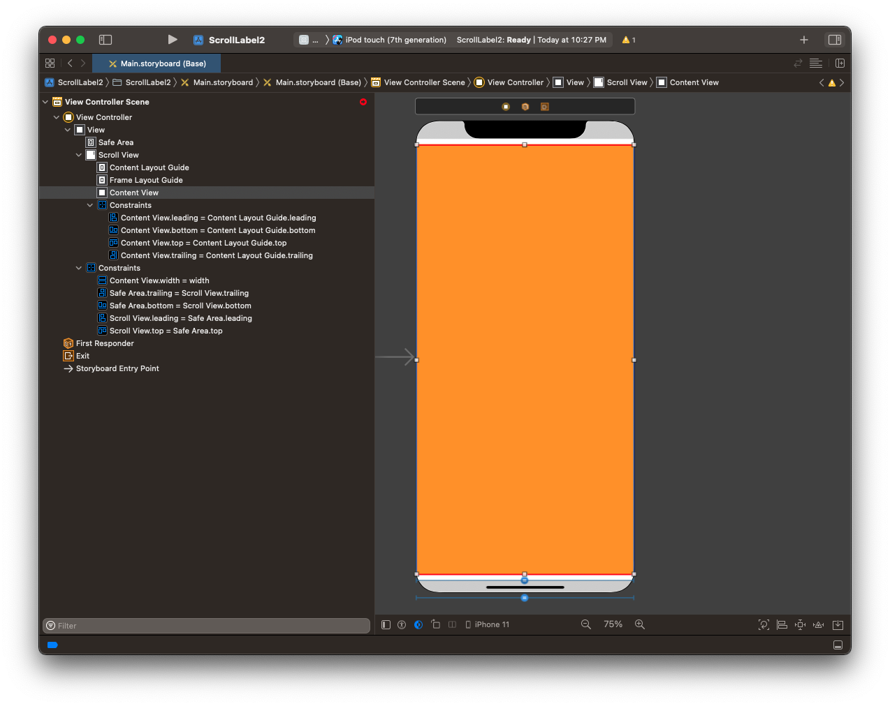

### Adding a label

- Add a label to the view and place it in the upper-right-hand corner.

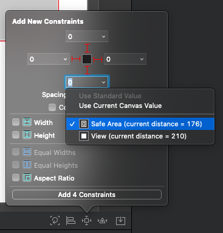

- Now simply pin the edges of the label to the edges of your inner `Content View`.
- Make the label multiline.

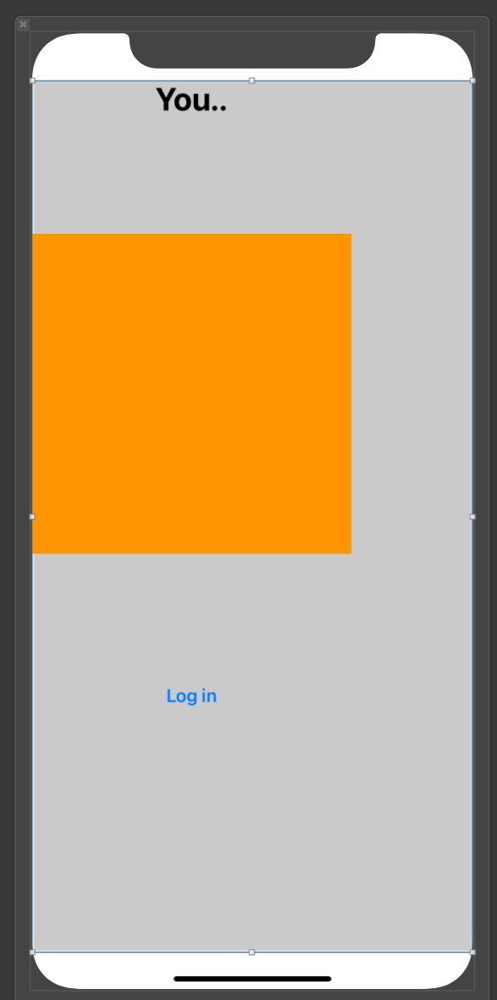

- At this point the ambiguity will be removed, and you are free to add as much text as you like to the label. 
- It will now scroll.

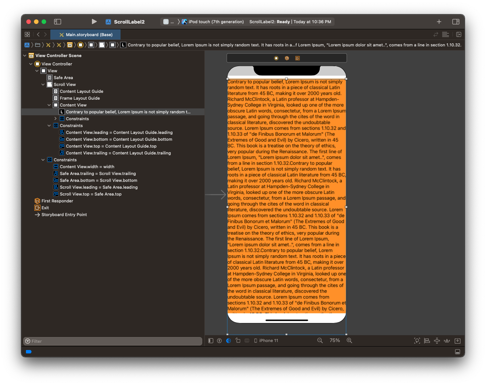

- You can now build any UI with scroll views you like.

### Links that help

* [Manually Scrolling](https://jayeshkawli.ghost.io/manually-scrolling-uiscrollview-ios-swift/)
* [Understanding UIScrollView](https://oleb.net/blog/2014/04/understanding-uiscrollview/)
* [Apple UIScrollView docs](https://developer.apple.com/documentation/uikit/uiscrollview)
* [Human Interface Guidelines](https://developer.apple.com/design/human-interface-guidelines/ios/views/scroll-views/)
* [Auto Layout UIScrollView](https://developer.apple.com/library/archive/documentation/UserExperience/Conceptual/AutolayoutPG/WorkingwithScrollViews.html#//apple_ref/doc/uid/TP40010853-CH24-SW1)
* [Example](https://blog.alltheflow.com/scrollable-uistackview)
