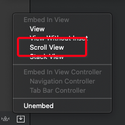
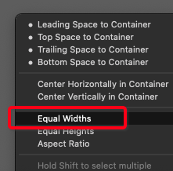
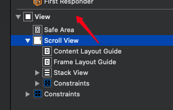
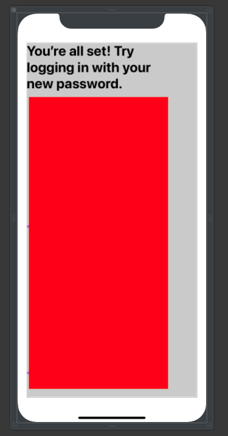
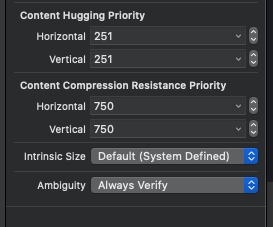
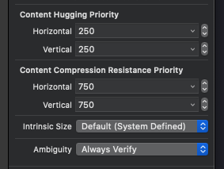
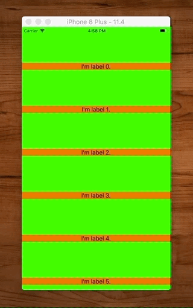

# UIScrollView


`UIScrollView`s aren't that bad so long as you remember that there are two sets of constraints:

1. The outer constraints between the `UIScrollView` and the outside world.
2. And the inner constraints between the inner content and the insides of the `UIScrollView` itself.

That and the fact the `UIScrollView` requires your content to have an intrinsic size. If you are purely using elements that already have an intrinsic size already set (`UILabel` and `UIImageView` you don't need to do anything. But if not you have to give your views a height or something else the layout won't work.


## The trick to understanding ScrollViews

The trick to understanding scroll views is you can't just rely on your contents intrinsic height to layout the scroll views content. You need an unbroken chain of constraints so the scroll view can calculate is scrollable area.

For example, if we add a label to a scroll view, but don't fully pin it to all the edge of the scroll view (and try to rely solely on it's intrinsic size like, this, we will get a warning.

```swift
label.topAnchor.constraint(equalTo: scrollView.topAnchor).isActive = true
label.leadingAnchor.constraint(equalTo: scrollView.leadingAnchor).isActive = true
label.trailingAnchor.constraint(equalTo: scrollView.trailingAnchor).isActive = true
```

`Warning: Constraints for scrollable content height are missing.`

And that's because even though the label has an intrinsic content size, the scroll view can't determine how much of the view is scrollable. The fix is make the chain of constraints unbroken. You can either.

Add a bottom anchor:

```label.bottomAnchor.constraint(equalTo: scrollView.bottomAnchor).isActive = true```

Give the label as explicit height:

```label.heightAnchor.constraint(equalToConstant: 300).isActive = true```

Or give the entire view an intrinsic content size:

```swift
    override var intrinsicContentSize: CGSize {
        return CGSize(width: 100, height: 100)
    }
```

Apple in their [docs](https://developer.apple.com/library/archive/documentation/UserExperience/Conceptual/AutolayoutPG/WorkingwithScrollViews.html) describes it like this:

> IMPORTANT
>
> Your layout must fully define the size of the content view (except where defined in steps 5 and 6). To set the height based on the intrinsic size of your content, you must have an unbroken chain of constraints and views stretching from the content view’s top edge to its bottom edge. Similarly, to set the width, you must have an unbroken chain of constraints and views from the content view’s leading edge to its trailing edge.
> 
> If your content does not have an intrinsic content size, you must add the appropriate size constraints, either to the content view or to the content.
> 
> When the content view is taller than the scroll view, the scroll view enables vertical scrolling. When the content view is wider than the scroll view, the scroll view enables horizontal scrolling. Otherwise, scrolling is disabled by default.
> 

## How to programmatically scroll


You can scroll to a position in your scroll view based on an offset.

```swift
override func viewDidAppear(_ animated: Bool) {
        super.viewDidAppear(animated)

        let contentSizeHeight = scrollView.contentSize.height
        let boundsHeight = scrollView.bounds.size.height
        let bottomOffset = CGPoint(x:0, y: contentSizeHeight - boundsHeight)
        scrollView.setContentOffset(bottomOffset, animated: true)

       // scrollView.setContentOffset(CGPoint(x: 0, y: 200), animated: true)
    }
```

> Note: This may not work in `viewDidLoad()` as view will not have been totally sized and rendered.

## StackView in ScrollView

[StackOverflow](https://stackoverflow.com/questions/31668970/is-it-possible-for-uistackview-to-scroll)

- Need to pin stack to inside of scroll.
- Pin the scroll to the edges of the main view
- Each subview will need an explicit height
- Constrain width or height to enbable scrolling by setting the width of the scroll view to the width of the parent view
- Bonus tip - if label too wide shorten text to ensure stackview fits on page

```swift
NSLayoutConstraint.activate([            
    scrollView.topAnchor.constraint(equalTo: headerView.bottomAnchor, constant: 8),
    scrollView.leadingAnchor.constraint(equalTo: view.leadingAnchor, constant: 8),
    scrollView.trailingAnchor.constraint(equalTo: view.trailingAnchor, constant: -8),
    scrollView.bottomAnchor.constraint(equalTo: view.safeAreaLayoutGuide.bottomAnchor),

    rootStackView.topAnchor.constraint(equalTo: scrollView.topAnchor),
    rootStackView.leadingAnchor.constraint(equalTo: scrollView.leadingAnchor),
    rootStackView.trailingAnchor.constraint(equalTo: scrollView.trailingAnchor),
    rootStackView.bottomAnchor.constraint(equalTo: scrollView.bottomAnchor),

    rootStackView.widthAnchor.constraint(equalTo: scrollView.widthAnchor),
])
```

## Vertical Scroll Stack View Example

Steps

- ensure all elements fit on screen
- embed in stack view
- embed in scroll view
- pin stack view to inside of scroll view
- pin scroll view to parent view
- stack view width = scroll view width
- scroll view width = view width

### Embed a stack view within a scroll view

Elements to embed.


- Shorten label so all text fits on screen.


- Select all elements and embed in stack view


- Select stack view and embed in scrollview



- Pin the stack view to the inside of the scroll view


- Ensure stack view constraint is pinned to `Scroll View`.


- Then pin the scroll view to the safe area of the parent view


### Widths

- Set the width of the stack view to the width of UIScrollView's superview, not UIScrollView itself.




- Then make the scroll view width the same as the parent view width. This constrains the scroll view vertically and makes it scrollable.




- Add back any long text you shortened in the beginning.



### Hugging and compression

Make your labels hug by bumping up to `251`.



Make your images stretch by lowering to `250`.





### Links that help

* [Manually Scrolling](https://jayeshkawli.ghost.io/manually-scrolling-uiscrollview-ios-swift/)
* [Understanding UIScrollView](https://oleb.net/blog/2014/04/understanding-uiscrollview/)
* [Apple UIScrollView docs](https://developer.apple.com/documentation/uikit/uiscrollview)
* [Human Interface Guidelines](https://developer.apple.com/design/human-interface-guidelines/ios/views/scroll-views/)
* [Auto Layout UIScrollView](https://developer.apple.com/library/archive/documentation/UserExperience/Conceptual/AutolayoutPG/WorkingwithScrollViews.html#//apple_ref/doc/uid/TP40010853-CH24-SW1)
* [Example](https://blog.alltheflow.com/scrollable-uistackview)
