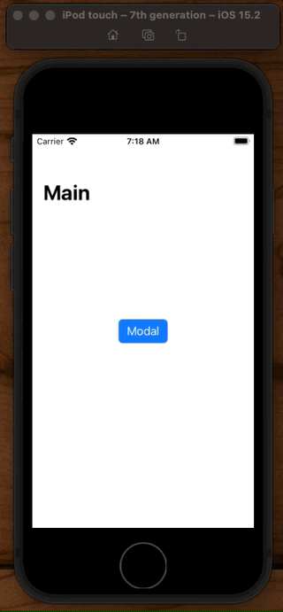
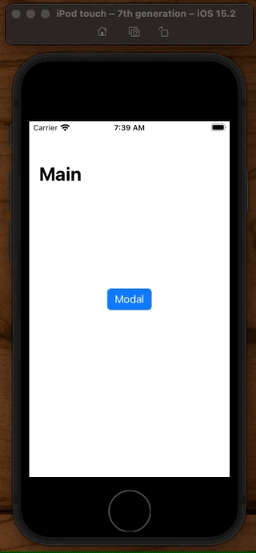
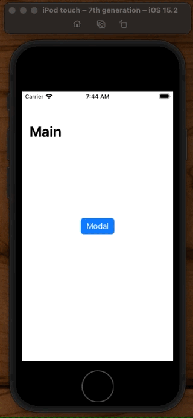
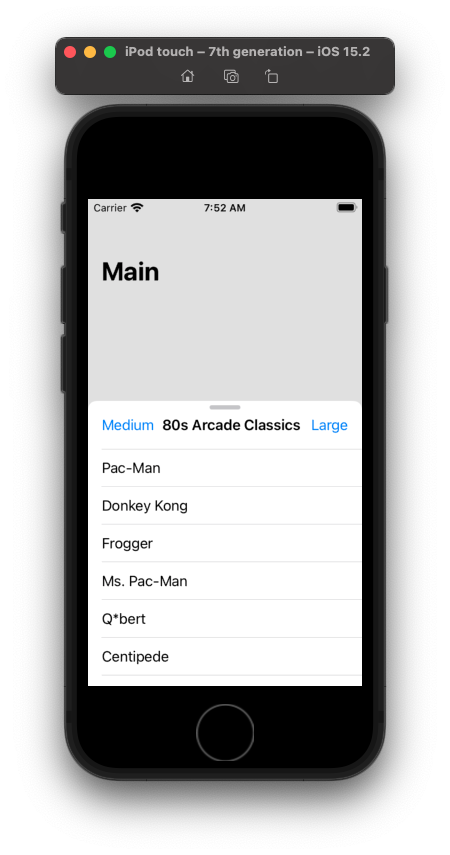

# UISheetPresentationController

- A presentation controller that manages the appearance and behavior of a sheet.
- Sheets are a subclass of `UISheetPresentationController`

## What are detents?

- a height where a sheet naturally rests
- a fraction of fully defined sheet frame (medium 1/2, large full)

### Basic usage



To make a child view controller appear has a 1/2 sized sheet:

```swift
@objc func presentModal(sender: UIButton) {
    // Create your child view controller
    let detailViewController = DetailViewController()

    // Set its sheet properties
    if let sheet = detailViewController.sheetPresentationController {
        sheet.detents = [.medium(), .large()]
    }
    present(detailViewController, animated: true, completion: nil)
}
```

By default this sheet will:

- expand when swiped up
- expand when scrolled up

### How to prevent scrolling up


You can turn off the sheet expansion due to a scroll like this:

```swift
@objc func presentModal(sender: UIButton) {
    let detailViewController = DetailViewController()
    let nav = UINavigationController(rootViewController: detailViewController)
    nav.modalPresentationStyle = .pageSheet

    if let sheet = nav.sheetPresentationController {
        sheet.detents = [.medium(), .large()]
        sheet.prefersScrollingExpandsWhenScrolledToEdge = false // add
    }
    present(nav, animated: true, completion: nil)
}
```

You can still make the sheet a `large()` detent height. You just need to grab the navigation bar and drag it up.

> Note here we are embedded in a navigation controller.

### How to change starting position

You can start in full detent mode like this:

```swift
sheet.detents = [.medium(), .large()]
sheet.selectedDetentIdentifier = .large
```

Also be sure to specifiy these as smallest to largest detents.

### Interact with underneath content

By default, when you enable a bottom sheet, UIKit disables the underneath content by dimming it and making it non-interactable.


You can change this behavior be setting the `largestUndimmedDetentIdentifier` on the `medium` detent.



That will make the dimming go away on the `medium` detent and allow you to interact with the view underneath.

```swift
@objc func presentModal(sender: UIButton) {
    let detailViewController = DetailViewController()
    let nav = UINavigationController(rootViewController: detailViewController)
    nav.modalPresentationStyle = .pageSheet

    if let sheet = nav.sheetPresentationController {
        sheet.detents = [.medium(), .large()]
        sheet.prefersScrollingExpandsWhenScrolledToEdge = false
        sheet.largestUndimmedDetentIdentifier = .medium // add
    }
    present(nav, animated: true, completion: nil)
}
```

### Prevent dismissal

To prevent the sheet from every dismissing set `isModalInPresentation` to `true`.



```swift
    @objc func presentModal(sender: UIButton) {
        let detailViewController = DetailViewController()
        let nav = UINavigationController(rootViewController: detailViewController)

        nav.modalPresentationStyle = .pageSheet
        nav.isModalInPresentation = true // add

        if let sheet = nav.sheetPresentationController {
            sheet.detents = [.medium(), .large()]
            sheet.prefersScrollingExpandsWhenScrolledToEdge = false
            sheet.largestUndimmedDetentIdentifier = .medium
        }
        present(nav, animated: true, completion: nil)
    }
```

Now if you want to dismiss the sheet, you'll need to add buttons or something else to the `nav` bar.

### Programmatically change the size

You can change the size of the sheets programmatically by setting `selectedDetentIdentifier`.

```swift
let detailViewController = DetailViewController()
let nav = UINavigationController(rootViewController: detailViewController)

if let sheet = nav.sheetPresentationController {
    sheet.detents = [.medium(), .large()]
}

let medium = UIBarButtonItem(title: "Medium", primaryAction: .init(handler: { _ in
    if let sheet = nav.sheetPresentationController {
        sheet.animateChanges {
            sheet.selectedDetentIdentifier = .medium
        }
    }
}))

let large = UIBarButtonItem(title: "Large", image: nil, primaryAction: .init(handler: { _ in
    if let sheet = nav.sheetPresentationController {
        sheet.animateChanges {
            sheet.selectedDetentIdentifier = .large
        }
    }
}))

detailViewController.navigationItem.leftBarButtonItem = medium
detailViewController.navigationItem.rightBarButtonItem = large

present(nav, animated: true, completion: nil)
```

## Appearance customization

### Corner radius

```swift
sheet.preferredCornerRadius = 50
```

### Grabber

A grabber is a visual clue that a sheet is resizable. 

```swift
sheet.prefersGrabberVisible = true
```



## Links that help

- [Apple docs - UISheetPresentationController](https://developer.apple.com/documentation/uikit/uisheetpresentationcontroller)

#### WWDC 2019
- [WWDC 2019 Modernizing Your UI for iOS 13](https://developer.apple.com/videos/play/wwdc2019/224)
- [Download - Disabling the Pull-Down Gesture for a Sheet](https://developer.apple.com/documentation/uikit/view_controllers/disabling_the_pull-down_gesture_for_a_sheet)

#### WWDC 2021
- [WWDC 2021 Customize and resize sheets in UIKit](https://developer.apple.com/videos/play/wwdc2021/10063/)
- [Download - Customize and Resize Sheets in UIKit](https://developer.apple.com/documentation/uikit/uiviewcontroller/customize_and_resize_sheets_in_uikit)

#### Misc

- [How to present a Bottom Sheet in iOS 15 with UISheetPresentationController
](https://sarunw.com/posts/bottom-sheet-in-ios-15-with-uisheetpresentationcontroller/)
