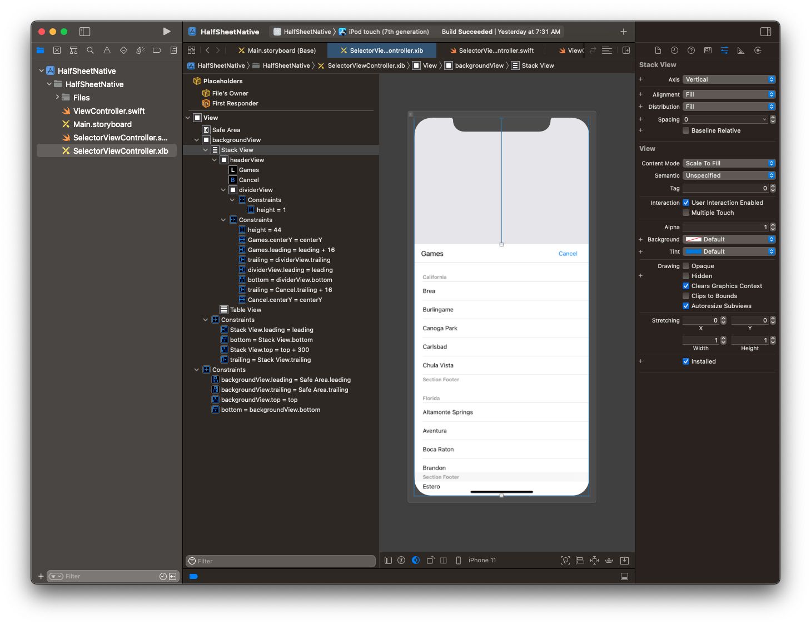
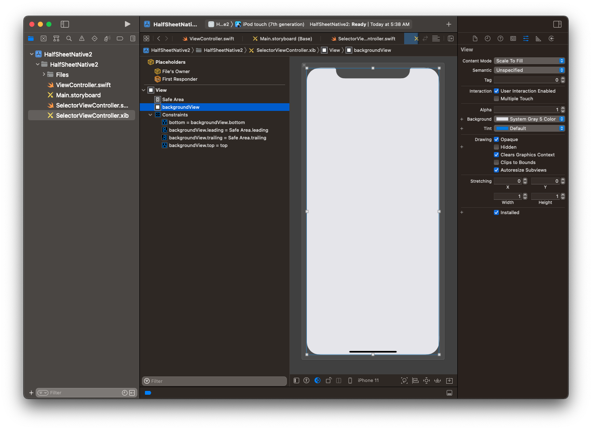
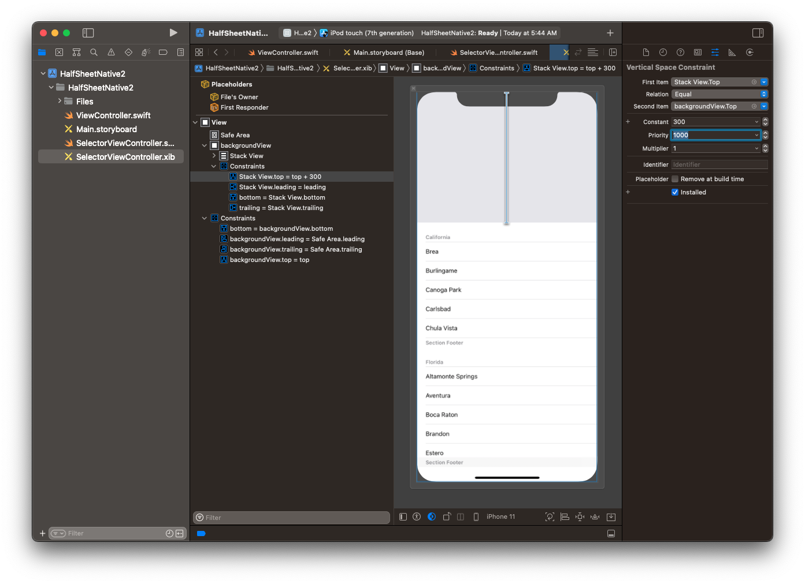
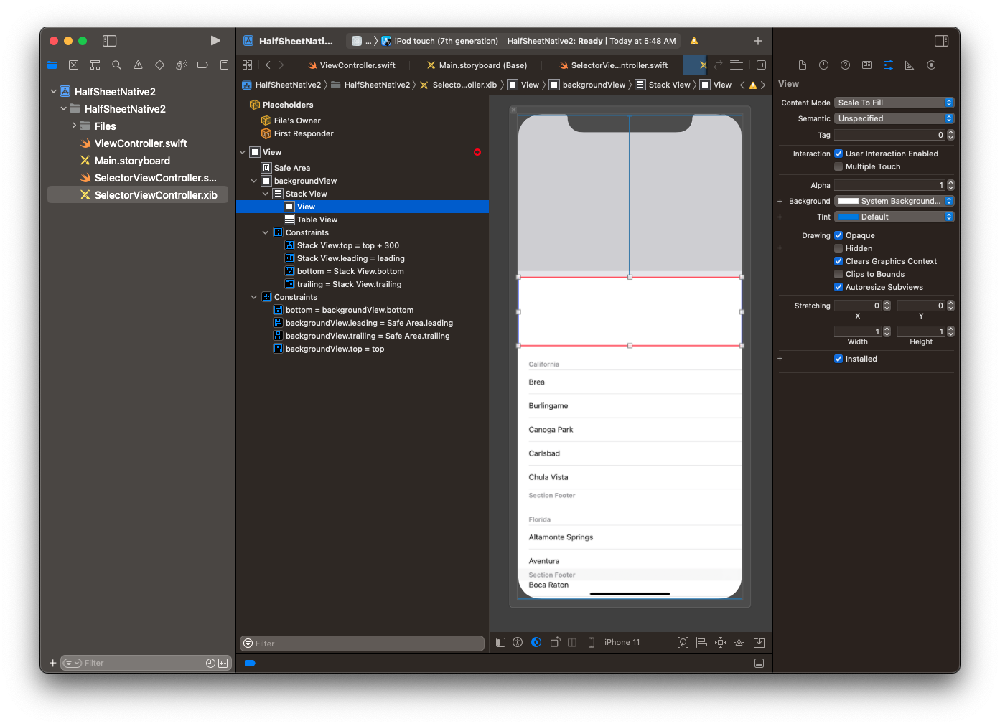
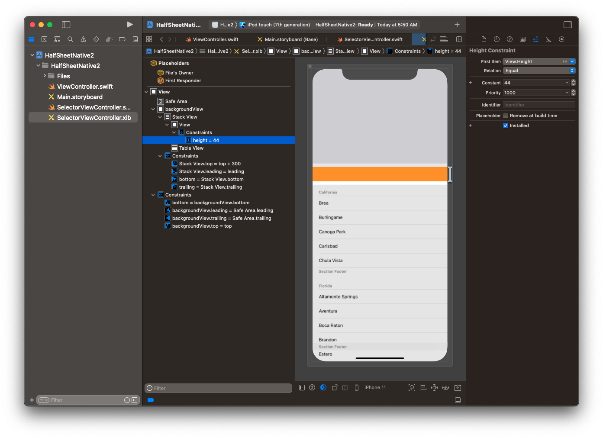
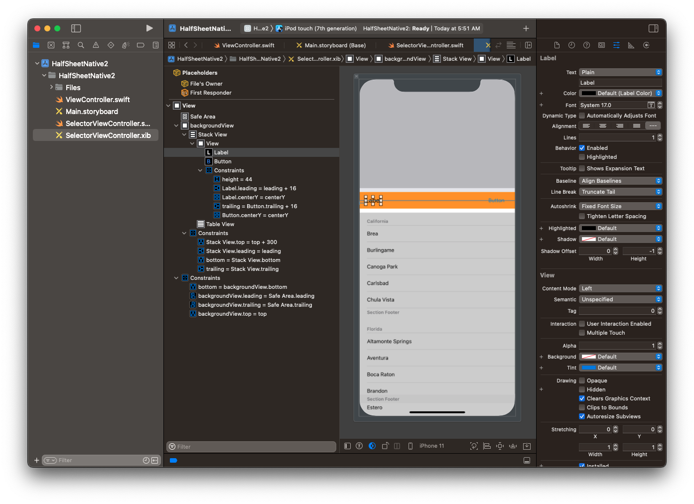
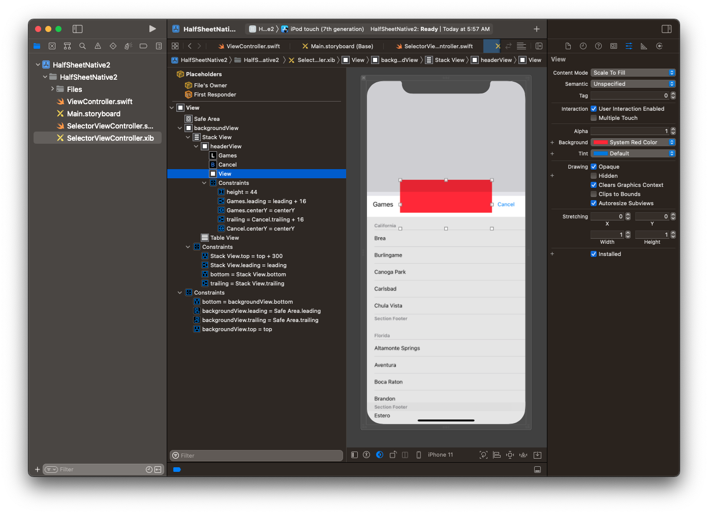
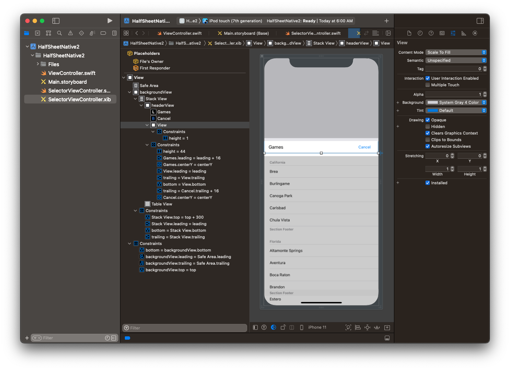
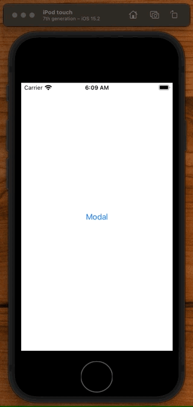

# Sheet Functionality pre-iOS 15

If you want 1/2 sheet functionality pre-iOS 15 do this.

#### Create a new View and Xib 



Add a background view:

- background color: `System Gray 5`
- pin to x4 edges of super view
- rename `backgroundView`



Add a `UITableViewController` and embed it in a stackview pinned to the x4 superview edges (not safeArea), but give the `topAnchor` and value of `300pt`. Put this inside `backgroundView`.



For our header, we are going to add another view to our stack view, and then lay out a label and a button within there.

Add a new view to the stack view (call it `headerView`).



Give it a height of `44pt` same height as navigation bar.



And then add a `UILabel` and `UIButton` pinned to the edges and centered with a spacing of `16 pts`.



Add a `dividerView` underneath `1pt` hight. Pinned to the left, right, and bottom edges of the `headerView`. Make `systemGray4` color.





Now we just need to hook it up! Create and drag out the following outlets to our view controller. Don' t forget the action on the cancel button.

**SelectorViewController**

```swift
import UIKit

class SelectorViewController: UIViewController {

    let games = [
        "Pacman",
        "Space Invaders",
        "Space Patrol",
    ]

    @IBOutlet var backgroundView: UIView!
    @IBOutlet var containerStackView: UIStackView!
    @IBOutlet var tableView: UITableView!
    @IBOutlet var topAnchorConstraint: NSLayoutConstraint!

    var topAnchorValue: CGFloat

    init(topAnchorValue: CGFloat) {
        self.topAnchorValue = topAnchorValue
        super.init(nibName: nil, bundle: nil)
    }

    required init?(coder: NSCoder) {
        fatalError("init(coder:) has not been implemented")
    }
    
    override func viewDidLoad() {
        super.viewDidLoad()

        tableView.delegate = self
        tableView.dataSource = self
    }

    @IBAction func cancelTapped(_ sender: Any) {
        dismiss(animated: true)
    }
}

extension SelectorViewController: UITableViewDataSource, UITableViewDelegate {
    func tableView(_ tableView: UITableView, cellForRowAt indexPath: IndexPath) -> UITableViewCell {
        let cell = UITableViewCell()
        cell.textLabel?.text = games[indexPath.row]
        return cell
    }

    func tableView(_ tableView: UITableView, numberOfRowsInSection section: Int) -> Int {
        return games.count
    }
}
```

Now we just need to instantiate and present, passing in the height of that `topAnchorConstraint` like this:

**ViewController**

```swift
import UIKit

class ViewController: UIViewController {

    override func viewDidLoad() {
        super.viewDidLoad()
        // Do any additional setup after loading the view.
    }

    @IBAction func presentModal(_ sender: Any) {
        let topAnchorValue = UIScreen.main.bounds.height * 0.5
        let vc = SelectorViewController(topAnchorValue: topAnchorValue)
        vc.modalPresentationStyle = .overCurrentContext
        present(vc, animated: true, completion: nil)
    }
}
```

If we run this now, we should have a nice half sheet, fully animated, and ready to go.



## Gotchas

The only gotcha with rolling your own like this is you will get a different background in dark mode compared to the `UISheetPresentationController` available in iOS 15.

Not a big deal if you are OK with a different background. Just something to be aware of.


