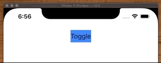

# UIStackView

## Specific spacing between elements

```swift
stackView.setCustomSpacing(32.0, after: repeatTextField)
```

## Add padding to your stackview

```swift
stackView.isLayoutMarginsRelativeArrangement = true
stackView.directionalLayoutMargins = NSDirectionalEdgeInsets(top: 8, leading: 16, bottom: 8, trailing: -16)
```

Note: Do not use `stackView.layoutMargins = UIEdgeInsets(...)` as this has been deprecated.

## Ambigous height/width of Label

For those times when your label is giving you ambiguous width/height, make it explicit breakable.

```swift
titleLabel.sizeToFit()
titleLabel.widthAnchor.constraint(equalToConstant: titleLabel.frame.size.width).setActiveBreakable()

ctaButton.heightAnchor.constraint(equalToConstant: ctaButton.frame.size.height).setActiveBreakable()

public extension NSLayoutConstraint {
    @objc func setActiveBreakable(priority: UILayoutPriority = UILayoutPriority(900)) {
        self.priority = priority
        isActive = true
    }
}
```

And if that doesn't work manually set some _stackView_ insets.

```swift
stackView.layoutMargins = UIEdgeInsets(top: 0, left: 0, bottom: 0, right: view.frame.width / 3)
```

## StackView in ScrollView

[StackOverflow](https://stackoverflow.com/questions/31668970/is-it-possible-for-uistackview-to-scroll)

- Need to pin stack to inside of scroll.
- Each subview will need an explicit height
- Constrain width or height to enbable scrolling (width for vertical scroll)

```swift
NSLayoutConstraint.activate([            
    scrollView.topAnchor.constraint(equalTo: headerView.bottomAnchor, constant: 8),
    scrollView.leadingAnchor.constraint(equalTo: view.leadingAnchor, constant: 8),
    scrollView.trailingAnchor.constraint(equalTo: view.trailingAnchor, constant: -8),
    scrollView.bottomAnchor.constraint(equalTo: view.safeAreaLayoutGuide.bottomAnchor),

    rootStackView.topAnchor.constraint(equalTo: scrollView.topAnchor),
    rootStackView.leadingAnchor.constraint(equalTo: scrollView.leadingAnchor),
    rootStackView.trailingAnchor.constraint(equalTo: scrollView.trailingAnchor),
    rootStackView.bottomAnchor.constraint(equalTo: scrollView.bottomAnchor),

    rootStackView.widthAnchor.constraint(equalTo: scrollView.widthAnchor),
])
```

## Animation

You can make views animate in and out by controlling their visibility in the stack view.

```swift
    @objc func toggleTapped() {
        UIView.animate(withDuration: 0.75) { [unowned self] in
            self.label.isHidden = !self.label.isHidden
            self.label.alpha = self.label.isHidden ? 0 : 1
            // maybe layoutIfNeeded()...
        }
    }
```



```swift
import UIKit

class ViewController: UIViewController {

    let stackView = UIStackView()
    let label = UILabel()
    let button = UIButton()
    
    override func viewDidLoad() {
        super.viewDidLoad()
        style()
        layout()
    }

    func style() {
        stackView.translatesAutoresizingMaskIntoConstraints = false
        
        label.translatesAutoresizingMaskIntoConstraints = false
        label.backgroundColor = .systemPink
        label.text = "Disappear..."
        
        button.translatesAutoresizingMaskIntoConstraints = false
        button.backgroundColor = .systemBlue
        button.setTitle("Toggle", for: .normal)
        button.setTitleColor(.label, for: .normal)
        button.addTarget(self, action: #selector(toggleTapped), for: .primaryActionTriggered)
    }
    
    @objc func toggleTapped() {
        UIView.animate(withDuration: 0.75) { [unowned self] in
            self.label.isHidden = !self.label.isHidden
            self.label.alpha = self.label.isHidden ? 0 : 1
        }
        
    }
    
    func layout() {
        stackView.addArrangedSubview(label)
        
        view.addSubview(stackView)
        view.addSubview(button)
        
        NSLayoutConstraint.activate([
            stackView.topAnchor.constraint(equalTo: view.safeAreaLayoutGuide.topAnchor, constant: 8),
            stackView.centerXAnchor.constraint(equalTo: view.centerXAnchor),
            
            button.centerXAnchor.constraint(equalTo: view.centerXAnchor),
            button.topAnchor.constraint(equalTo: stackView.bottomAnchor, constant: 8),
        ])
    }
}
```

## How to set specific or variable spacing

```swift
stackView.setCustomSpacing(10.0, after: firstLabel)
stackView.setCustomSpacing(10.0, after: secondLabel)
```

## Stack within Stack for padding

Nudge elements within a stackView can be tricky. Usually it involves embedding your control in a view, and then setting constraints (or padding) around that control within your view inside the stack.

Another quick easy way to do this is to add your control to another stackView, set it's edge insets or padding, and then it to the parent stackView. Like this.

```swift

func buildSubviews() {
    let titleStackView = makeTitleStackView()

    let stackView = makeStackView()

    stackView.addArrangedSubview(titleStackView)

    view.addSubview(stackView)
}

private func makeTitleStackView() -> UIView {
    let stackView = UIStackView()
    StackViewStyle.tileRow.apply(to: stackView)

    let titleLabel = UILabel()
    titleLabel.translatesAutoresizingMaskIntoConstraints = false
    titleLabel.text = "Activate your service"

    LabelStyle.titleDarkGrey.apply(to: titleLabel)

    stackView.addArrangedSubview(titleLabel)
    stackView.layoutMargins = UIEdgeInsets(top: 24, left: 8, bottom: 0, right: 0)

    return stackView.wrapInCollapsible()
}
```


## breakable spacer view

```swift
stackView.addArrangedSubview(makeSpacerView(height: 200))

public func makeSpacerView(height: CGFloat? = nil) -> UIView {
    let spacerView = UIView(frame: .zero)
    if let height = height {
        spacerView.heightAnchor.constraint(equalToConstant: height).setActiveBreakable()
    }
    spacerView.translatesAutoresizingMaskIntoConstraints = false
    return spacerView
}

public extension NSLayoutConstraint {
    @objc func setActiveBreakable(priority: UILayoutPriority = UILayoutPriority(900)) {
        self.priority = priority
        isActive = true
    }
}
```

What this is doing is inserting a spacer view into the stack view, but making it breakable. That way if the stackview needs to adjust because of its distribution or alignment it can.

## Always pin your stackview to avoid ambiguous height

```swift
        textStackView.topAnchor.constraint(equalTo: topAnchor, constant: 20).isActive = true
        textStackView.leftAnchor.constraint(equalTo: warningImageView.rightAnchor, constant: 16).isActive = true
        textStackView.trailingAnchor.constraint(equalTo: trailingAnchor, constant: -8).isActive = true
        textStackView.bottomAnchor.constraint(equalTo: bottomAnchor, constant: -8).isActive = true
```

If you fully pin your stackviews, you don't need to define intrinsicContentSize. If getting height is ambiguous, double check your stackView is fully pinned.

## How to layout x2 elements side by side

Often you want x2 items to be side-by-side in a stackView. The question is how? This is where stackView inside stackViews really comes in handy.

Create a container stackView holding the elements you want side-by-side, make one hug itself more than the other, then add that root stack view and style as you like using insets.

Here is the parent.

```swuft
    func buildSubviews() {
        let stackView = makeStackView()
        view.addSubview(stackView)

        stackView.addArrangedSubview(makeOverdueStackView())
    }
```

And here is the embedded stackview containing the hugging elements.

```swift
    func makeOverdueStackView() -> UIStackView {
        let stackView = ControlFactory.makeStackView(axis: .horizontal)
        stackView.alignment = .leading

        let imageView = ...
        let label = ...

        imageView.setContentHuggingPriority(UILayoutPriority.required, for: .horizontal)
        label.setContentHuggingPriority(UILayoutPriority.defaultLow, for: .horizontal)

        stackView.addArrangedSubview(imageView)
        stackView.addArrangedSubview(label)

        return stackView
    }
```


Note you still have a problem - how to nudge that label over. There is no real good way to do this in a horizontal stackView - it doesn't have `alignment = .leading` the way vertical does.

If you wanted those close together I would probably wrap those in a customer container view, and manually lay those out relative to one another.

## How to layout margins set insets

If you want to nudge controls around instead a `UIStackView`, the easiest way to do it is to embed the control in an other `UIStackView` and then play with it's layout margins as showing below.

```swift
        let textLabelStackView = makeStackView()
        stackView.layoutMargins = UIEdgeInsets(top: 0, left: 20, bottom: 0, right: 20)
        stackView.isLayoutMarginsRelativeArrangement = true // yes you need this
```

or 

```swift
        stackView.layoutMargins.top = LocalSpacing.rowSpacing
        stackView.layoutMargins.left = Spacing.margin
        stackView.layoutMargins.right = Spacing.margin
```

## How to put a button in a`UIStackView`


The trick to getting any view to layout custom in a `UIStackView` is to embed it in a container view and then let the stackview lay it out. Meanwhile you can setup whatever padding or constraints you want between your innerview and the container view.

```swift
    let moreButton = makeMoreButton()

    let container = UIView()
    container.translatesAutoresizingMaskIntoConstraints = false
    container.heightAnchor.constraint(equalToConstant: layout.CTAButtonHeight).isActive = true
    container.addSubview(moreButton)

    moreButton.centerXAnchor.constraint(equalTo: container.centerXAnchor).isActive = true
    moreButton.centerYAnchor.constraint(equalTo: container.centerYAnchor).isActive = true
    moreButton.leadingAnchor.constraint(equalTo: container.leadingAnchor, constant: 24).isActive = true
    moreButton.trailingAnchor.constraint(equalTo: container.trailingAnchor, constant: -24).isActive = true
    moreButton.heightAnchor.constraint(equalToConstant: layout.CTAButtonHeight).isActive = true

    stackView.addArrangedSubview(container)
```

## How to add a separator into a `UIStackView`

Using the same technique as above, you need to add the separator into a container view, and then set contraints between the separator and container view to give it the spacing you want.


```swift
    func setupViews() {
        ...
        stackView.addArrangedSubview(makeTopSeparatorView())
        ...
    }

    func makeTopSeparatorView() -> UIView {
        let container = UIView()
        container.translatesAutoresizingMaskIntoConstraints = false

        let separatorView = makeSeparatorView()

        container.addSubview(separatorView)

        separatorView.topAnchor.constraint(equalTo: container.topAnchor, constant: -12).isActive = true
        separatorView.leadingAnchor.constraint(equalTo: container.leadingAnchor, constant: 24).isActive = true
        separatorView.trailingAnchor.constraint(equalTo: container.trailingAnchor, constant: 0).isActive = true

        container.heightAnchor.constraint(equalTo: separatorView.heightAnchor).isActive = true

        return container
    }
    
    func makeSeparatorView() -> UIView {
       let view = UIView()
       view.translatesAutoresizingMaskIntoConstraints = false
       view.backgroundColor = .lightGray
       view.heightAnchor.constraint(equalToConstant: 0.5).isActive = true

       return view
    }
```

# UIStackView Basics

Let's say we want to build this model using a `UIStackView`.


We can start off with a `UILabel` and `UITextField` side-by-side. 


But what we are missing is the hugging and compression necessary to tell autolayout which control to expand, and which not to.


    Usually in this situation we want the label to hold it's intrinsic width, 
    and have the text field expand. 
    So we **increase** the `UILabel` horizontal and vertical **hugging**,
    while **decreasing** the `UITextField` hugging and horizontal resistance.


OK not bad. But what we need are some attributes on our stack views.


If we add those we get this


Now, if we want to add more label and text fields, and make it so everything is aligned, the trick is to make the widths of the various text fields the same. 

If we add more stack views, and don't make the text field widths the same we get this.


When we add the weighting constraints (#6, #7) from diagram at top, we get this.


> Note: Order here matters. You can only add a constraint between two separate elements like this in different stack views after they have been added to the common parent. Else you will get a 'not common ancestor' error.

```swift
//
//  ViewController.swift
//  StackViewBasic
//
//  Created by Jonathan Rasmusson (Contractor) on 2018-09-05.
//  Copyright © 2018 Jonathan Rasmusson (Contractor). All rights reserved.
//

import UIKit

class ViewController: UIViewController {

    override func viewDidLoad() {
        super.viewDidLoad()

        setupViews()
    }

    func setupViews () {

        // first name
        let firstNameStack = makeNameStackView()
        let firstNameLabel = makeLabel(withText: "First")
        let firstNameTextField = makeTextField(withPlaceholderText: "Enter first name")

        firstNameStack.addArrangedSubview(firstNameLabel)
        firstNameStack.addArrangedSubview(firstNameTextField)

        firstNameLabel.setContentHuggingPriority(UILayoutPriority(rawValue: 251), for: .vertical)
        firstNameLabel.setContentHuggingPriority(UILayoutPriority(rawValue: 251), for: .horizontal)

        firstNameTextField.setContentHuggingPriority(UILayoutPriority(rawValue: 48), for: .horizontal)
        firstNameTextField.setContentCompressionResistancePriority(UILayoutPriority(rawValue: 749), for: .horizontal)

        // middle name
        let middleNameStack = makeNameStackView()
        let middleNameLabel = makeLabel(withText: "Middle")
        let middleNameTextField = makeTextField(withPlaceholderText: "Enter middle name")

        middleNameStack.addArrangedSubview(middleNameLabel)
        middleNameStack.addArrangedSubview(middleNameTextField)

        middleNameLabel.setContentHuggingPriority(UILayoutPriority(rawValue: 251), for: .vertical)
        middleNameLabel.setContentHuggingPriority(UILayoutPriority(rawValue: 251), for: .horizontal)

        middleNameTextField.setContentHuggingPriority(UILayoutPriority(rawValue: 48), for: .horizontal);
        middleNameTextField.setContentCompressionResistancePriority(UILayoutPriority(rawValue: 749), for: .horizontal)

        // Name rows stack
        let nameRowsStack = makeRowStackView()

        nameRowsStack.addArrangedSubview(firstNameStack)
        nameRowsStack.addArrangedSubview(middleNameStack)

        // make the rows equal width (order matters - must come after both added to parent stack)
        firstNameTextField.widthAnchor.constraint(equalTo: middleNameTextField.widthAnchor).isActive = true

        view.addSubview(nameRowsStack)

        NSLayoutConstraint.activate([
            nameRowsStack.topAnchor.constraint(equalTo: view.topAnchor, constant: 20),
            nameRowsStack.leadingAnchor.constraint(equalTo: view.leadingAnchor, constant: 20),
            nameRowsStack.trailingAnchor.constraint(equalTo: view.trailingAnchor, constant: -20),
            ])

    }

    func makeNameStackView() -> UIStackView {
        let stack = UIStackView()
        stack.translatesAutoresizingMaskIntoConstraints = false
        stack.axis = .horizontal
        stack.distribution = .fill
        stack.alignment = .firstBaseline
        stack.spacing = 8.0

        return stack
    }

    func makeRowStackView() -> UIStackView {
        let stack = UIStackView()
        stack.translatesAutoresizingMaskIntoConstraints = false
        stack.axis = .vertical
        stack.distribution = .fill
        stack.alignment = .fill
        stack.spacing = 8.0

        return stack
    }

    func makeLabel(withText text: String) -> UILabel {
        let label = UILabel()
        label.translatesAutoresizingMaskIntoConstraints = false
        label.text = text
        label.backgroundColor = .red

        return label
    }

    func makeTextField(withPlaceholderText text: String) -> UITextField {
        let textField = UITextField()
        textField.translatesAutoresizingMaskIntoConstraints = false
        textField.placeholder = text
        textField.backgroundColor = .green

        return textField
    }
}
```

### What if you are working with images?

Images in stack views have there own instrinsic views. So their height and width may not align. 

In this case you can get your images to align by changing you stack view alignment to `center`.

```swift
func makeNameStackView() -> UIStackView {
        let stack = UIStackView()
        stack.translatesAutoresizingMaskIntoConstraints = false
        stack.axis = .horizontal
        stack.distribution = .fill
        stack.alignment = .center // gets them aligned
        stack.spacing = 8.0

        return stack
    }
```

And then making the images themselves `scaleAspectFit`

```swift
// first name
let firstNameStack = makeNameStackView()
let chat = UIImageView(image: UIImage(named: "chat"))
chat.contentMode = .scaleAspectFit // so they don't stretch
```

If you do that, everything should line up nicely like this.


## Misc

### How to layout stackviews with different margins and padding

Say you want to layout a view like this. With the top image expandable and flush, but with other elements aligned differently with different margins. The way to do it is to insert the second element in another StackView and set is insets there.


```swift
class ViewController: UIViewController {

    override func viewDidLoad() {
        super.viewDidLoad()
        setupViews()
    }

    func setupViews() {
        view.backgroundColor = .white
        title = "Connect"

        // Scroll view, vertical
        let scrollView = UIScrollView()
        view.addSubview(scrollView)

        scrollView.translatesAutoresizingMaskIntoConstraints = false
        scrollView.leadingAnchor.constraint(equalTo: self.view.leadingAnchor).isActive = true
        scrollView.trailingAnchor.constraint(equalTo: self.view.trailingAnchor).isActive = true
        scrollView.topAnchor.constraint(equalTo: self.view.safeAreaLayoutGuide.topAnchor).isActive = true
        scrollView.bottomAnchor.constraint(equalTo: self.view.safeAreaLayoutGuide.bottomAnchor, constant: 0).isActive = true

        // Holding a stackview
        let rootStackView = makeStackView()
        scrollView.addSubview(rootStackView)

        rootStackView.leadingAnchor.constraint(equalTo: scrollView.leadingAnchor).isActive = true
        rootStackView.trailingAnchor.constraint(equalTo: scrollView.trailingAnchor).isActive = true
        rootStackView.topAnchor.constraint(equalTo: scrollView.topAnchor).isActive = true
        rootStackView.bottomAnchor.constraint(equalTo: scrollView.bottomAnchor).isActive = true
        rootStackView.widthAnchor.constraint(equalTo: scrollView.widthAnchor).isActive = true

        // TextLabel - Create another stackView here and set it's insets
        let textLabelStackView = makeStackView()
        textLabelStackView.layoutMargins = UIEdgeInsets(top: 0, left: 24, bottom: 0, right: 24)
        textLabelStackView.isLayoutMarginsRelativeArrangement = true

        let textLabel = makeGrayTextLabel(text: "Lorem Ipsum is simply dummy text of the printing and typesetting industry. Lorem Ipsum has been the industry's standard dummy text ever since the 1500s.")
        textLabelStackView.addArrangedSubview(textLabel)

        rootStackView.addArrangedSubview(textLabelStackView)
    }
```
### Hugging example image, labels, image


This examples shows how the labels in a `UIStackView` can stretch to fill available space.

```swift

    func makeDownloadLabelsStackView() -> UIView {
        let stackView = makeStackView(axis: .vertical)

        stackView.addArrangedSubview(makeDownloadTitleLabel())
        stackView.addArrangedSubview(makeDownloadSubTitleLabel())

        return stackView
    }
    
    func makeDownloadTitleLabel() -> UILabel {
        ...
        label.backgroundColor = .red
        label.setContentHuggingPriority(UILayoutPriority(rawValue: 48), for: .horizontal) // stretch horizontal
        label.setContentHuggingPriority(UILayoutPriority(rawValue: 249), for: .vertical)  // stretch vertical

        return label
    }
    
    func makeDownloadSubTitleLabel() -> UILabel {
        ...
        label.backgroundColor = .green
        label.setContentHuggingPriority(UILayoutPriority(rawValue: 48), for: .horizontal) // stretch

        return label
    }

```

## How to set background color on a stackView

Say you have inherited from stackView and you want to set the background color.

```swift
let background = UIView(frame: .zero)
background.backgroundColor = UIColor.Rebrand.white()
background.autoresizingMask = [.flexibleWidth, .flexibleHeight]
insertSubview(background, at: 0)
```

### Links that help

* [Apple docs](https://developer.apple.com/documentation/uikit/uistackview)
* [Apple Example](https://developer.apple.com/library/archive/documentation/UserExperience/Conceptual/AutolayoutPG/LayoutUsingStackViews.html#//apple_ref/doc/uid/TP40010853-CH11-SW1)
* [Excellent article on distribution](https://spin.atomicobject.com/2016/06/22/uistackview-distribution/)
* [Use your loaf - Padding to StackView](https://useyourloaf.com/blog/adding-padding-to-a-stack-view/)


