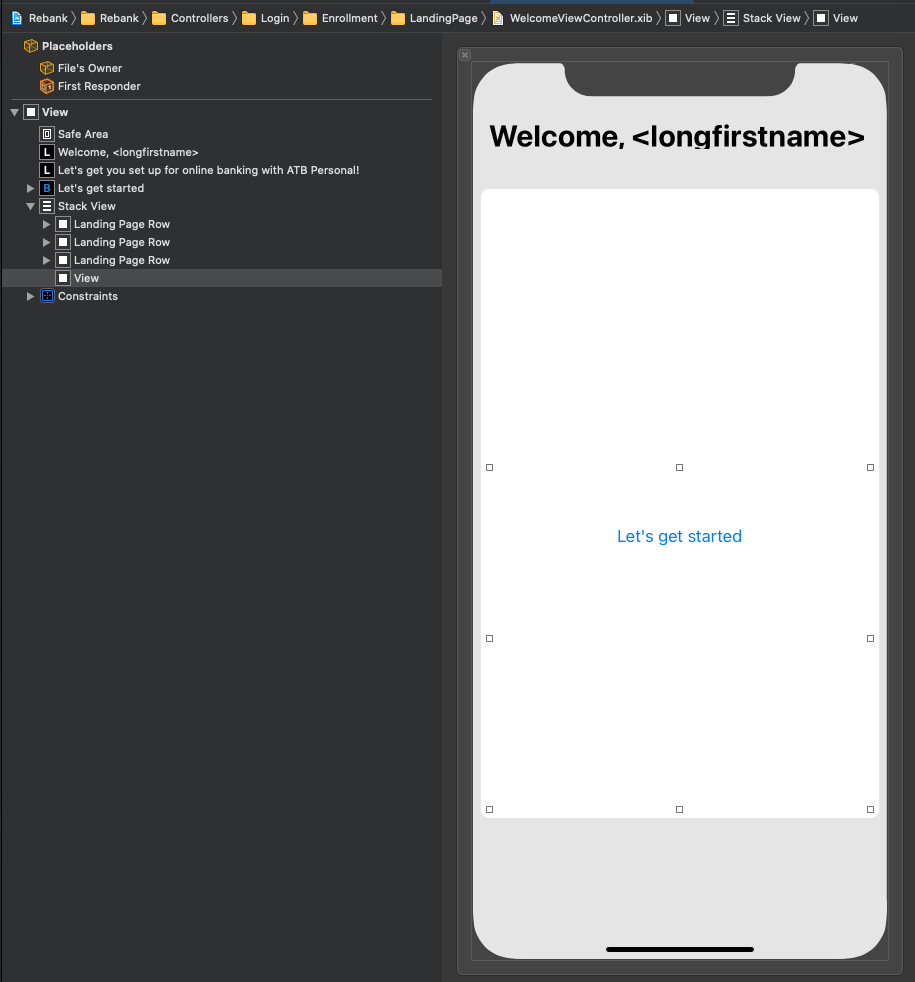
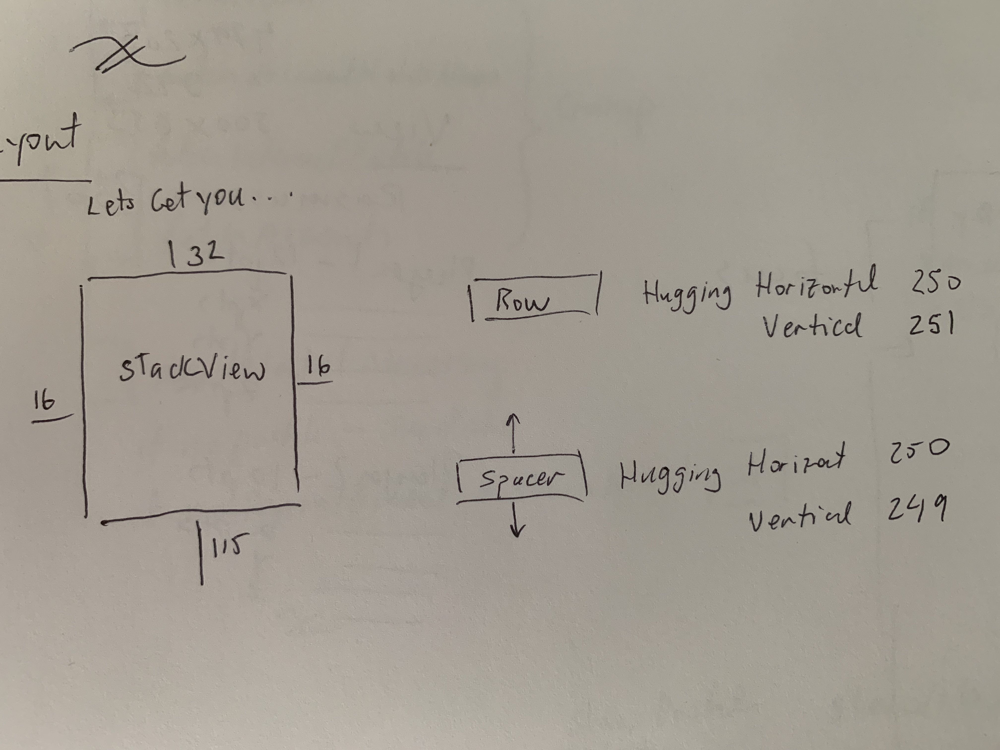
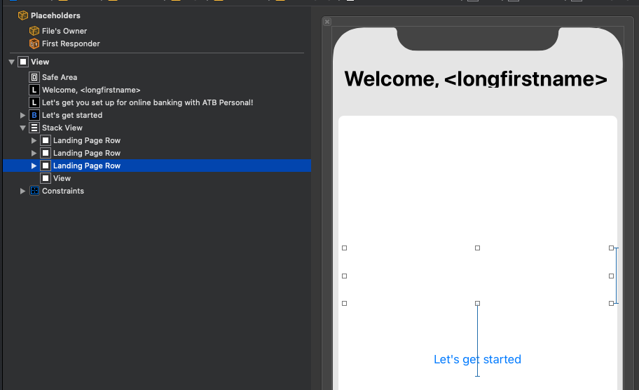

# Layout Patterns

## Spacer view at bottom

One of the challenges of the stack view is it always wants to stretch the last element. To fix that, give it an empty spacer view (no contraints except for leading and trailing) and let them resize itself to whatever need be.

Also be sure to adjust CHCR so bottom space stretch while subviews in stack hug.

## Every element needs a height

The other thing to realize about stack views is that every view needs a height. If you can set that explicitly, things become a lot easier.

Also, because the height of the stack view may be unknown, if you need something like a button sitting underneath it, you can add a constraint to an element inside the stack. Not ideal, but it works.

### Links that help

* [Apple docs](https://developer.apple.com/documentation/uikit/uistackview)
* [Apple Autolayout StackView Recipes](https://developer.apple.com/library/archive/documentation/UserExperience/Conceptual/AutolayoutPG/LayoutUsingStackViews.html#//apple_ref/doc/uid/TP40010853-CH11-SW1)
