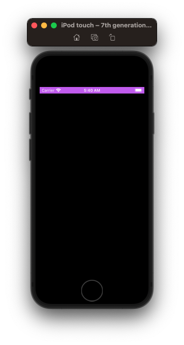
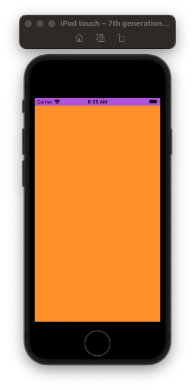

# UIStatusBar

## AppDelegate

### View Controller

```swift
import UIKit

@main
class AppDelegate: UIResponder, UIApplicationDelegate {

    var window: UIWindow?
    
    func application(_ application: UIApplication, didFinishLaunchingWithOptions launchOptions: [UIApplication.LaunchOptionsKey: Any]?) -> Bool {
        window = UIWindow(frame: UIScreen.main.bounds)
        window?.makeKeyAndVisible()
        window?.backgroundColor = .systemBackground
        
        let vc = ViewController()
        vc.setStatusBar()
        
        window?.rootViewController = vc
        
        return true
    }
}

extension UIViewController {
    func setStatusBar() {
        let statusBarSize = UIApplication.shared.statusBarFrame.size // deprecated but OK
        let frame = CGRect(origin: .zero, size: statusBarSize)
        let statusbarView = UIView(frame: frame)

        statusbarView.backgroundColor = .systemTeal
        view.addSubview(statusbarView)
    }
}
```



## SceneDelegate

```swift
import UIKit

class SceneDelegate: UIResponder, UIWindowSceneDelegate {

    var window: UIWindow?

    func scene(_ scene: UIScene, willConnectTo session: UISceneSession, options connectionOptions: UIScene.ConnectionOptions) {
        guard let windowScene = (scene as? UIWindowScene) else { return }
        
        window = UIWindow(windowScene: windowScene)
        window?.makeKeyAndVisible()
        window?.backgroundColor = .systemOrange
        
        let vc = ViewController()
        let statusBarBackgroundView = UIView.makeStatusBarBackgroundView()
        vc.view.addSubview(statusBarBackgroundView)
        
        window?.rootViewController = vc
    }
}

extension UIView {
    static func makeStatusBarBackgroundView() -> UIView {
        let statusBarManager = UIApplication.shared.keyWindow?.windowScene?.statusBarManager
        let statusBarFrame = statusBarManager?.statusBarFrame
        let statusBarSize = (statusBarFrame?.size)!
        let frame = CGRect(origin: .zero, size: statusBarSize)
        
        let statusBackgroundView = UIView(frame: frame)
        statusBackgroundView.backgroundColor = .systemPurple
        statusBackgroundView.layer.zPosition = 100
        return statusBackgroundView
    }
}
```



## Links that help

- [StackOverflow](https://stackoverflow.com/questions/57134259/how-to-resolve-keywindow-was-deprecated-in-ios-13-0/57899013)

## Misc

```swift
class ActivateViewController: UIViewController {

    override var prefersStatusBarHidden: Bool {
        return false
    }

    override var preferredStatusBarStyle: UIStatusBarStyle {
        return .lightContent
    }
}
```

```swift
public enum UIStatusBarStyle : Int {
    case `default` // Dark content, for use on light backgrounds

    @available(iOS 7.0, *)
    case lightContent // Light content, for use on dark backgrounds
}
```


