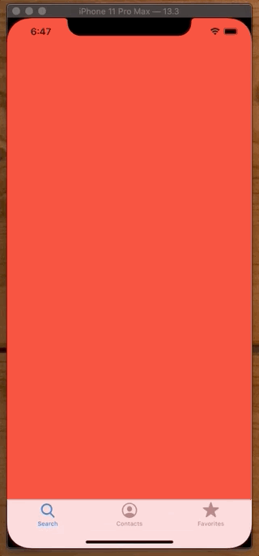
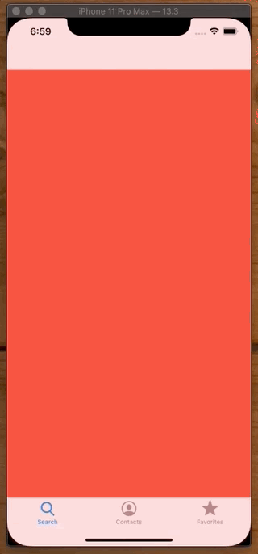

# UITabBarViewController

## Basic

```swift
import UIKit

class ViewController: UITabBarController {

    override func viewDidLoad() {
        super.viewDidLoad()
        setupViews()
    }

    func setupViews() {
        view.backgroundColor = .white

        let firstViewController = ViewController1()

        firstViewController.tabBarItem = UITabBarItem(tabBarSystemItem: .search, tag: 0)

        let secondViewController = ViewController2()

        secondViewController.tabBarItem = UITabBarItem(tabBarSystemItem: .more, tag: 1)

        let tabBarList = [firstViewController, secondViewController]

        viewControllers = tabBarList
    }
}

class ViewController1: UIViewController {
    override func viewDidLoad() {
        view.backgroundColor = .red
    }
}

class ViewController2: UIViewController {
    override func viewDidLoad() {
        view.backgroundColor = .blue
    }
}
```

### How to specify which `ViewController` to show?

You can programatically specify which `ViewController` you would to like to appear or navigate to like this. 

`selectedViewController` is a property inside `UITabBarViewController` and you just specifiy the one you want there.

`tabBarController.selectedIndex = 0` or you can specify the index as so.

```swift
selectedViewController = secondViewController
```


## TabBar vs NavBar

You can either embed a TabBar in a NavBar or a NavBar in a TabBar - it's completely up to you. 

### NavBar within a TabBar



Simply create your _ViewControllers_ (one of which can be a _NavigationController_ and add them to your TabBar.

```swift
import UIKit

class ViewController1: UIViewController {
    override func viewDidLoad() {
        view.backgroundColor = .systemRed
    }
}

class ViewController2: UIViewController {
    override func viewDidLoad() {
        view.backgroundColor = .systemBlue
    }
}

class ViewController3: UIViewController {
    override func viewDidLoad() {
        view.backgroundColor = .systemGreen
        title = "ViewController3"
    }
}

@UIApplicationMain
class AppDelegate: UIResponder, UIApplicationDelegate {

    var window: UIWindow?

    func application(_ application: UIApplication, didFinishLaunchingWithOptions launchOptions: [UIApplication.LaunchOptionsKey: Any]?) -> Bool {
        
        window = UIWindow(frame: UIScreen.main.bounds)
        window?.makeKeyAndVisible()
        window?.backgroundColor = .systemBackground
                
        let vc1 = ViewController1()
        vc1.tabBarItem = UITabBarItem(tabBarSystemItem: .search, tag: 0)

        let vc2 = ViewController2()
        vc2.tabBarItem = UITabBarItem(tabBarSystemItem: .contacts, tag: 1)

        let vc3 = ViewController3()
        vc3.tabBarItem = UITabBarItem(tabBarSystemItem: .favorites, tag: 2)
        
        let navController = UINavigationController(rootViewController: vc3)
        
        let tabBarController = UITabBarController()
        tabBarController.viewControllers = [vc1, vc2, navController]

        window?.rootViewController = tabBarController
        
        return true
    }
}
```

### TabBar within a NavBar



Simply reverse who gets embedded within whom. Little less screen real estate this way.

```swift
@UIApplicationMain
class AppDelegate: UIResponder, UIApplicationDelegate {

    var window: UIWindow?

    func application(_ application: UIApplication, didFinishLaunchingWithOptions launchOptions: [UIApplication.LaunchOptionsKey: Any]?) -> Bool {
        
        window = UIWindow(frame: UIScreen.main.bounds)
        window?.makeKeyAndVisible()
        window?.backgroundColor = .systemBackground
                
        let vc1 = ViewController1()
        vc1.tabBarItem = UITabBarItem(tabBarSystemItem: .search, tag: 0)

        let vc2 = ViewController2()
        vc2.tabBarItem = UITabBarItem(tabBarSystemItem: .contacts, tag: 1)

        let vc3 = ViewController3()
        vc3.tabBarItem = UITabBarItem(tabBarSystemItem: .favorites, tag: 2)
        
        let tabBarController = UITabBarController()
        tabBarController.viewControllers = [vc1, vc2, vc3]
        
        let navController = UINavigationController(rootViewController: tabBarController)

        window?.rootViewController = navController
        
        return true
    }
}
```

#### How to set the title of the nav bar on a view controller within a tab bar

The title of the nav bar is tied to the title of the tab bar button. You can't set it via `title`. Instead do it like this.

```swift
    private func setupNavBar() {
        navigationController?.navigationBar.topItem?.title = "Good afternoon, Jonathan ☀️"
//        title = "Good afternoon, Jonathan ☀️"
    }
```


### Links that help

* [Apple docs](https://developer.apple.com/documentation/uikit/uitabbarcontroller)
* [TabBar vs NavBar Apple](https://developer.apple.com/library/archive/documentation/WindowsViews/Conceptual/ViewControllerCatalog/Chapters/CombiningViewControllers.html)
* [How To: Working With Tab Bar Controllers In Swift](https://learnappmaking.com/tab-bar-controller-uitabbarcontroller-swift-ios/)

