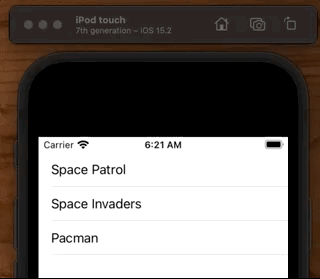

# Drag and Drop



**ViewController**

```swift
import UIKit

class ViewController: UIViewController {

    var games = [
        "Pacman",
        "Space Invaders",
        "Space Patrol",
    ]

    var tableView = UITableView()

    override func viewDidLoad() {
        super.viewDidLoad()
        tableView.delegate = self
        tableView.dataSource = self
        tableView.dragDelegate = self //
        tableView.dragInteractionEnabled = true //

        view = tableView
    }
}

extension ViewController: UITableViewDataSource, UITableViewDelegate {
    func tableView(_ tableView: UITableView, cellForRowAt indexPath: IndexPath) -> UITableViewCell {
        let cell = UITableViewCell()
        cell.textLabel?.text = games[indexPath.row]
        return cell
    }

    func tableView(_ tableView: UITableView, numberOfRowsInSection section: Int) -> Int {
        return games.count
    }

    func tableView(_ tableView: UITableView, moveRowAt sourceIndexPath: IndexPath, to destinationIndexPath: IndexPath) {
        let mover = games.remove(at: sourceIndexPath.row)
        games.insert(mover, at: destinationIndexPath.row)
    }
}

extension ViewController: UITableViewDragDelegate {
    func tableView(_ tableView: UITableView, itemsForBeginning session: UIDragSession, at indexPath: IndexPath) -> [UIDragItem] {
        let dragItem = UIDragItem(itemProvider: NSItemProvider())
        dragItem.localObject = games[indexPath.row]
        return [ dragItem ]
    }
}
```

## Haptic Feedback

You can give a nice soft haptic feedback for when the user initiates a drag like this:

```swift
extension ViewController: UITableViewDragDelegate {
    func tableView(_ tableView: UITableView, itemsForBeginning session: UIDragSession, at indexPath: IndexPath) -> [UIDragItem] {
        // Haptic feedback
        let generator = UIImpactFeedbackGenerator(style: .medium)
        generator.impactOccurred()

        let dragItem = UIDragItem(itemProvider: NSItemProvider())
        dragItem.localObject = games[indexPath.row]
        return [ dragItem ]
    }
}
```

### Links that help

- [How can I use Drag and Drop to reorder a UITableView](https://stackoverflow.com/questions/60270449/how-can-i-use-drag-and-drop-to-reorder-a-uitableview)