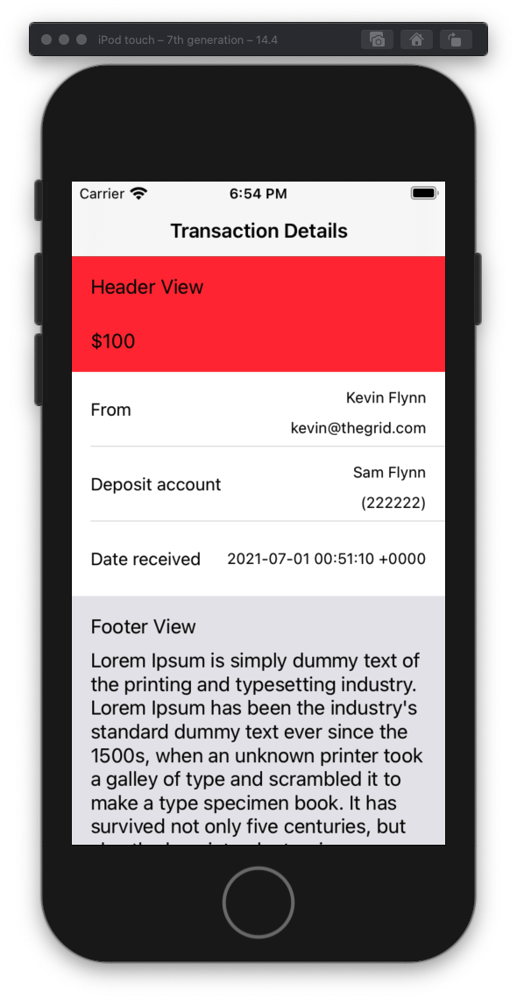
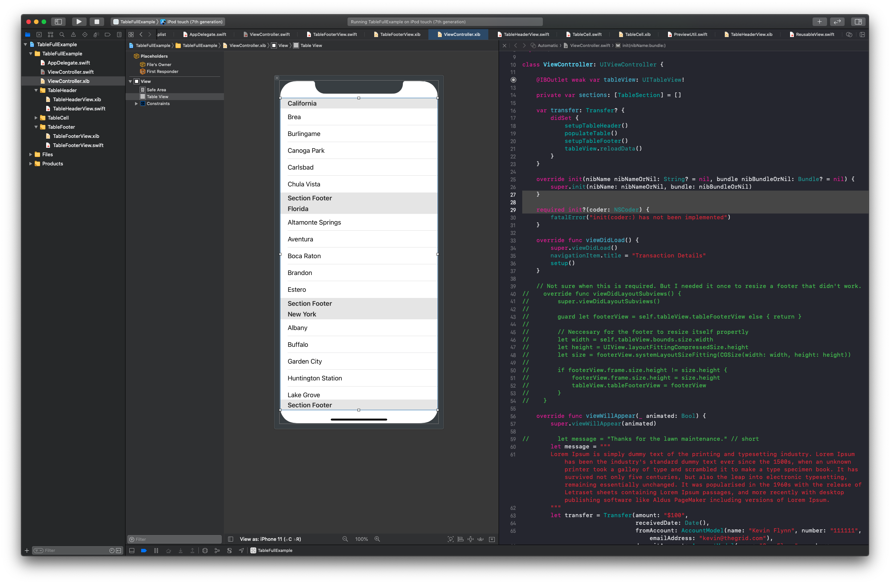
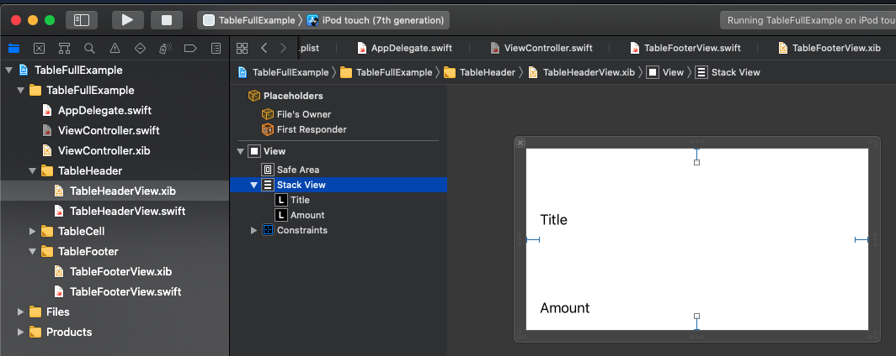
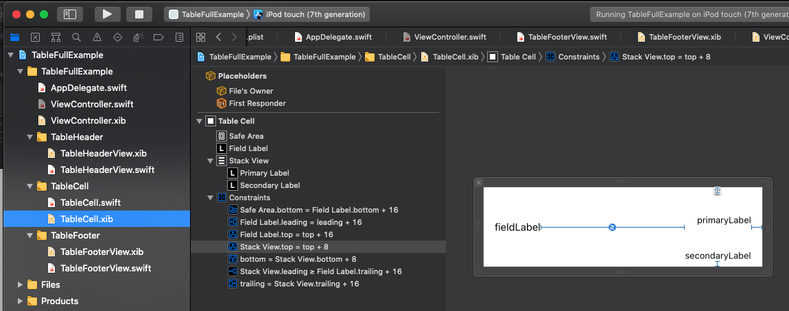
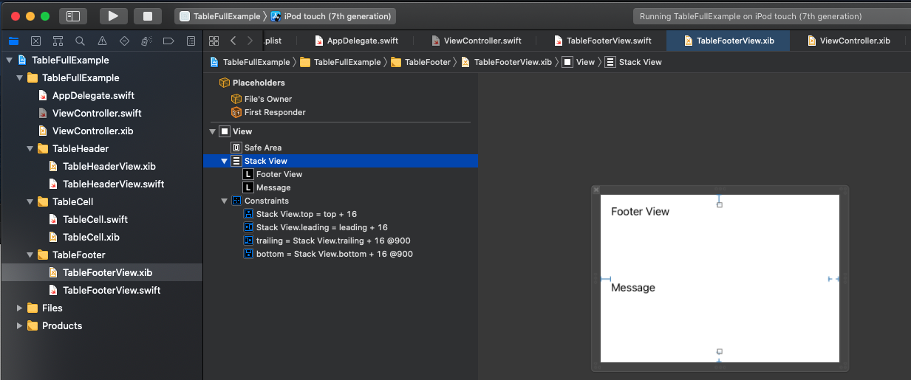

# Header Footer Example



**ViewController**

```swift
import UIKit

class ViewController: UIViewController {

    @IBOutlet weak var tableView: UITableView!

    private var sections: [TableSection] = []

    var transfer: Transfer? {
        didSet {
            setupTableHeader()
            populateTable()
            setupTableFooter()
            tableView.reloadData()
        }
    }

    override init(nibName nibNameOrNil: String? = nil, bundle nibBundleOrNil: Bundle? = nil) {
        super.init(nibName: nibNameOrNil, bundle: nibBundleOrNil)
    }

    required init?(coder: NSCoder) {
        fatalError("init(coder:) has not been implemented")
    }

    override func viewDidLoad() {
        super.viewDidLoad()
        navigationItem.title = "Transaction Details"
        setup()
    }

    // Not sure when this is required. But I needed it once to resize a footer that didn't work.
//    override func viewDidLayoutSubviews() {
//        super.viewDidLayoutSubviews()
//
//        guard let footerView = self.tableView.tableFooterView else { return }
//
//        // Neccesary for the footer to resize itself propertly
//        let width = self.tableView.bounds.size.width
//        let height = UIView.layoutFittingCompressedSize.height
//        let size = footerView.systemLayoutSizeFitting(CGSize(width: width, height: height))
//
//        if footerView.frame.size.height != size.height {
//            footerView.frame.size.height = size.height
//            tableView.tableFooterView = footerView
//        }
//    }

    override func viewWillAppear(_ animated: Bool) {
        super.viewWillAppear(animated)

//        let message = "Thanks for the lawn maintenance." // short
        let message = """
        Lorem Ipsum is simply dummy text of the printing and typesetting industry. Lorem Ipsum has been the industry's standard dummy text ever since the 1500s, when an unknown printer took a galley of type and scrambled it to make a type specimen book. It has survived not only five centuries, but also the leap into electronic typesetting, remaining essentially unchanged. It was popularised in the 1960s with the release of Letraset sheets containing Lorem Ipsum passages, and more recently with desktop publishing software like Aldus PageMaker including versions of Lorem Ipsum.
        """
        let transfer = Transfer(amount: "$100",
                                receivedDate: Date(),
                                fromAccount: AccountModel(name: "Kevin Flynn", number: "111111", emailAddress: "kevin@thegrid.com"),
                                depositAccount: AccountModel(name: "Sam Flynn", number: "222222", emailAddress: "sam@encom.com"),
                                message: message)

        self.transfer = transfer
    }
}

// MARK: - Setup
extension ViewController {

    private func setup() {
        tableView.dataSource = self
        tableView.rowHeight = 64
        tableView.backgroundColor = .white

        tableView.register(TableCell.self)

        // Need to set to 0 because using grouped tableview style
        tableView.sectionHeaderHeight = 0
        tableView.sectionFooterHeight = 0

        setupTableHeader()
        setupTableFooter()
//        fetchData()
    }

    private func setupTableHeader() {
        // Don't try to set up header if no details
        guard let details = transfer else { return }

        let header = TableHeaderView(frame: .zero)

        // Set frame size before populate view to have initial size
        var size = header.systemLayoutSizeFitting(UIView.layoutFittingCompressedSize)
        size.width = UIScreen.main.bounds.width
        header.frame.size = size

        header.configure(with: details.amount)

        // Recalculate header size after populated with content
        size = header.systemLayoutSizeFitting(UIView.layoutFittingCompressedSize)
        size.width = UIScreen.main.bounds.width
        header.frame.size = size

        tableView.tableHeaderView = header
    }

    // This is where we setup our row types
    private func populateTable() {
        guard let details = transfer else { return }
        var rows: [TableSection.RowType] = []

        rows.append(.fromAccount(details.fromAccount))
        rows.append(.depositAccount(details.depositAccount))
        rows.append(.receivedDate(details.receivedDate))

        // Currently only one section, so always handle after switch
        self.sections = [TableSection(title: "", rows: rows)]
    }

    private func setupTableFooter() {
        // Don't try to set up footer if no details
        guard let details = transfer else { return }

        let footer = TableFooterView(frame: .zero)

        // Set frame size before populate view to have initial size
        var size = footer.systemLayoutSizeFitting(UIView.layoutFittingCompressedSize)
        size.width = UIScreen.main.bounds.width
        footer.frame.size = size

        footer.configure(with: details)

        // Recalculate footer size after populated with content
        size = footer.systemLayoutSizeFitting(UIView.layoutFittingCompressedSize)
        size.width = UIScreen.main.bounds.width
        footer.frame.size = size

        tableView.tableFooterView = footer
    }

}

// MARK: - UITableViewDataSource
extension ViewController: UITableViewDataSource {
    func numberOfSections(in tableView: UITableView) -> Int {
        return self.sections.count
    }

    func tableView(_ tableView: UITableView, numberOfRowsInSection section: Int) -> Int {
        return self.sections[section].rows.count
    }

    func tableView(_ tableView: UITableView, cellForRowAt indexPath: IndexPath) -> UITableViewCell {
        let cell: TableCell = tableView.dequeueResuableCell(for: indexPath)
        let rowType = self.sections[indexPath.section].rows[indexPath.row]
        cell.configure(rowType: rowType)
        return cell
    }
}

// MARK: - TableSection
extension ViewController {

    struct TableSection {

        enum RowType {
            case fromAccount(AccountModel)
            case depositAccount(AccountModel)
            case receivedDate(Date)

            var fieldLabel: String {
                switch self {
                case .fromAccount(_): return "From"
                case .depositAccount(_): return "Deposit account"
                case .receivedDate(_): return "Date received"
                }
            }
        }

        let title: String
        let rows: [RowType]
    }
}

struct Transfer {
    let amount: String
    let receivedDate: Date
    let fromAccount: AccountModel
    let depositAccount: AccountModel
    let message: String
}

struct AccountModel {
    let name: String
    let number: String
    let emailAddress: String?
}
```



**TableViewHeader**



```swift
//
//  TableHeaderView.swift
//  TableFullExample
//
//  Created by Rasmusson, Jonathan on 2021-06-30.
//

import UIKit

class TableHeaderView: UIView {

    @IBOutlet var contentView: UIView!

    @IBOutlet weak var titleLabel: UILabel!
    @IBOutlet weak var amountLabel: UILabel!

    override init(frame: CGRect) {
        super.init(frame: frame)
        commonInit()
    }

    required init?(coder aDecoder: NSCoder) {
        super.init(coder: aDecoder)
        commonInit()
    }

    override var intrinsicContentSize: CGSize {
        return CGSize(width: UIView.noIntrinsicMetric, height: 40)
    }

    private func commonInit() {
        let bundle = Bundle(for: TableHeaderView.self)
        bundle.loadNibNamed("TableHeaderView", owner: self, options: nil)
        addSubview(contentView)

        contentView.translatesAutoresizingMaskIntoConstraints = false
        contentView.topAnchor.constraint(equalTo: self.topAnchor).isActive = true
        contentView.rightAnchor.constraint(equalTo: self.rightAnchor).isActive = true
        contentView.bottomAnchor.constraint(equalTo: self.bottomAnchor).isActive = true
        contentView.leftAnchor.constraint(equalTo: self.leftAnchor).isActive = true

        setup()
    }

    private func setup() {
        titleLabel.text = "Header View"
        contentView.backgroundColor = .systemRed
    }

    func configure(with amount: String) {
        amountLabel.text = amount
    }
}
```

**TableCell**



```swift
//
//  TableCell.swift
//  TableFullExample
//
//  Created by Rasmusson, Jonathan on 2021-06-30.
//

import UIKit

class TableCell: UITableViewCell {

    @IBOutlet weak var fieldLabel: UILabel!
    @IBOutlet weak var primaryLabel: UILabel!
    @IBOutlet weak var secondaryLabel: UILabel!

    override func awakeFromNib() {
        super.awakeFromNib()
        selectionStyle = .none
        secondaryLabel.isHidden = true
    }

    override func prepareForReuse() {
        super.prepareForReuse()
        secondaryLabel.isHidden = true
    }
}

extension TableCell {
    typealias RowType = ViewController.TableSection.RowType

    func configure(rowType: RowType) {
        fieldLabel.text = rowType.fieldLabel

        switch rowType {
        case .fromAccount(let fromAccount):
            primaryLabel.text = fromAccount.name
            if let emailAddress = fromAccount.emailAddress {
                secondaryLabel.text = emailAddress
                secondaryLabel.isHidden = false
            }
        case .depositAccount(let depositAccount):
            primaryLabel.text = depositAccount.name
            secondaryLabel.text = "(\(depositAccount.number))"
            secondaryLabel.isHidden = false
        case .receivedDate(let date):
            primaryLabel.text = "\(date)"
        }
    }
}
```

**TableViewFooter**



```swift
import UIKit

class TableFooterView: UIView {

    @IBOutlet var contentView: UIView!

    @IBOutlet weak var messageLabel: UILabel!

    override init(frame: CGRect) {
        super.init(frame: frame)
        commonInit()
    }

    required init?(coder aDecoder: NSCoder) {
        super.init(coder: aDecoder)
        commonInit()
    }

    override var intrinsicContentSize: CGSize {
        return CGSize(width: UIView.noIntrinsicMetric, height: 80)
    }

    private func commonInit() {
        let bundle = Bundle(for: TableFooterView.self)
        bundle.loadNibNamed("TableFooterView", owner: self, options: nil)
        addSubview(contentView)

        contentView.translatesAutoresizingMaskIntoConstraints = false
        contentView.topAnchor.constraint(equalTo: self.topAnchor).isActive = true
        contentView.rightAnchor.constraint(equalTo: self.rightAnchor).isActive = true
        contentView.bottomAnchor.constraint(equalTo: self.bottomAnchor).isActive = true
        contentView.leftAnchor.constraint(equalTo: self.leftAnchor).isActive = true

        contentView.backgroundColor = .systemGray5
    }

    func configure(with details: Transfer) {
        messageLabel.text = details.message
        messageLabel.layoutIfNeeded()
    }
}
```

**ReusableView**

```swift
import UIKit

protocol ReusableView: class {}
protocol NibLoadableView: class {}

extension ReusableView {
    static var reuseID: String { return "\(self)" }
}

extension NibLoadableView {
    static var nibName: String { return "\(self)" }
}

extension UITableViewCell: ReusableView, NibLoadableView {}
extension UICollectionViewCell: ReusableView, NibLoadableView {}
extension UITableViewHeaderFooterView: ReusableView, NibLoadableView {}

extension UITableView {
    func dequeueResuableCell<T: UITableViewCell>(for indexPath: IndexPath) -> T {
        guard let cell = dequeueReusableCell(withIdentifier: T.reuseID, for: indexPath) as? T else {
            fatalError("Could not dequeue cell with identifier: \(T.reuseID)")
        }
        return cell
    }

    func dequeueResuableHeaderFooter<T: UITableViewHeaderFooterView>() -> T {
        guard let headerFooter = dequeueReusableHeaderFooterView(withIdentifier: T.reuseID) as? T else {
            fatalError("Could not dequeue header footer view with identifier: \(T.reuseID)")
        }
        return headerFooter
    }

    func register<T: ReusableView & NibLoadableView>(_: T.Type) {
        let nib = UINib(nibName: T.nibName, bundle: nil)
        register(nib, forCellReuseIdentifier: T.reuseID)
    }

    func registerHeaderFooter<T: ReusableView & NibLoadableView>(_: T.Type) {
        let nib = UINib(nibName: T.nibName, bundle: nil)
        register(nib, forHeaderFooterViewReuseIdentifier: T.reuseID)
    }
}
```