# Header Footer Example Nib


## Create the Table View

Create a new nib/view and drag a `UITableView` onto it pinned to all the edges. Drag an outlet called `tableView` into the view controller and set your data up.

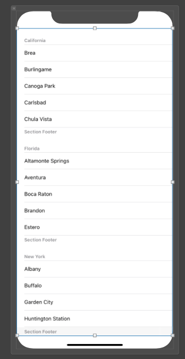

**ViewController**

```swift
//
//  ViewController.swift
//  FullPowerTableView
//
//  Created by jrasmusson on 2021-08-22.
//

import UIKit

class ViewController: UIViewController {
    
    @IBOutlet var tableView: UITableView!

    let games = [
        "Pacman",
        "Space Invaders",
        "Space Patrol",
    ]
        
    let cellId = "cellId"

    override func viewDidLoad() {
        super.viewDidLoad()
        setup()
    }
}

// MARK: - Setup
extension ViewController {
    func setup() {
        setupTableView()
    }
    
    private func setupTableView() {
        tableView.delegate = self
        tableView.dataSource = self

        tableView.register(UITableViewCell.self, forCellReuseIdentifier: cellId)
        tableView.tableFooterView = UIView() // hide empty rows
    }
}

// MARK: - UITableViewDelegate
extension ViewController: UITableViewDelegate {
    func tableView(_ tableView: UITableView, didSelectRowAt indexPath: IndexPath) {

    }
}

// MARK: - UITableViewDataSource
extension ViewController: UITableViewDataSource {
    func tableView(_ tableView: UITableView, cellForRowAt indexPath: IndexPath) -> UITableViewCell {
        let cell = tableView.dequeueReusableCell(withIdentifier: cellId, for: indexPath)

        cell.textLabel?.text = games[indexPath.row]
        cell.accessoryType = UITableViewCell.AccessoryType.disclosureIndicator

        return cell
    }

    func tableView(_ tableView: UITableView, numberOfRowsInSection section: Int) -> Int {
        return games.count
    }
}
```

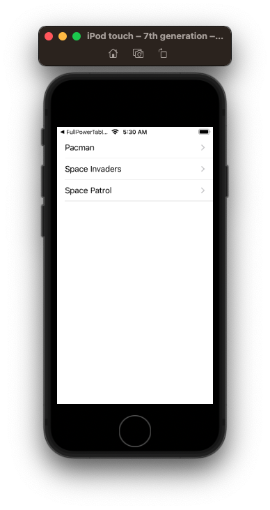

## Add the table view header

Create a new header view and nib and assign the `File's Owner` like a plain old nib. 

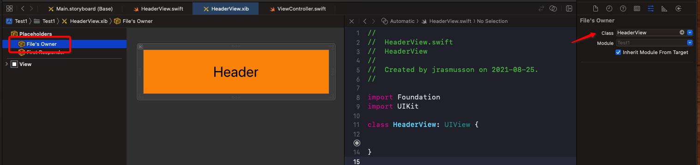

Drag the `View` from the nib into the file and call it `contentView`.

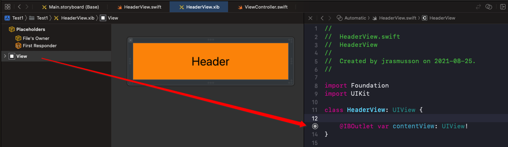

Then if you wanted to do something fancy you could.

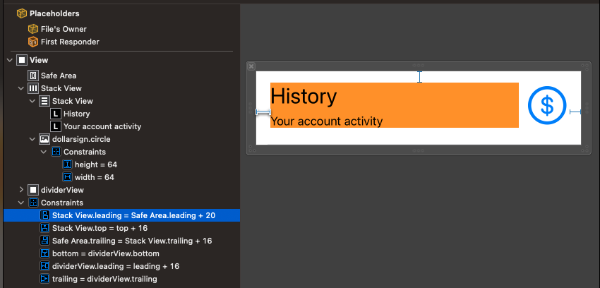

Pin your content view to the edges like this.

**HeaderView**

```swift
import Foundation
import UIKit

class HeaderView: UIView {
    
    @IBOutlet var contentView: UIView!
    
    override init(frame: CGRect) {
        super.init(frame: frame)
        commonInit()
    }

    required init?(coder aDecoder: NSCoder) {
        super.init(coder: aDecoder)
        commonInit()
    }

    // important! 
    override var intrinsicContentSize: CGSize {
        return CGSize(width: UIView.noIntrinsicMetric, height: 104)
    }

    private func commonInit() {
        let bundle = Bundle(for: HeaderView.self)
        bundle.loadNibNamed("HeaderView", owner: self, options: nil)
        addSubview(contentView)

        contentView.translatesAutoresizingMaskIntoConstraints = false
        contentView.topAnchor.constraint(equalTo: self.topAnchor).isActive = true
        contentView.rightAnchor.constraint(equalTo: self.rightAnchor).isActive = true
        contentView.bottomAnchor.constraint(equalTo: self.bottomAnchor).isActive = true
        contentView.leftAnchor.constraint(equalTo: self.leftAnchor).isActive = true
    }
}
```

Then add it to the view controller like so.

**ViewController**

```swift
// MARK: - Setup
extension ViewController {
    func setup() {
        setupTableView()
        setupTableViewHeader()
    }
    
    ...
        
    private func setupTableViewHeader() {
        let header = HeaderView(frame: .zero)

        // Set frame size before populate view to have initial size
        var size = header.systemLayoutSizeFitting(UIView.layoutFittingCompressedSize)
        size.width = UIScreen.main.bounds.width
        header.frame.size = size

        // Recalculate header size after populated with content
        size = header.systemLayoutSizeFitting(UIView.layoutFittingCompressedSize)
        size.width = UIScreen.main.bounds.width
        header.frame.size = size

        tableView.tableHeaderView = header
    }
}
```

Yes you need to calculate the header size x2. Strange but this is how it works.

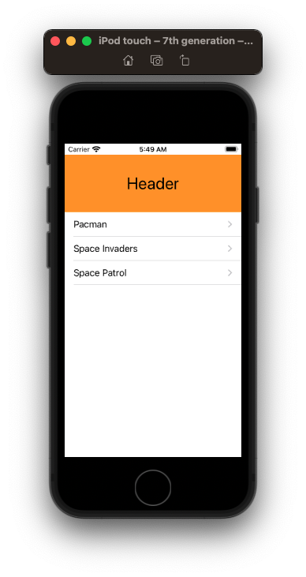

### Trouble shooting

If your header overlaps your table like so

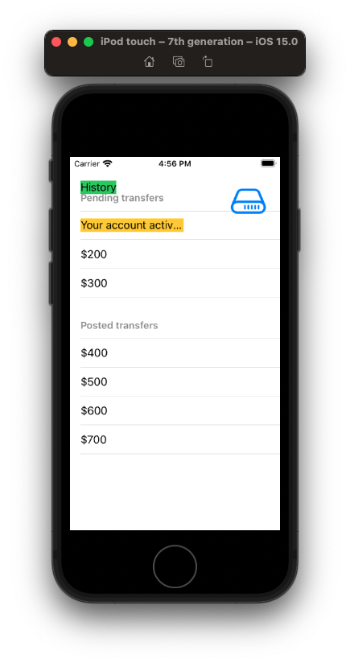

its because you forget to set an intrinsic content size in your `HeaderView`.

```swift
    override var intrinsicContentSize: CGSize {
        return CGSize(width: UIView.noIntrinsicMetric, height: 104)
    }
```

## Add sections

To add sections to our table view, we are going to need some kind of data model. 

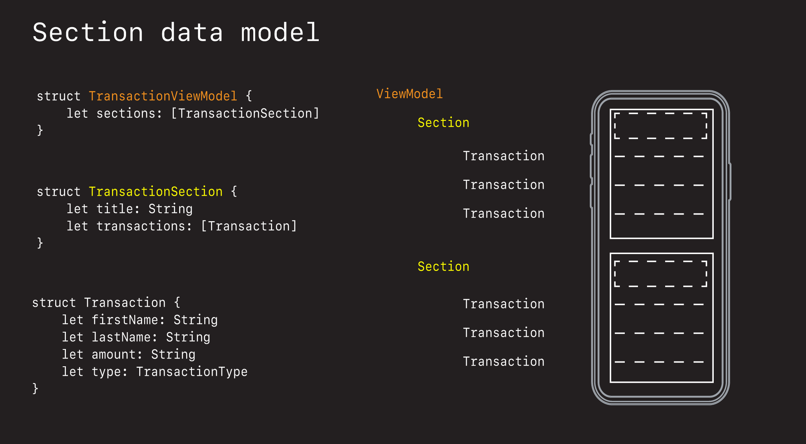

```swift
enum TransactionType: String {
    case pending = "Pending"
    case posted = "Posted"
}

struct Transaction {
    let firstName: String
    let lastName: String
    let amount: String
    let type: TransactionType
}

struct TransactionSection {
    let title: String
    let transactions: [Transaction]
}

struct TransactionViewModel {
    let sections: [TransactionSection]
}
```

Then to sync with with our table, we need to update our data source methods like this.

**ViewController**

```swift
class ViewController: UIViewController {
            
    var viewModel: TransactionViewModel?

    override func viewDidLoad() {
    	 ...
        fetchData()
    }
}

// MARK: - Networking
extension ViewController {
    private func fetchData() {
        let tx1 = Transaction(firstName: "Kevin", lastName: "Flynn", amount: "$100", type: .pending)
        let tx2 = Transaction(firstName: "Allan", lastName: "Bradley", amount: "$200", type: .pending)
        let tx3 = Transaction(firstName: "Ed", lastName: "Dillinger", amount: "$300", type: .pending)

        let tx4 = Transaction(firstName: "Sam", lastName: "Flynn", amount: "$400", type: .pending)
        let tx5 = Transaction(firstName: "Quorra", lastName: "Iso", amount: "$500", type: .pending)
        let tx6 = Transaction(firstName: "Castor", lastName: "Barkeep", amount: "$600", type: .pending)
        let tx7 = Transaction(firstName: "CLU", lastName: "MCU", amount: "$700", type: .pending)
        
        let section1 = TransactionSection(title: "Pending transfers", transactions: [tx1, tx2, tx3])
        let section2 = TransactionSection(title: "Posted transfers", transactions: [tx4, tx5, tx6, tx7])

        viewModel = TransactionViewModel(sections: [section1, section2])
    }
}

// MARK: - UITableViewDelegate
extension ViewController: UITableViewDelegate {
    func tableView(_ tableView: UITableView, didSelectRowAt indexPath: IndexPath) {
        
    }
}

// MARK: - UITableViewDataSource
extension ViewController: UITableViewDataSource {
    func tableView(_ tableView: UITableView, cellForRowAt indexPath: IndexPath) -> UITableViewCell {
        guard let vm = viewModel else { return UITableViewCell() }
        
        let cell = tableView.dequeueReusableCell(withIdentifier: cellId, for: indexPath)
        let section = indexPath.section
        
        let text = vm.sections[section].transactions[indexPath.row].amount
        cell.textLabel?.text = text
        
        return cell
    }
    
    func tableView(_ tableView: UITableView, numberOfRowsInSection section: Int) -> Int {
        guard let vm = viewModel else { return 0 }
        return vm.sections[section].transactions.count
    }
    
    func tableView(_ tableView: UITableView, titleForHeaderInSection section: Int) -> String? {
        guard let vm = viewModel else { return nil }
        return vm.sections[section].title
    }
    
    func tableView(_ tableView: UITableView, heightForHeaderInSection section: Int) -> CGFloat {
        return 40
    }
    
    func numberOfSections(in tableView: UITableView) -> Int {
        guard let sections = viewModel?.sections else { return 0 }
        return sections.count
    }
}
```

To make it so your sections headers don't stack as you scroll make the style grouped.

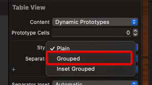

Should now have this.

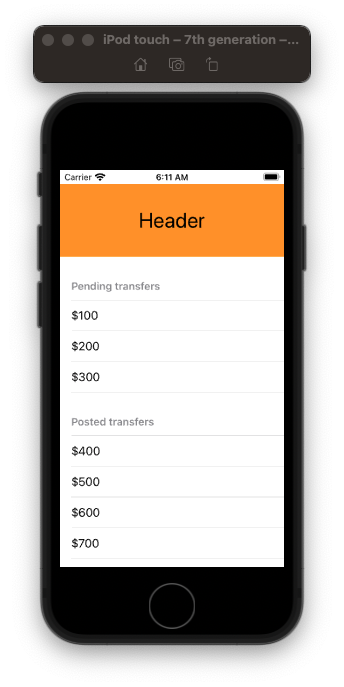

### Section header simple

You can either use the default section header that comes with the `UITableView`.

```swift
// MARK: - UITableViewDataSource
extension ViewController: UITableViewDataSource {
    ...
    func tableView(_ tableView: UITableView, titleForHeaderInSection section: Int) -> String? {
        guard let vm = viewModel else { return nil }
        return vm.sections[section].title
    }
}
```

### Section header complex

Or you can create your own nib and register just like we did with the header before.

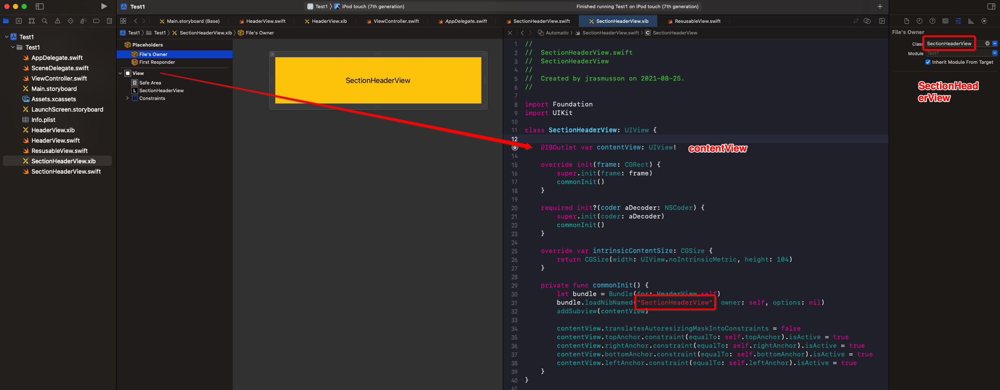

**SectionHeaderView**

```swift
import Foundation
import UIKit

class SectionHeaderView: UIView {
    
    @IBOutlet var contentView: UIView!
    
    override init(frame: CGRect) {
        super.init(frame: frame)
        commonInit()
    }

    required init?(coder aDecoder: NSCoder) {
        super.init(coder: aDecoder)
        commonInit()
    }

    override var intrinsicContentSize: CGSize {
        return CGSize(width: UIView.noIntrinsicMetric, height: 104)
    }

    private func commonInit() {
        let bundle = Bundle(for: SectionHeaderView.self)
        bundle.loadNibNamed("SectionHeaderView", owner: self, options: nil)
        addSubview(contentView)

        contentView.translatesAutoresizingMaskIntoConstraints = false
        contentView.topAnchor.constraint(equalTo: self.topAnchor).isActive = true
        contentView.rightAnchor.constraint(equalTo: self.rightAnchor).isActive = true
        contentView.bottomAnchor.constraint(equalTo: self.bottomAnchor).isActive = true
        contentView.leftAnchor.constraint(equalTo: self.leftAnchor).isActive = true
    }
}
```

And then replace the default one like this.

**ViewController**

```swift
// MARK: - UITableViewDataSource
extension ViewController: UITableViewDataSource {

// Comment this out...    
//    func tableView(_ tableView: UITableView, titleForHeaderInSection section: Int) -> String? {
//        guard let vm = viewModel else { return nil }
//        return vm.sections[section].title
//    }

    func tableView(_ tableView: UITableView, viewForHeaderInSection section: Int) -> UIView? {
        let headerView: SectionHeader = SectionHeader()
        return headerView
    }
        
    func tableView(_ tableView: UITableView, heightForHeaderInSection section: Int) -> CGFloat {
        return 70 // should match the height of our nib
    }
}
```


### How to size your header and sections

When it comes to sizing, the frame of the nib is actually used. So size your nib to the frame size you want.

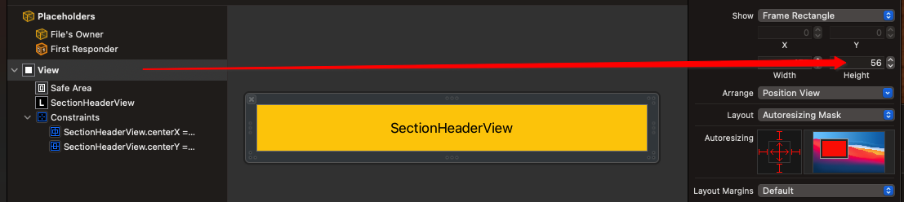

And then embed your controls in a view in the nib setting the height you want for the view as a constraint.

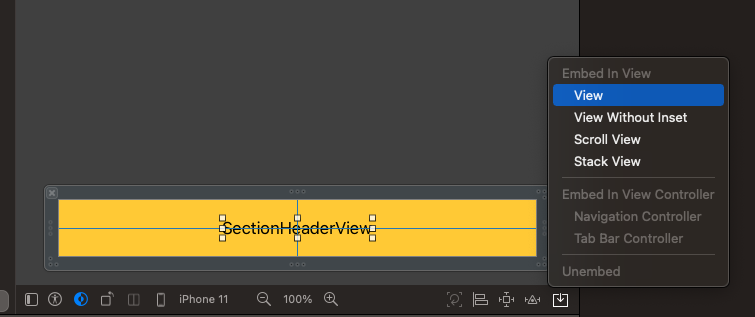

Pin the new embedded view to the edges of the nib (**important!** do not pin to `safeArea`).

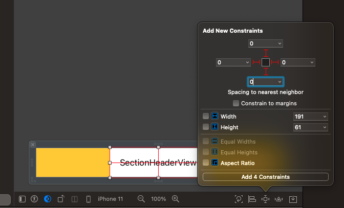

There should be no ambiguity.

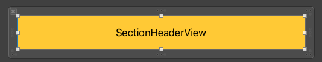

Now add your explicit height constraint.

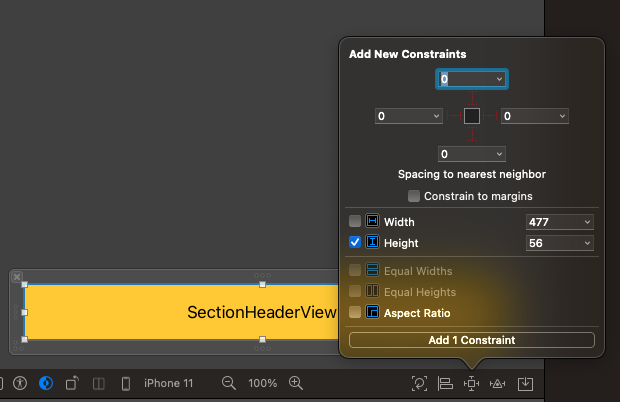

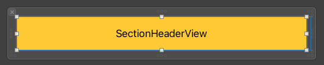

This section header will now have a hard wired height. If you run the app now...it still may not come out sized correctly, because you need to specifiy the section height explicitly in the view controller.

```swift
// MARK: - UITableViewDataSource
extension ViewController: UITableViewDataSource {
    func tableView(_ tableView: UITableView, heightForHeaderInSection section: Int) -> CGFloat {
        return 56 // Should match what we set in the nib
    }
}
```

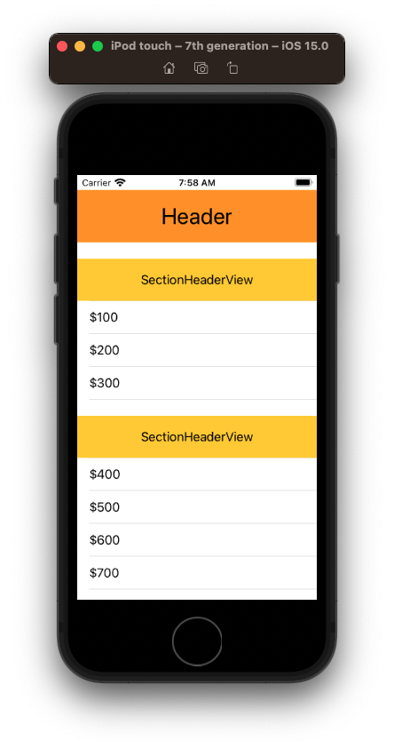

Note: The `heightForHeaderInSection` setting will override the height constraint in the nib. So if you set it to something really small.

```swift
// MARK: - UITableViewDataSource
extension ViewController: UITableViewDataSource {
    func tableView(_ tableView: UITableView, heightForHeaderInSection section: Int) -> CGFloat {
        return 20 // This overrides the nib
    }
    
    func numberOfSections(in tableView: UITableView) -> Int {
        guard let sections = viewModel?.sections else { return 0 }
        return sections.count
    }
}
```

It will override the nib.

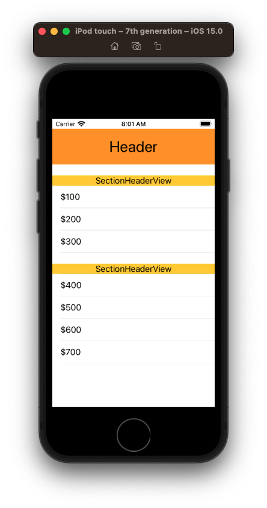

Using this technique you can create custom headers and custom section headers.


To get the layout above:

- embed both labels inside a `View`
- embed those within a `StackView` 
- set the heights of each view explicitly (i.e. 50 and 30)
- pin the stack view to the edges
- make the stackview with `fill` for alignment and distribution
- resize the nib frame to match the height (i.e. 80)

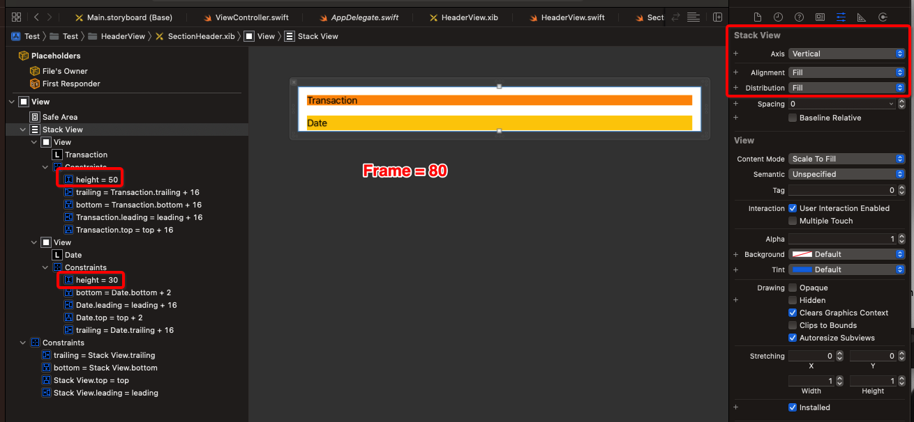

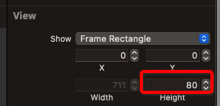

### Gap between section and header

If you notice a gap between your section header and main header

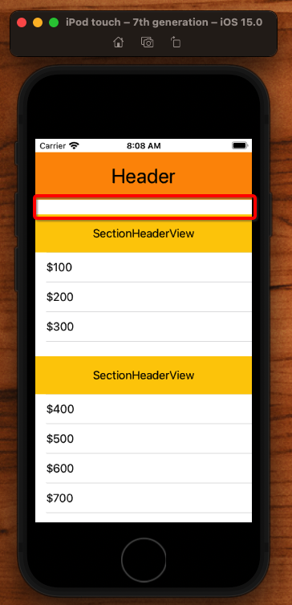

try changing the `Style` of your table from `Plain` to `Grouped`.

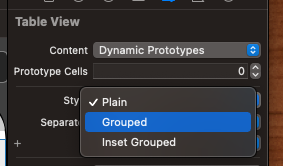

That should hopefully get rid of the gap. 

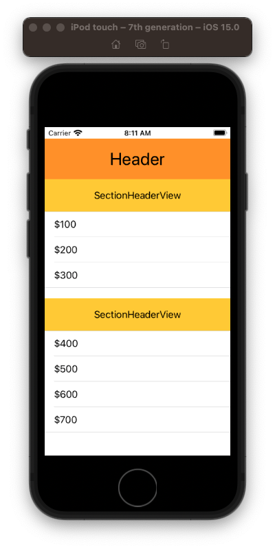


## Create Custom Cells


### Links that help

- [Table Header View Storyboard](https://programmingwithswift.com/how-to-add-header-footer-view-in-uitableview-in-storyboard/)