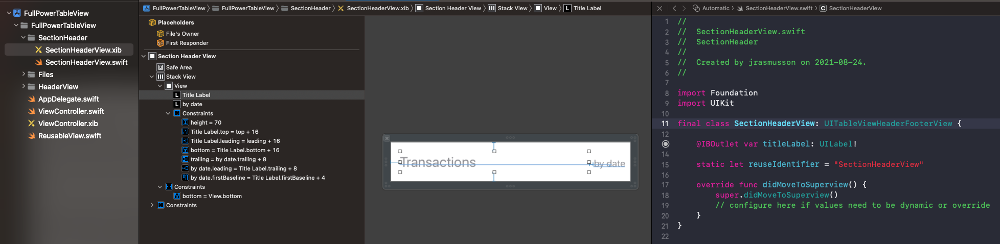
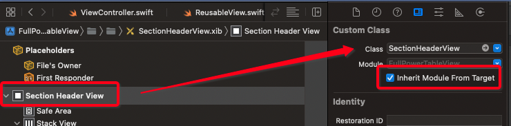

# Header Footer Example Nib


## Create the Table View

Create a new nib/view and drag a `UITableView` onto it pinned to all the edges. Drag an outlet called `tableView` into the view controller and set your data up.


**ViewController**

```swift
//
//  ViewController.swift
//  FullPowerTableView
//
//  Created by jrasmusson on 2021-08-22.
//

import UIKit

class ViewController: UIViewController {
    
    let games = [
        "Pacman",
        "Space Invaders",
        "Space Patrol",
    ]
    
    @IBOutlet var tableView: UITableView!
    
    let cellId = "cellId"

    override func viewDidLoad() {
        super.viewDidLoad()
        setup()
    }

}

// MARK: - Setup
extension ViewController {
    func setup() {
        setupTableView()
    }
    
    private func setupTableView() {
        tableView.delegate = self
        tableView.dataSource = self

        tableView.register(UITableViewCell.self, forCellReuseIdentifier: cellId)
        tableView.tableFooterView = UIView() // hide empty rows
    }

// MARK: - UITableViewDelegate
extension ViewController: UITableViewDelegate {
    func tableView(_ tableView: UITableView, didSelectRowAt indexPath: IndexPath) {

    }
}

// MARK: - UITableViewDataSource
extension ViewController: UITableViewDataSource {
    func tableView(_ tableView: UITableView, cellForRowAt indexPath: IndexPath) -> UITableViewCell {
        let cell = tableView.dequeueReusableCell(withIdentifier: cellId, for: indexPath)

        cell.textLabel?.text = games[indexPath.row]
        cell.accessoryType = UITableViewCell.AccessoryType.disclosureIndicator

        return cell
    }

    func tableView(_ tableView: UITableView, numberOfRowsInSection section: Int) -> Int {
        return games.count
    }
}
```

## Add the table view header

Create a new header view and nib. Drag the `View` from the nib into the file and call it `contentView` pinning it to the edges of the view.


**HeaderView**

```swift
import Foundation
import UIKit

class HeaderView: UIView {
    
    @IBOutlet var contentView: UIView!
    
    override init(frame: CGRect) {
        super.init(frame: frame)
        commonInit()
    }

    required init?(coder aDecoder: NSCoder) {
        super.init(coder: aDecoder)
        commonInit()
    }

    override var intrinsicContentSize: CGSize {
        return CGSize(width: UIView.noIntrinsicMetric, height: 104)
    }

    private func commonInit() {
        let bundle = Bundle(for: HeaderView.self)
        bundle.loadNibNamed("HeaderView", owner: self, options: nil)
        addSubview(contentView)

        contentView.translatesAutoresizingMaskIntoConstraints = false
        contentView.topAnchor.constraint(equalTo: self.topAnchor).isActive = true
        contentView.rightAnchor.constraint(equalTo: self.rightAnchor).isActive = true
        contentView.bottomAnchor.constraint(equalTo: self.bottomAnchor).isActive = true
        contentView.leftAnchor.constraint(equalTo: self.leftAnchor).isActive = true
    }
}
```

The add it to the view controller like so.

**ViewController**

```swift
// MARK: - Setup
extension ViewController {
    func setup() {
        setupTableView()
        setupTableViewHeader()
    }
    
    ...
        
    private func setupTableViewHeader() {
        let header = HeaderView(frame: .zero)

        // Set frame size before populate view to have initial size
        var size = header.systemLayoutSizeFitting(UIView.layoutFittingCompressedSize)
        size.width = UIScreen.main.bounds.width
        header.frame.size = size

        // Recalculate header size after populated with content
        size = header.systemLayoutSizeFitting(UIView.layoutFittingCompressedSize)
        size.width = UIScreen.main.bounds.width
        header.frame.size = size

        tableView.tableHeaderView = header
    }
}
```

The above code seems strange at first, but if you don't recalculate the header size after populating with content the header view won't show.

## Add sections

To add sections to our table view, we are going to need a data model. 

```swift
enum TransactionType: String {
    case pending = "Pending"
    case posted = "Posted"
}

struct Transaction {
    let firstName: String
    let lastName: String
    let amount: String
    let type: TransactionType
}

struct TransactionSection {
    let title: String
    let transactions: [Transaction]
}

struct TransactionViewModel {
    let sections: [TransactionSection]
}
```

Then to sync with with our table, we need to update our data source methods like this.

**ViewController**

```swift
class ViewController: UIViewController {
            
    var viewModel: TransactionViewModel?

    override func viewDidLoad() {
    	 ...
        fetchData()
    }
}

// MARK: - Networking
extension ViewController {
    private func fetchData() {
        let tx1 = Transaction(firstName: "Kevin", lastName: "Flynn", amount: "$100", type: .pending)
        let tx2 = Transaction(firstName: "Allan", lastName: "Bradley", amount: "$200", type: .pending)
        let tx3 = Transaction(firstName: "Ed", lastName: "Dillinger", amount: "$300", type: .pending)

        let tx4 = Transaction(firstName: "Sam", lastName: "Flynn", amount: "$100", type: .pending)
        let tx5 = Transaction(firstName: "Quorra", lastName: "Iso", amount: "$200", type: .pending)
        let tx6 = Transaction(firstName: "Castor", lastName: "Barkeep", amount: "$300", type: .pending)
        let tx7 = Transaction(firstName: "CLU", lastName: "MCU", amount: "$400", type: .pending)
        
        let section1 = TransactionSection(title: "Pending transfers", transactions: [tx1, tx2, tx3])
        let section2 = TransactionSection(title: "Posted transfers", transactions: [tx4, tx5, tx6, tx7])

        viewModel = TransactionViewModel(sections: [section1, section2])
    }
}

// MARK: - UITableViewDelegate
extension ViewController: UITableViewDelegate {

}

// MARK: - UITableViewDataSource
extension ViewController: UITableViewDataSource {
    func tableView(_ tableView: UITableView, cellForRowAt indexPath: IndexPath) -> UITableViewCell {
        guard let vm = viewModel else { return UITableViewCell() }
        
        let cell = tableView.dequeueReusableCell(withIdentifier: cellId, for: indexPath)
        let section = indexPath.section
        
        let text = vm.sections[section].transactions[indexPath.row].amount
        cell.textLabel?.text = text
        
        return cell
    }
    
    func tableView(_ tableView: UITableView, numberOfRowsInSection section: Int) -> Int {
        guard let vm = viewModel else { return 0 }
        return vm.sections[section].transactions.count
    }
    
    func tableView(_ tableView: UITableView, titleForHeaderInSection section: Int) -> String? {
        guard let vm = viewModel else { return nil }
        return vm.sections[section].title
    }
    
    func tableView(_ tableView: UITableView, heightForHeaderInSection section: Int) -> CGFloat {
        return 40
    }
    
    func numberOfSections(in tableView: UITableView) -> Int {
        guard let sections = viewModel?.sections else { return 0 }
        return sections.count
    }
}
```

### Section header simple

You can add a section header easily by using the default title like so.

```swift
func tableView(_ tableView: UITableView, titleForHeaderInSection section: Int) -> String? {
    guard let vm = viewModel else { return nil }
    return vm.sections[section].title
}
```

### Section header complex

Or you can supply your own complex header view programmatically or as a nib.



Couple things to note with the nib:

1. This custom class is set on the `View` instead of the `File's Owner`.
2. You need to manually check the `Inherit Module From Target` option.



Not sure why this is. Will try setting directly on the nib later and see what happens.

Also, I am making use of a convenience class for the loading of nibs.

**ReusableView**

```swift
import UIKit

protocol ReusableView: AnyObject {}
protocol NibLoadableView: AnyObject {}

extension ReusableView {
    static var reuseID: String { return "\(self)" }
}

extension NibLoadableView {
    static var nibName: String { return "\(self)" }
}

extension UITableViewCell: ReusableView, NibLoadableView {}
extension UICollectionViewCell: ReusableView, NibLoadableView {}
extension UITableViewHeaderFooterView: ReusableView, NibLoadableView {}

extension UITableView {
    func dequeueResuableCell<T: UITableViewCell>(for indexPath: IndexPath) -> T {
        guard let cell = dequeueReusableCell(withIdentifier: T.reuseID, for: indexPath) as? T else {
            fatalError("Could not dequeue cell with identifier: \(T.reuseID)")
        }
        return cell
    }

    func dequeueResuableHeaderFooter<T: UITableViewHeaderFooterView>() -> T {
        guard let headerFooter = dequeueReusableHeaderFooterView(withIdentifier: T.reuseID) as? T else {
            fatalError("Could not dequeue header footer view with identifier: \(T.reuseID)")
        }
        return headerFooter
    }

    func register<T: ReusableView & NibLoadableView>(_: T.Type) {
        let nib = UINib(nibName: T.nibName, bundle: nil)
        register(nib, forCellReuseIdentifier: T.reuseID)
    }

    func registerHeaderFooter<T: ReusableView & NibLoadableView>(_: T.Type) {
        let nib = UINib(nibName: T.nibName, bundle: nil)
        register(nib, forHeaderFooterViewReuseIdentifier: T.reuseID)
    }
}
```

I don't like it, because I don't yet fully understand it. But I will try repeating this steps and see if I can get it all to work without its use. Until then I will make use.

And then finally, this is how we add it to the view controller.

**ViewController**

```swift
private func setupTableView() {
    tableView.registerHeaderFooter(SectionHeaderView.self)
}

...

// MARK: - UITableViewDataSource
extension ViewController: UITableViewDataSource {

// Comment this out...    
//    func tableView(_ tableView: UITableView, titleForHeaderInSection section: Int) -> String? {
//        guard let vm = viewModel else { return nil }
//        return vm.sections[section].title
//    }

    func tableView(_ tableView: UITableView, viewForHeaderInSection section: Int) -> UIView? {
        let headerView: SectionHeaderView = tableView.dequeueResuableHeaderFooter()
        headerView.titleLabel.text = "Pending eller Post"
        return headerView
    }
    
    func tableView(_ tableView: UITableView, heightForHeaderInSection section: Int) -> CGFloat {
        return 70 // the same height constraint used in our `SectionHeaderView`
    }
}
```

The same process can be repeated for the footer.

### Links that help

- [Table Header View Storyboard](https://programmingwithswift.com/how-to-add-header-footer-view-in-uitableview-in-storyboard/)