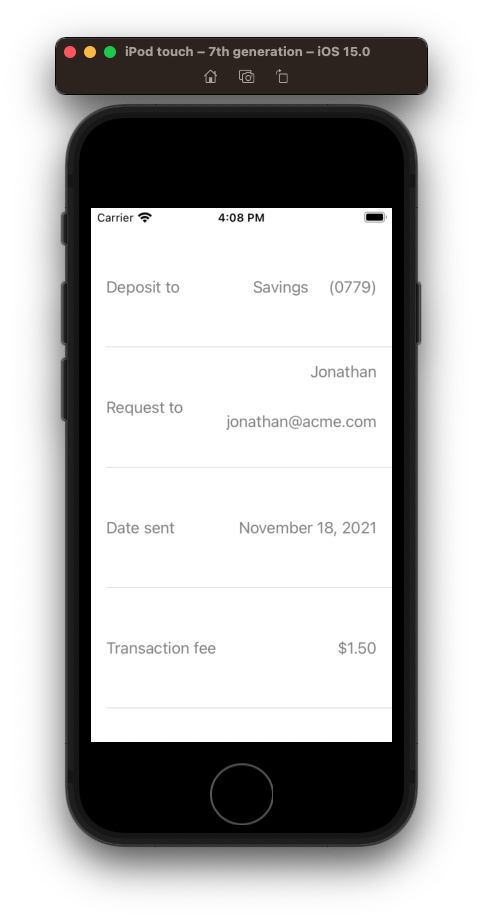
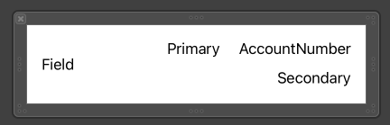

# UITableView Cells and Types



You can do some real cool things with `Section` `Row` and `enum` by defining a cell.



And then defining various row types and simply switching on them to configure the cell.

**ViewController**

```swift
import UIKit

// MARK: - TableSection
extension ViewController {
    struct TableSection {
        let title: String
        let rows: [RowType]

        enum RowType {
            case depositTo(DepositModel)
            case requestTo(RecipientModel)
            case sentDate(Date)
            case transactionFee

            var fieldLabel: String {
                switch self {
                case .depositTo: return "Deposit to"
                case .requestTo: return "Request to"
                case .sentDate: return "Date sent"
                case .transactionFee: return "Transaction fee"
                }
            }
        }
    }
}

class ViewController: UIViewController {

    var tableView = UITableView()

    var sections: [TableSection] = []

    var eTransferDetails: RequestDetailModel? {
        didSet {
            populateTable()
            tableView.reloadData()
        }
    }

    override func viewDidLoad() {
        super.viewDidLoad()
        setup()
    }

    private func setup() {
        tableView.dataSource = self
        tableView.rowHeight = 128
        tableView.register(Cell.self)

        view = tableView

        fetchETransferDetails()
    }

    private func populateTable() {
        guard let details = self.eTransferDetails else { return }
        var rows: [TableSection.RowType] = []

        switch details.eTransferStatus {
        case .available:
            rows.append(.depositTo(details.depositAccount))
            rows.append(.requestTo(details.requestedFrom))
            rows.append(.sentDate(details.executionDate))
            rows.append(.transactionFee)
        case .cancelled:
            rows.append(.depositTo(details.depositAccount))
            rows.append(.requestTo(details.requestedFrom))
            rows.append(.sentDate(details.executionDate))
            rows.append(.transactionFee)
        }

        // Currently only one section, so always handle after switch
        self.sections = [TableSection(title: "", rows: rows)]
    }
}

// MARK: - UITableViewDataSource
extension ViewController: UITableViewDataSource {
    func numberOfSections(in tableView: UITableView) -> Int {
        return sections.count
    }

    func tableView(_ tableView: UITableView, numberOfRowsInSection section: Int) -> Int {
        return sections[section].rows.count
    }

    func tableView(_ tableView: UITableView, cellForRowAt indexPath: IndexPath) -> UITableViewCell {
        let cell: Cell = tableView.dequeueResuableCell(for: indexPath)
        let rowType = sections[indexPath.section].rows[indexPath.row]
        cell.configure(rowType: rowType)
        return cell
    }
}

// MARK: - Networking
extension ViewController {
    private func fetchETransferDetails() {
        let depositAccountModel = DepositModel(accountName: "Savings", accountNumber: "0779")
        let recipientModel = RecipientModel(alias: "Jonathan", email: "jonathan@acme.com")
        let details = RequestDetailModel(eTransferStatus: .cancelled, depositAccount: depositAccountModel, requestedFrom: recipientModel, executionDate: Date())
        eTransferDetails = details
    }
}
```

**Cell**

```swift
import UIKit

final class Cell: UITableViewCell {

    @IBOutlet weak var fieldLabel: UILabel!
    @IBOutlet weak var primaryLabel: UILabel!
    @IBOutlet weak var secondaryLabel: UILabel!
    @IBOutlet weak var accountNumberLabel: UILabel!

    override func awakeFromNib() {
        super.awakeFromNib()
        selectionStyle = .none
        accountNumberLabel.isHidden = true
        secondaryLabel.isHidden = true
        [fieldLabel,
        primaryLabel,
        secondaryLabel,
         accountNumberLabel].forEach { $0?.textColor = .gray }
    }
}

extension Cell {
    typealias RowType = ViewController.TableSection.RowType
    func configure(rowType: RowType) {
        fieldLabel.text = rowType.fieldLabel

        switch rowType {
        case .sentDate(let date):
            primaryLabel.text = date.fullMonthDayYearString

        case .requestTo(let recipient):
            primaryLabel.text = recipient.alias
            secondaryLabel.text = recipient.email
            secondaryLabel.isHidden = false

        case .depositTo(let account):
            primaryLabel.text = account.accountName
            accountNumberLabel.text = "(\(account.accountNumber))"
            accountNumberLabel.isHidden = false

        case .transactionFee:
            primaryLabel.text = "$1.50"
        }
    }
}
```

**ViewModel**

```swift
enum TransferStatus: String, Codable {
    case available = "Available"
    case cancelled = "Cancelled"
}

struct DepositModel {
    var accountName: String
    var accountNumber: String
}

struct RecipientModel {
    let alias: String
    let email: String
}

struct RequestDetailModel {
    var eTransferStatus: TransferStatus
    var depositAccount: DepositModel
    var requestedFrom: RecipientModel
    var executionDate: Date
}
```


