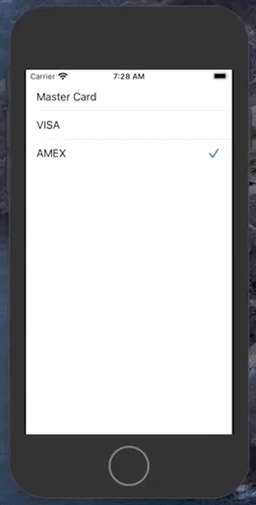
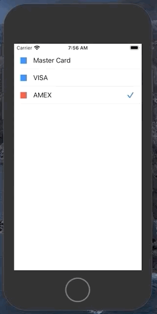
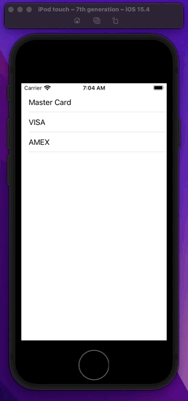

# UITableView

## Simple

```swift
import UIKit

class ViewController: UIViewController {

    let games = [
        "Pacman",
        "Space Invaders",
        "Space Patrol",
    ]

    var tableView = UITableView()

    override func viewDidLoad() {
        super.viewDidLoad()
        tableView.delegate = self
        tableView.dataSource = self

        view = tableView
    }
}

extension ViewController: UITableViewDataSource, UITableViewDelegate {
    func tableView(_ tableView: UITableView, cellForRowAt indexPath: IndexPath) -> UITableViewCell {
        let cell = UITableViewCell()
        cell.textLabel?.text = games[indexPath.row]
        return cell
    }

    func tableView(_ tableView: UITableView, numberOfRowsInSection section: Int) -> Int {
        return games.count
    }
}
```

## Simple with dequeue cell


```swift
import UIKit

class ViewController: UIViewController {

let games = [
                "Pacman",
                "Space Invaders",
                "Space Patrol",
    ]
    
    let cellId = "cellId"

    var tableView = UITableView()

    override func viewDidLoad() {
        super.viewDidLoad()
        setupViews()
    }

    func setupViews() {
        tableView.delegate = self
        tableView.dataSource = self

        tableView.register(UITableViewCell.self, forCellReuseIdentifier: cellId)

        tableView.tableFooterView = UIView() // hide empty rows

        view = tableView
    }
}

extension ViewController: UITableViewDelegate {
    func tableView(_ tableView: UITableView, didSelectRowAt indexPath: IndexPath) {

    }
}

extension ViewController: UITableViewDataSource {
    func tableView(_ tableView: UITableView, cellForRowAt indexPath: IndexPath) -> UITableViewCell {
        let cell = tableView.dequeueReusableCell(withIdentifier: cellId, for: indexPath)

        cell.textLabel?.text = games[indexPath.row]
        cell.accessoryType = UITableViewCell.AccessoryType.disclosureIndicator

        return cell
    }

    func tableView(_ tableView: UITableView, numberOfRowsInSection section: Int) -> Int {
        return games.count
    }
}
```

### Hide extra rows in footer

```swift
tableView.tableFooterView = UIView() // hide empty rows
```

### Hide section footer

```swift
tableView.sectionFooterHeight = 0.0
```

### Hide first section but not others

```swift
func tableView(_ tableView: UITableView, viewForHeaderInSection section: Int) -> UIView? {
    guard section > 0 else { return nil }
    return SectionHeader()
}

func tableView(_ tableView: UITableView, heightForHeaderInSection section: Int) -> CGFloat {
    return section == 0 ? CGFloat.leastNonzeroMagnitude : 34
}
```

### Make cell separators span full screen width

```swift
extension UITableViewCell {
    func enableFullWidthSeparator() {
        preservesSuperviewLayoutMargins = false
        separatorInset = UIEdgeInsets.zero
        layoutMargins = UIEdgeInsets.zero
    }
}
```

## Navigation title

Sometimes you will see a nice title at the top of your table. Often that is a nav bar with a title set.

```swift
    func application(_ application: UIApplication, didFinishLaunchingWithOptions launchOptions: [UIApplication.LaunchOptionsKey: Any]?) -> Bool {
        window = UIWindow(frame: UIScreen.main.bounds)
        window?.makeKeyAndVisible()

        let navigatorController = UINavigationController(rootViewController: ViewController())
        window?.rootViewController = navigatorController

        return true
    }
```

```swift
    override func viewDidLoad() {
        super.viewDidLoad()
        setupViews()

        navigationItem.title = "Actions"
        navigationController?.navigationBar.prefersLargeTitles = true
    }
```


## Accessory types

There are five different accessory types for a `UITableViewCell`.

```swift
    func tableView(_ tableView: UITableView, cellForRowAt indexPath: IndexPath) -> UITableViewCell {
        let cell = tableView.dequeueReusableCell(withIdentifier: "myCell", for: indexPath)

        cell.textLabel?.text = actionButtons[indexPath.row]

        if indexPath.row == 0 {
            cell.accessoryType = UITableViewCell.AccessoryType.none
        } else if indexPath.row == 1 {
            cell.accessoryType = UITableViewCell.AccessoryType.disclosureIndicator
        } else if indexPath.row == 2 {
            cell.accessoryType = UITableViewCell.AccessoryType.detailDisclosureButton
        } else if indexPath.row == 3 {
            cell.accessoryType = UITableViewCell.AccessoryType.checkmark
        } else if indexPath.row == 4 {
            cell.accessoryType = UITableViewCell.AccessoryType.detailButton
        }

        return cell
    }
```


## TableView Style

```swift
let tableView = UITableView(frame: .zero, style: .plain)
let tableView = UITableView(frame: .zero, style: .grouped)
```


## Editing Styles

There are two ways you can edit the rows and provide actions on a _UITableViewCell_. You can either return an array of action buttons with closures like this.

```swift
override func tableView(_ tableView: UITableView, commit editingStyle: UITableViewCell.EditingStyle, forRowAt indexPath: IndexPath) {
    if editingStyle == .delete {
        objects.remove(at: indexPath.row)
        tableView.deleteRows(at: [indexPath], with: .fade)
    } else if editingStyle == .insert {
        // Create a new instance of the appropriate class, insert it into the array, and add a new row to the table view.
    }
}
```

- [How to swipe to delete tableViewCelles](https://www.hackingwithswift.com/example-code/uikit/how-to-swipe-to-delete-uitableviewcells)

Or you can create a custom action button (like on a navbarController) and do your work via target-action there.

```swift
    lazy var addButtonItem: UIBarButtonItem = {
        let barButtonItem = UIBarButtonItem(title: "Add", style: .plain, target: self, action: #selector(addGamePressed))
        return barButtonItem
    }()

    @objc
    func addGamePressed() {
        games.append("Ms Pacman")
        let indexPath = IndexPath(row: games.count - 1, section: 0)

        tableView.beginUpdates()
        tableView.insertRows(at: [indexPath], with: .fade)
        tableView.endUpdates()
    }
```

Either way will work. More just a matter of design and whatever makes sense for your app.

## Handling Row Selection

### Selecting items from a list

[Handling Row Selection in a Table View](https://developer.apple.com/documentation/uikit/uitableviewdelegate/handling_row_selection_in_a_table_view)


```swift
import UIKit

class ViewController: UIViewController {

    struct CardItem {
        let name: String
        let isSelected: Bool
        
        init(_ name: String, _ isSelected: Bool) {
            self.name = name
            self.isSelected = isSelected
        }
    }
    
    var cardList = [
        CardItem("Master Card", false),
        CardItem("VISA", false),
        CardItem("AMEX", false),
    ]
    
    let cellId = "cellId"

    var tableView = UITableView()

    override func viewDidLoad() {
        super.viewDidLoad()
        setupViews()
    }

    func setupViews() {
        tableView.delegate = self
        tableView.dataSource = self

        tableView.register(UITableViewCell.self, forCellReuseIdentifier: cellId)
        tableView.tableFooterView = UIView() // hide empty rows

        view = tableView
    }
}

extension ViewController: UITableViewDelegate {

}

extension ViewController: UITableViewDataSource {
    func tableView(_ tableView: UITableView, cellForRowAt indexPath: IndexPath) -> UITableViewCell {

        let cell = tableView.dequeueReusableCell(withIdentifier: cellId, for: indexPath)

        let card = cardList[indexPath.row]
        cell.textLabel?.text = card.name
        
        return cell
    }

    func tableView(_ tableView: UITableView, numberOfRowsInSection section: Int) -> Int {
        return cardList.count
    }

    func tableView(_ tableView: UITableView, didSelectRowAt indexPath: IndexPath) {
        // Unselect the row, and instead, show the state with a checkmark.
        tableView.deselectRow(at: indexPath, animated: false)
        
        guard let cell = tableView.cellForRow(at: indexPath) else { return }
        
        // Update the selected item to indicate whether the user packed it or not.
        let item = cardList[indexPath.row]
        let newItem = CardItem(item.name, !item.isSelected)
        cardList.remove(at: indexPath.row)
        cardList.insert(newItem, at: indexPath.row)
        
        // Show a check mark next to packed items.
        if newItem.isSelected {
            cell.accessoryType = .checkmark
        } else {
            cell.accessoryType = .none
        }
    }
}
```

## Exclusively selecting items from a list



```swift
import UIKit

class ViewController: UIViewController {

    struct CardItem {
        let name: String
        let isSelected: Bool
        
        init(_ name: String, _ isSelected: Bool) {
            self.name = name
            self.isSelected = isSelected
        }
    }
    
    var cardList = [
        CardItem("Master Card", false),
        CardItem("VISA", false),
        CardItem("AMEX", false),
    ]
    var previouslySelectedRow = 99
    
    let cellId = "cellId"

    var tableView = UITableView()

    override func viewDidLoad() {
        super.viewDidLoad()
        setupViews()
    }

    func setupViews() {
        tableView.delegate = self
        tableView.dataSource = self

        tableView.register(UITableViewCell.self, forCellReuseIdentifier: cellId)
        tableView.tableFooterView = UIView() // hide empty rows

        view = tableView
    }
}

extension ViewController: UITableViewDelegate {

}

extension ViewController: UITableViewDataSource {
    func tableView(_ tableView: UITableView, cellForRowAt indexPath: IndexPath) -> UITableViewCell {

        let cell = tableView.dequeueReusableCell(withIdentifier: cellId, for: indexPath)

        let card = cardList[indexPath.row]
        cell.textLabel?.text = card.name
        
        return cell
    }

    func tableView(_ tableView: UITableView, numberOfRowsInSection section: Int) -> Int {
        return cardList.count
    }
    
    // exclusively selecting items from a list
    func tableView(_ tableView: UITableView, didSelectRowAt indexPath: IndexPath) {
        // Unselect the row.
        tableView.deselectRow(at: indexPath, animated: false)
        
        // Did the user tap on the previously selected row?
        if previouslySelectedRow == indexPath.row {
            return
        }

        // Remove the checkmark from the previously selected filter item.
        if let previousCell = tableView.cellForRow(at: IndexPath(row: previouslySelectedRow, section: indexPath.section)) {
            previousCell.accessoryType = .none
        }
        
        // Mark the newly selected filter item with a checkmark.
        if let cell = tableView.cellForRow(at: indexPath) {
            cell.accessoryType = .checkmark
        }
        
        // Remember this selected filter item.
        previouslySelectedRow = indexPath.row
    }
}
```

## Exclusively list custom cell



**CardCell.swift**

```swift
import UIKit

class CardCell: UITableViewCell {
    
    let onOffImageView = UIView()
    let label = UILabel()
    
    var cardItem: CardItem? {
        didSet {
            guard let cardItem = cardItem else { return }
            label.text = cardItem.name
            if cardItem.isSelected {
                onOffImageView.backgroundColor = .systemRed
            } else {
                onOffImageView.backgroundColor = .systemBlue
            }
        }
    }
    
    override init(style: UITableViewCell.CellStyle, reuseIdentifier: String?) {
        super.init(style: style, reuseIdentifier: reuseIdentifier)
        setup()
        layout()
    }
    
    required init?(coder: NSCoder) {
        fatalError("init(coder:) has not been implemented")
    }
    
    func setup() {
        onOffImageView.translatesAutoresizingMaskIntoConstraints = false
        onOffImageView.backgroundColor = .systemRed
        
        label.translatesAutoresizingMaskIntoConstraints = false
    }
    
    func layout() {
        contentView.addSubview(onOffImageView)
        contentView.addSubview(label)
        
        NSLayoutConstraint.activate([
            onOffImageView.centerYAnchor.constraint(equalTo: centerYAnchor),
            onOffImageView.leadingAnchor.constraint(equalToSystemSpacingAfter: leadingAnchor, multiplier: 2),
            onOffImageView.widthAnchor.constraint(equalToConstant: 16),
            onOffImageView.heightAnchor.constraint(equalToConstant: 16),
            
            label.centerYAnchor.constraint(equalTo: centerYAnchor),
            label.leadingAnchor.constraint(equalToSystemSpacingAfter: onOffImageView.trailingAnchor, multiplier: 2),
            trailingAnchor.constraint(equalToSystemSpacingAfter: label.trailingAnchor, multiplier: 2),
        ])
    }
}
```

**ViewController.swift**

```swift
import UIKit

struct CardItem {
    let name: String
    let isSelected: Bool
    
    init(_ name: String, _ isSelected: Bool) {
        self.name = name
        self.isSelected = isSelected
    }
}

class ViewController: UIViewController {

    var cardList = [
        CardItem("Master Card", false),
        CardItem("VISA", false),
        CardItem("AMEX", false),
    ]
    var previouslySelectedRow = 99
    
    let cellId = "cellId"

    var tableView = UITableView()

    override func viewDidLoad() {
        super.viewDidLoad()
        setupViews()
    }

    func setupViews() {
        tableView.delegate = self
        tableView.dataSource = self

        tableView.register(CardCell.self, forCellReuseIdentifier: cellId)
        tableView.tableFooterView = UIView() // hide empty rows

        view = tableView
    }
}

extension ViewController: UITableViewDelegate {

}

extension ViewController: UITableViewDataSource {
    
    func tableView(_ tableView: UITableView, cellForRowAt indexPath: IndexPath) -> UITableViewCell {
        guard let cell = tableView.dequeueReusableCell(withIdentifier: cellId, for: indexPath) as? CardCell else {
            return UITableViewCell()
        }
        cell.cardItem = cardList[indexPath.row]
        
        return cell
    }

    func tableView(_ tableView: UITableView, numberOfRowsInSection section: Int) -> Int {
        return cardList.count
    }
    
    // exclusively selecting items from a list
    func tableView(_ tableView: UITableView, didSelectRowAt indexPath: IndexPath) {
        // Unselect the row.
        tableView.deselectRow(at: indexPath, animated: false)
        
        // Did the user tap on the previously selected row?
        if previouslySelectedRow == indexPath.row {
            return
        }

        // Remove the checkmark from the previously selected row
        if let previousCell = tableView.cellForRow(at: IndexPath(row: previouslySelectedRow, section: indexPath.section)) as? CardCell {
            previousCell.accessoryType = .none
            
            // Update the previously selected card
            let previousCard = cardList[previouslySelectedRow]
            let updatedPreviousCard = CardItem(previousCard.name, false)
            previousCell.cardItem = updatedPreviousCard
        }
        
        // Mark the newly row with a checkmark.
        if let cell = tableView.cellForRow(at: indexPath) as? CardCell {
            cell.accessoryType = .checkmark
            
            // Update the current card
            let currentCard = cardList[indexPath.row]
            let updatedCurrentCard = CardItem(currentCard.name, true)
            cell.cardItem = updatedCurrentCard
        }
        
        // Remember this selected filter item.
        previouslySelectedRow = indexPath.row
    }
}
```

## Cell Animation

You can animate the appearance of a cell by making it fade in:

```swift
func tableView(_ tableView: UITableView, willDisplay cell: UITableViewCell, forRowAt indexPath: IndexPath) {
    cell.alpha = 0
    UIView.animate(withDuration: 0.75) {
        cell.alpha = 1.0
    }
}
```

### Pulse animation



Or you can make it pulse on a tap:

```swift
func tableView(_ tableView: UITableView, didSelectRowAt indexPath: IndexPath) {
    tableView.cellForRow(at: indexPath)?.showAnimationPulse {
        // weak self
    }
}

extension UITableViewCell {
    func showAnimationPulse(_ completionBlock: @escaping () -> Void) {
        isUserInteractionEnabled = false
        UIView.animate(withDuration: 0.1,
                       delay: 0,
                       options: .curveLinear,
                       animations: { [weak self] in
            self?.transform = CGAffineTransform.init(scaleX: 0.95, y: 0.95)
        }) {  (done) in
            UIView.animate(withDuration: 0.1,
                           delay: 0,
                           options: .curveLinear,
                           animations: { [weak self] in
                self?.transform = CGAffineTransform.init(scaleX: 1, y: 1)
            }) { [weak self] (_) in
                self?.isUserInteractionEnabled = true
                completionBlock()
            }
        }
    }
}
```

## Other things you can change

* [Focus style](https://developer.apple.com/documentation/uikit/uitableviewcell/focusstyle)
* [Editting style](https://developer.apple.com/documentation/uikit/uitableviewcell/1623234-editingstyle)
* [Selection style](https://developer.apple.com/documentation/uikit/uitableviewcell/1623221-selectionstyle)

### Links that help
* [Apple UITableView docs](https://developer.apple.com/documentation/uikit/uitableview)
* [Human Interface Guidelines](https://developer.apple.com/design/human-interface-guidelines/ios/views/tables)
* [Great article on how to calculate TableViewCellHeight](https://stackoverflow.com/questions/18746929/using-auto-layout-in-uitableview-for-dynamic-cell-layouts-variable-row-heights)
