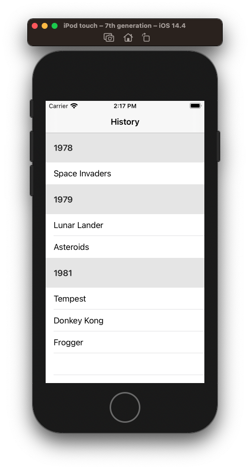
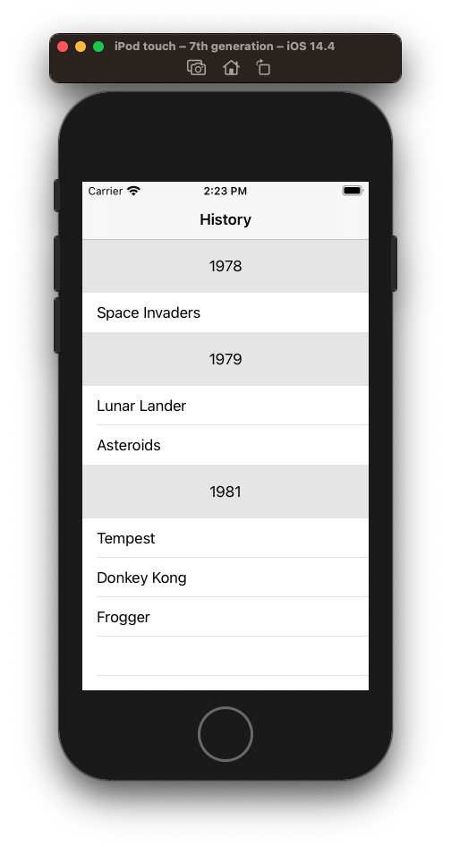
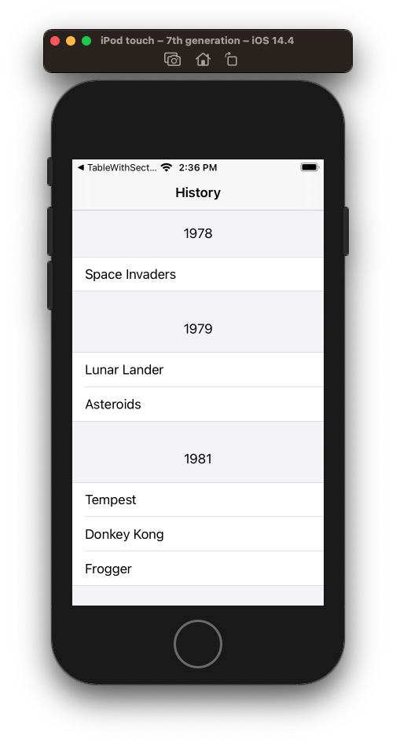
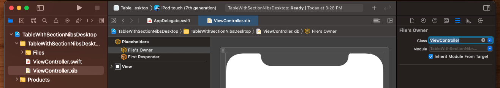
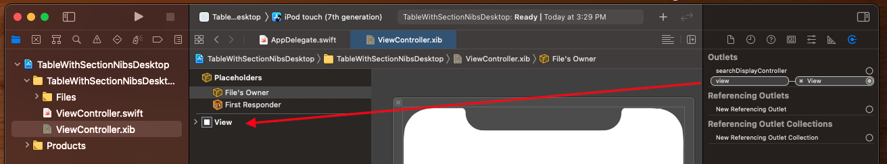
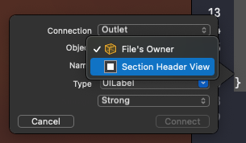

# UITableView Header and Footer In Section

How to set the header and footer in a section.

## Simple

Simplest thing you can do just to get a title in their is implement

```swift
// Simple
func tableView(_ tableView: UITableView, titleForHeaderInSection section: Int) -> String? {
    guard let vm = viewModel else { return nil }
    return vm.sections[section].title
}
```



## Custom

If you want a custom section header you need to:

- Create a custom section header view

```swift
final class SectionHeaderView: UITableViewHeaderFooterView {
    static let reuseIdentifier: String = String(describing: self)

    var label = UILabel()
    
    override init(reuseIdentifier: String?) {
        super.init(reuseIdentifier: reuseIdentifier)

        contentView.addSubview(label)
        
        label.translatesAutoresizingMaskIntoConstraints = false
                
        NSLayoutConstraint.activate([
            label.centerXAnchor.constraint(equalTo: centerXAnchor),
            label.centerYAnchor.constraint(equalTo: centerYAnchor),
        ])
    }

    required init?(coder aDecoder: NSCoder) {
        super.init(coder: aDecoder)
    }
}
```

* Register it's reuse identifier

```swift     tableView.register(SectionHeaderView.self,forHeaderFooterViewReuseIdentifier:SectionHeaderView.reuseIdentifier)
```

* Then comment out the simple, and implement `viewForHeaderISection` along with the estimated and actual methods to adjust height.

```swift
extension ViewController: UITableViewDelegate {

    // Simple
//    func tableView(_ tableView: UITableView, titleForHeaderInSection section: Int) -> String? {
//        guard let vm = viewModel else { return nil }
//        return vm.sections[section].title
//    }

    // Complex - comment out above func if you want custom
    func tableView(_ tableView: UITableView, viewForHeaderInSection section: Int) -> UIView? {
        guard let view = tableView.dequeueReusableHeaderFooterView(withIdentifier: SectionHeaderView.reuseIdentifier)
                as? SectionHeaderView
        else {
            return nil
        }

        guard let vm = viewModel else { return nil }
        view.label.text = vm.sections[section].title

        return view
    }
    
    // To make height variable implement these two methods
    func tableView(_ tableView: UITableView, estimatedHeightForHeaderInSection section: Int) -> CGFloat {
        return 100
    }
    
    func tableView(_ tableView: UITableView, heightForHeaderInSection section: Int) -> CGFloat {
        return 60
    }
}
```



### Getting rid of floating headers

If you don't want the headers to group and float as you scroll up try changing the styling to `Grouped`.


Plain

```swift
let tableView = UITableView(frame: .zero, style: .plain)
```


Grouped

```swift
let tableView = UITableView(frame: .zero, style: .grouped)
```


Group-inset

```swift
let tableView = UITableView(frame: .zero, style: .insetGrouped)
```


### Full source

```swift
import UIKit

struct Game: Codable {
    let title: String
}

struct YearSection {
    let title: String
    let transactions: [Game]
}

class ViewController: UIViewController {

    let tableView = UITableView(frame: .zero, style: .plain)
    let cellId = "cellId"
    
    var sections: [YearSection]?
    
    override func viewDidLoad() {
        super.viewDidLoad()
        data()
        setup()
        layout()
    }

    func data() {
        let g1 = Game(title: "Space Invaders")

        let g2 = Game(title: "Lunar Lander")
        let g22 = Game(title: "Asteroids")
        
        let g3 = Game(title: "Tempest")
        let g33 = Game(title: "Donkey Kong")
        let g333 = Game(title: "Frogger")

        let section1 = YearSection(title: "1978", transactions: [g1])
        let section2 = YearSection(title: "1979", transactions: [g2, g22])
        let section3 = YearSection(title: "1981", transactions: [g3, g33, g333])

        sections = [section1, section2, section3]
    }

    func setup() {
        tableView.delegate = self
        tableView.dataSource = self
        navigationItem.title = "History"
        
        tableView.register(UITableViewCell.self, forCellReuseIdentifier: cellId)
        tableView.register(SectionHeaderView.self,forHeaderFooterViewReuseIdentifier:SectionHeaderView.reuseIdentifier)
    }
    
    func layout() {
        tableView.translatesAutoresizingMaskIntoConstraints = false
        
        view.addSubview(tableView)
        
        NSLayoutConstraint.activate([
            tableView.topAnchor.constraint(equalTo: view.safeAreaLayoutGuide.topAnchor),
            tableView.leadingAnchor.constraint(equalTo: view.leadingAnchor),
            tableView.trailingAnchor.constraint(equalTo: view.trailingAnchor),
            tableView.bottomAnchor.constraint(equalTo: view.safeAreaLayoutGuide.bottomAnchor),
        ])
    }
}

// MARK: UITableViewDataSource

extension ViewController: UITableViewDataSource {

    func tableView(_ tableView: UITableView, cellForRowAt indexPath: IndexPath) -> UITableViewCell {
        guard let sections = sections else { return UITableViewCell() }

        let cell = tableView.dequeueReusableCell(withIdentifier: cellId, for: indexPath)
        let section = indexPath.section

        let text = sections[section].transactions[indexPath.row].title
        cell.textLabel?.text = text

        return cell
    }

    func tableView(_ tableView: UITableView, numberOfRowsInSection section: Int) -> Int {
        guard let sections = sections else { return 0 }
        return sections[section].transactions.count
    }

    func numberOfSections(in tableView: UITableView) -> Int {
        guard let sections = sections else { return 0 }
        return sections.count
    }
}

// MARK: UITableViewDataSource

extension ViewController: UITableViewDelegate {

    // Simple
//    func tableView(_ tableView: UITableView, titleForHeaderInSection section: Int) -> String? {
//        guard let vm = viewModel else { return nil }
//        return vm.sections[section].title
//    }

    // Complex - comment out above func if you want custom
    func tableView(_ tableView: UITableView, viewForHeaderInSection section: Int) -> UIView? {
        guard let view = tableView.dequeueReusableHeaderFooterView(withIdentifier: SectionHeaderView.reuseIdentifier)
                as? SectionHeaderView
        else {
            return nil
        }

        guard let sections = sections else { return nil }
        view.label.text = sections[section].title

        return view
    }
    
    // To make height variable implement these two methods
    func tableView(_ tableView: UITableView, estimatedHeightForHeaderInSection section: Int) -> CGFloat {
        return 100
    }
    
    func tableView(_ tableView: UITableView, heightForHeaderInSection section: Int) -> CGFloat {
        return 60
    }
}

final class SectionHeaderView: UITableViewHeaderFooterView {
    static let reuseIdentifier: String = String(describing: self)

    var label = UILabel()
    
    override init(reuseIdentifier: String?) {
        super.init(reuseIdentifier: reuseIdentifier)

        contentView.addSubview(label)
        
        label.translatesAutoresizingMaskIntoConstraints = false
                
        NSLayoutConstraint.activate([
            label.centerXAnchor.constraint(equalTo: centerXAnchor),
            label.centerYAnchor.constraint(equalTo: centerYAnchor),
        ])
    }

    required init?(coder aDecoder: NSCoder) {
        super.init(coder: aDecoder)
    }
}
```

## Same thing with nibs

Get rid of storyboards. Setup AppDelegate like you always do manually loading a hard coded `ViewController`.

The add a new xib file for `ViewController` called `ViewController.xib`.

Set File's Owner.



Then drag outlet's view to xib's view.



At this point your xib and view controller are connected and hooked up.

Drag out a table view into the nib. Pin it to the edges. And drag it as an outlet property into your view controller.


### Design your section header

Create a new nib and class called `SectionHeaderView` and set your subclass as the “Custom Class” for both File’s Owner and the top-level view.


```swift
import UIKit

final class SectionHeaderView: UITableViewHeaderFooterView {
    static let reuseIdentifier: String = String(describing: self)

    static var nib: UINib {
        return UINib(nibName: String(describing: self), bundle: nil)
    }
    
}
```


When you drag your outlet's in be sure to make them... not `File Owner`. If you don't you will get key code runtime errors.




Taking care not to disrupt the output of the `tableView`, you can now copy in the following code and leverage your nib header view.

```swift
import UIKit

struct Game: Codable {
    let title: String
}

struct YearSection {
    let title: String
    let transactions: [Game]
}

class ViewController: UIViewController {

    let cellId = "cellId"
    var sections: [YearSection]?

    @IBOutlet var tableView: UITableView!
    
    override func viewDidLoad() {
        super.viewDidLoad()
        data()
        setup()
    }

    func data() {
        let g1 = Game(title: "Space Invaders")

        let g2 = Game(title: "Lunar Lander")
        let g22 = Game(title: "Asteroids")
        
        let g3 = Game(title: "Tempest")
        let g33 = Game(title: "Donkey Kong")
        let g333 = Game(title: "Frogger")

        let section1 = YearSection(title: "1978", transactions: [g1])
        let section2 = YearSection(title: "1979", transactions: [g2, g22])
        let section3 = YearSection(title: "1981", transactions: [g3, g33, g333])

        sections = [section1, section2, section3]
    }

    func setup() {
        tableView.delegate = self
        tableView.dataSource = self
        navigationItem.title = "History"
        
        tableView.register(UITableViewCell.self, forCellReuseIdentifier: cellId)
        tableView.register(SectionHeaderView.nib, forHeaderFooterViewReuseIdentifier:SectionHeaderView.reuseIdentifier)
    }
}

// MARK: UITableViewDataSource

extension ViewController: UITableViewDataSource {

    func tableView(_ tableView: UITableView, cellForRowAt indexPath: IndexPath) -> UITableViewCell {
        guard let sections = sections else { return UITableViewCell() }

        let cell = tableView.dequeueReusableCell(withIdentifier: cellId, for: indexPath)
        let section = indexPath.section

        let text = sections[section].transactions[indexPath.row].title
        cell.textLabel?.text = text

        return cell
    }

    func tableView(_ tableView: UITableView, numberOfRowsInSection section: Int) -> Int {
        guard let sections = sections else { return 0 }
        return sections[section].transactions.count
    }

    func numberOfSections(in tableView: UITableView) -> Int {
        guard let sections = sections else { return 0 }
        return sections.count
    }
}

// MARK: UITableViewDataSource

extension ViewController: UITableViewDelegate {

    // Complex - comment out above func if you want custom
    func tableView(_ tableView: UITableView, viewForHeaderInSection section: Int) -> UIView? {
        guard let view = tableView.dequeueReusableHeaderFooterView(withIdentifier: SectionHeaderView.reuseIdentifier)
                as? SectionHeaderView
        else {
            return nil
        }

        guard let sections = sections else { return nil }
        view.yearLabel.text = sections[section].title

        return view
    }
    
    // To make height variable implement these two methods
    func tableView(_ tableView: UITableView, estimatedHeightForHeaderInSection section: Int) -> CGFloat {
        return 100
    }
    
    func tableView(_ tableView: UITableView, heightForHeaderInSection section: Int) -> CGFloat {
        return 60
    }
}
```

### Design your cell

Repeat the same process above for your `UITableViewCell` for nib.

**Note: When setting color or subviews, do everything on the `contentView` of the cell.**

```swift
contentView.backgroundColor = .systemOrange
```

**FailedTransactionCell.swift**

```swift
import UIKit

final class FailedTransactionCell: UITableViewCell {
    static let reuseIdentifier: String = String(describing: self)

    static var nib: UINib {
        return UINib(nibName: String(describing: self), bundle: nil)
    }

    @IBOutlet var titleLabel: UILabel!
    @IBOutlet var bodyLabel: UILabel!
    
    override func awakeFromNib() {
        super.awakeFromNib()
        commonInit()
    }

    private func commonInit() {
        titleLabel.textColor = .systemGray
        bodyLabel.textColor = .systemGray
    }
}
```

Then register and load like this:

```swift
tableView.register(FailedTransactionCell.nib, forCellReuseIdentifier: FailedTransactionCell.reuseIdentifier)

func tableView(_ tableView: UITableView, cellForRowAt indexPath: IndexPath) -> UITableViewCell {
    guard let sections = sections else { return UITableViewCell() }

    let cell = tableView.dequeueReusableCell(withIdentifier: FailedTransactionCell.reuseIdentifier, for: indexPath) as! FailedTransactionCell

    let section = indexPath.section

    let text = sections[section].transactions[indexPath.row].title
    cell.titleLabel.text = text

    return cell
}
```

And set your row height like this.

```swift
func tableView(_ tableView: UITableView, heightForRowAt indexPath: IndexPath) -> CGFloat {
    return 96
}
```


## How to set the table view footer height

This is the trick. Reset the footer view after autolayout and reset the frame.

```swift
override func viewDidLayoutSubviews() {
  super.viewDidLayoutSubviews()
  guard let footerView = self.tableView.tableFooterView else {
    return
  }
  let width = self.tableView.bounds.size.width
  let size = footerView.systemLayoutSizeFitting(CGSize(width: width, height: UIView.layoutFittingCompressedSize.height))
  if footerView.frame.size.height != size.height {
    footerView.frame.size.height = size.height
    self.tableView.tableFooterView = footerView
  }
}
```


### Links that help
- [NSHipter](https://nshipster.com/uitableviewheaderfooterview/)
- [How to set the height](https://medium.com/poka-techblog/uitableview-auto-sizing-header-footer-views-with-autolayout-d4a9dd0729e)
- [Great article on how to calculate TableViewCellHeight](https://stackoverflow.com/questions/18746929/using-auto-layout-in-uitableview-for-dynamic-cell-layouts-variable-row-heights)
- [How to set table header footer height](https://betterprogramming.pub/dynamic-height-uitableview-footer-e99e8c04484a)
