# UITextField

## Delegates

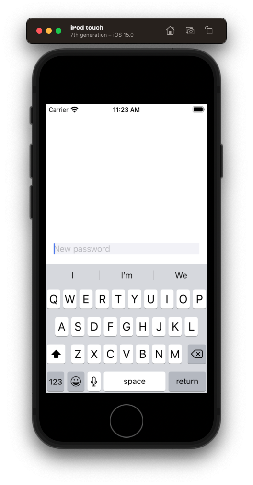

Here are all the different delegates that come with `UITextField`.

```swift
import UIKit

class ViewController: UIViewController {

    let textField = UITextField()

    override func viewDidLoad() {
        super.viewDidLoad()
        style()
        layout()
    }
}

extension ViewController {
    private func style() {
        textField.translatesAutoresizingMaskIntoConstraints = false
        textField.placeholder = "New password"
        textField.backgroundColor = .systemGray6
        textField.delegate = self

        // extra interaction
        textField.addTarget(self, action: #selector(textFieldEditingChanged), for: .editingChanged)
    }

    private func layout() {
        view.addSubview(textField)

        NSLayoutConstraint.activate([
            textField.centerYAnchor.constraint(equalTo: view.centerYAnchor),
            textField.leadingAnchor.constraint(equalToSystemSpacingAfter: view.leadingAnchor, multiplier: 2),
            view.trailingAnchor.constraint(equalToSystemSpacingAfter: textField.trailingAnchor, multiplier: 2)
        ])
    }
}

// MARK: - UITextFieldDelegate
extension ViewController: UITextFieldDelegate {

    // return NO to disallow editing.
    func textFieldShouldBeginEditing(_ textField: UITextField) -> Bool {
        return true
    }

    // became first responder
    func textFieldDidBeginEditing(_ textField: UITextField) {
    }

    // return YES to allow editing to stop and to resign first responder status.
    // return NO to disallow the editing session to end
    func textFieldShouldEndEditing(_ textField: UITextField) -> Bool {
        return true
    }

    // if implemented, called in place of textFieldDidEndEditing: ?
    func textFieldDidEndEditing(_ textField: UITextField) {
    }

    // detect - keypress
    // return NO to not change text
    func textField(_ textField: UITextField, shouldChangeCharactersIn range: NSRange, replacementString string: String) -> Bool {
        let word = textField.text ?? ""
        let char = string
        print("Default - shouldChangeCharactersIn: \(word) \(char)")
        return true
    }

    // called when 'clear' button pressed. return NO to ignore (no notifications)
    func textFieldShouldClear(_ textField: UITextField) -> Bool {
        return true
    }

    // called when 'return' key pressed. return NO to ignore.
    func textFieldShouldReturn(_ textField: UITextField) -> Bool {
        textField.endEditing(true) // resign first responder
        return true
    }
}

// MARK: - Extra Actions
extension ViewController {
    @objc func textFieldEditingChanged(_ sender: UITextField) {
        print("Extra - textFieldEditingChanged: \(sender.text)")
    }
}
```

## Text when return pressed

```swift
// called when 'return' key pressed. return NO to ignore.
func textFieldShouldReturn(_ textField: UITextField) -> Bool {
    textField.endEditing(true) // resign first responder
    print("Text from return: \(textField.text)")
    return true
}
```

## Detecting keypresses

Detect each keypress using the following callback.

```swift
// detect - keypress
// return NO to not change text
func textField(_ textField: UITextField, shouldChangeCharactersIn range: NSRange, replacementString string: String) -> Bool {
    let textFieldText = textField.text ?? ""
    let newText = (textFieldText as NSString).replacingCharacters(in: range, with: string)
    print("text: \(textFieldText) newText: \(newText)")
    
    return true
}
```

Note: First key press is not yet added to the word.

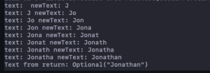

To get the full word changed, including the keypress, add a custom action on the `textField` and get the full word in the action.

```swift
// extra interaction
textField.addTarget(self, action: #selector(textFieldEditingChanged), for: .editingChanged)

// MARK: - Extra Actions
extension ViewController {
    @objc func textFieldEditingChanged(_ sender: UITextField) {
        print("Extra - textFieldEditingChanged: \(sender.text)")
    }
}
```

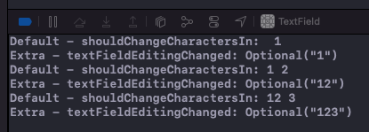

## Styling placeholder text

```swift
searchFilterTextFiled.attributedPlaceholder = NSAttributedString(string: "Search", attributes: [
    .foregroundColor: UIColor.reBankGrey,
    .font: UIFont.systemFont(ofSize: 17)
])
```

## Weather Search Delegate

Example delegate callback for a search textfield.

```swift
// MARK: - UITextFieldDelegate

extension WeatherViewController: UITextFieldDelegate {
    
    @objc func searchPressed(_ sender: UIButton) {
        searchTextField.endEditing(true)
    }
    
    func textFieldShouldReturn(_ textField: UITextField) -> Bool {
        searchTextField.endEditing(true)
        return true
    }
    
    // Return pressed
    func textFieldShouldEndEditing(_ textField: UITextField) -> Bool {
        if textField.text != "" {
            return true
        } else {
            textField.placeholder = "Type something"
            return false
        }
    }
    
    func textFieldDidEndEditing(_ textField: UITextField) {
        if let city = searchTextField.text {
            weatherService.fetchWeather(cityName: city)
        }
        searchTextField.text = ""
    }
}
```

## Hide password

```swift
textField.isSecureTextEntry = true
```

## Hide password with toggle image

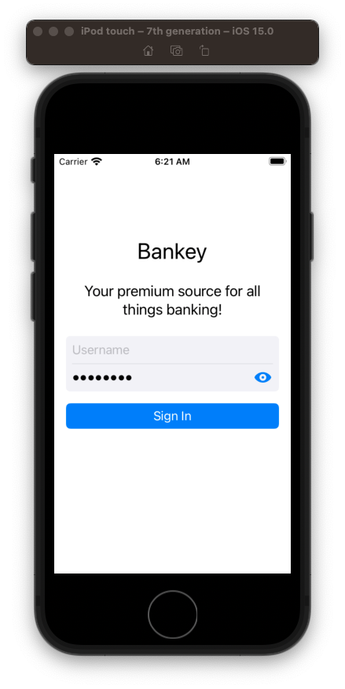

```swift
import Foundation
import UIKit

let passwordToggleButton = UIButton(type: .custom)

extension UITextField {
    
    func enablePasswordToggle(){
        passwordToggleButton.setImage(UIImage(systemName: "eye.fill"), for: .normal)
        passwordToggleButton.setImage(UIImage(systemName: "eye.slash.fill"), for: .selected)
        passwordToggleButton.addTarget(self, action: #selector(togglePasswordView), for: .touchUpInside)
        rightView = passwordToggleButton
        rightViewMode = .always
    }
    
    @objc func togglePasswordView(_ sender: Any) {
        isSecureTextEntry.toggle()
        passwordToggleButton.isSelected.toggle()
    }
}
```

## Border Style

```swift
textField.borderStyle = .none
```

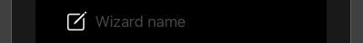


```swift
textField.borderStyle = .line
```

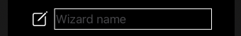

```swift
textField.borderStyle = .bezel
```

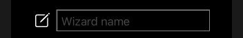

```swift
textField.borderStyle = .roundedRect
```

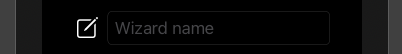

## endEditting vs resignFirstResponder

There are two ways to give up first responder:

- `textField.resignFirstResponder`
- `textField.endEditting`

Another way to dismiss the keyboard is to call `endEditting` on a `UIView` containing a `UITextField`. Which is better?

`resignFirstResponder()` is good when you know which text field has the keyboard. It’s direct. It’s efficient. Use it when you have the `UITextField` causing the keyboard to appear and you want to give it up.

`endEditing` is actually a method on the `UIView`. Use this when you don’t know who caused the keyboard to appear or you don’t have reference to the `UITextField` currenty in focus. It searches all the subviews in the view hierarchy until it finds the one holding the first responder status and then asks it to give it up. Not as efficient. But it works too (just more broadly).

## Different keyboards 

iOS lets you choose from a vareity of keyboards when accepting user input. Simply change the `keyboardType` on `UITextField` set display various kinds.


```
        textField.keyboardType = UIKeyboardType.emailAddress

//        case `default` // Default type for the current input method.
//
//        case asciiCapable // Displays a keyboard which can enter ASCII characters
//
//        case numbersAndPunctuation // Numbers and assorted punctuation.
//
//        case URL // A type optimized for URL entry (shows . / .com prominently).
//
//        case numberPad // A number pad with locale-appropriate digits (0-9, ۰-۹, ०-९, etc.). Suitable for PIN entry.
//
//        case phonePad // A phone pad (1-9, *, 0, #, with letters under the numbers).
//
//        case namePhonePad // A type optimized for entering a person's name or phone number.
//
//        case emailAddress // A type optimized for multiple email address entry (shows space @ . prominently).
```

## Adding images

### Raw image

You can add a image natively to the `UITextField` like this:

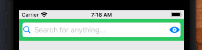

**SearchBarView**

```swift
extension SearchBarView {

    func style() {
        textField.translatesAutoresizingMaskIntoConstraints = false
        textField.borderStyle = .roundedRect // round
        textField.placeholder = "Search for anything..."
        textField.enableSearchButton()
        textField.enablePasswordToggle()
    }
```


**UITextField+Ext**

```swift
import Foundation
import UIKit

let passwordToggleButton = UIButton(type: .custom)
let searchToggleButton = UIButton(type: .custom)

extension UITextField {

    func enableSearchButton(){
        searchToggleButton.setImage(UIImage(systemName: "magnifyingglass"), for: .normal)
        leftView = searchToggleButton
        leftViewMode = .always
    }

    func enablePasswordToggle(){
        passwordToggleButton.setImage(UIImage(systemName: "eye.fill"), for: .normal)
        passwordToggleButton.setImage(UIImage(systemName: "eye.slash.fill"), for: .selected)
        passwordToggleButton.addTarget(self, action: #selector(togglePasswordView), for: .touchUpInside)
        rightView = passwordToggleButton
        rightViewMode = .always
    }

    @objc func togglePasswordView(_ sender: Any) {
        isSecureTextEntry.toggle()
        passwordToggleButton.isSelected.toggle()
    }
}
```

This works but the spacing is kind of off.

If you want to place precisely do like this:

```swift
searchFilterTextFiled.backgroundColor = .searchFieldBackground
searchFilterTextFiled.leftViewMode = .always
let leftView = UIView(frame: CGRect(x: 0, y: 0, width: 28, height: 36))
let imageView = UIImageView(image: UIImage(named: "search"))
imageView.frame = CGRect(origin: CGPoint(x: 28.0 - imageView.frame.size.width, y: (36.0 - imageView.frame.size.height) / 2.0), size: imageView.frame.size)
leftView.addSubview(imageView)
searchFilterTextFiled.leftView = leftView
```

### Image with spacing

To get the image exactly where you want it, embed it in another `UIView` and add that to the `UITextField`:

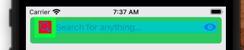

```swift
func addSearchImage() {
    let imageView = UIImageView(frame: CGRect(x: 8.0, y: 8.0, width: 24.0, height: 24.0))
    let image = UIImage(systemName: "magnifyingglass")
    imageView.image = image
    imageView.contentMode = .scaleAspectFit
    imageView.backgroundColor = UIColor.red

    let view = UIView(frame: CGRect(x: 0, y: 0, width: 40, height: 40))
    view.addSubview(imageView)
    view.backgroundColor = .green
    leftViewMode = .always
    leftView = view
}
```

### Image outside TextField

Best option is to probably not even add an image to the text field and instead just keep it separate and add as part of stack view:

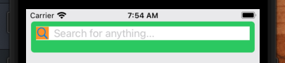

**SearchVBarView**

```swift
//
//  SearchBarView.swift
//  Kijiji
//
//  Created by jrasmusson on 2022-05-28.
//

import Foundation
import UIKit

class SearchBarView: UIView {

    let stackView = UIStackView()
    let imageView = UIImageView()
    let textField = UITextField()

    override init(frame: CGRect) {
        super.init(frame: frame)

        style()
        layout()
    }

    required init?(coder: NSCoder) {
        fatalError("init(coder:) has not been implemented")
    }

    override var intrinsicContentSize: CGSize {
        return CGSize(width: UIView.noIntrinsicMetric, height: 50)
    }
}

extension SearchBarView {

    func style() {
        translatesAutoresizingMaskIntoConstraints = false
        backgroundColor = .systemGreen

        stackView.translatesAutoresizingMaskIntoConstraints = false
        stackView.axis = .horizontal
        stackView.spacing = 8
        stackView.backgroundColor = .systemBackground

        imageView.translatesAutoresizingMaskIntoConstraints = false
        imageView.image = UIImage(systemName: "magnifyingglass")
        imageView.backgroundColor = .systemOrange

        textField.translatesAutoresizingMaskIntoConstraints = false
        textField.placeholder = "Search for anything..."

        layer.cornerRadius = 5
        clipsToBounds = true
    }

    func layout() {
        imageView.setContentHuggingPriority(.defaultHigh, for: .horizontal)

        stackView.addArrangedSubview(imageView)
        stackView.addArrangedSubview(textField)

        addSubview(stackView)

        NSLayoutConstraint.activate([
            stackView.topAnchor.constraint(equalToSystemSpacingBelow: topAnchor, multiplier: 1),
            stackView.leadingAnchor.constraint(equalToSystemSpacingAfter: leadingAnchor, multiplier: 1),
            trailingAnchor.constraint(equalToSystemSpacingAfter: stackView.trailingAnchor, multiplier: 1)
        ])
    }
}
```


## How to adjust view when keyboard present

When the keyboard appears, you may need to adjust your current view layout  to prevent certain elements from being obstructed.


One way to handle this is to

* create a default height constraint 
* calculate the size of the keyboard
* and then update that constraint to include the original height + the keyboard height

The other is to use [TPKeyboardAvoiding](https://github.com/michaeltyson/TPKeyboardAvoiding).

This example below shows you how to do it the manual way.

```swift
//
//  ViewController.swift
//  keyboardHeight
//
//  Created by Jonathan Rasmusson (Contractor) on 2018-07-27.
//  Copyright © 2018 Jonathan Rasmusson (Contractor). All rights reserved.
//

import UIKit

class ViewController: UIViewController {

    @IBOutlet var textField: UITextField!
    @IBOutlet var heightConstraint: NSLayoutConstraint!

    let defaultHeight = CGFloat(20)
    
    override func viewDidLoad() {
        super.viewDidLoad()
    }

    override func viewWillAppear(_ animated: Bool) {

        NotificationCenter.default.addObserver(self, selector: #selector(keyboardWillShow), name: UIResponder.keyboardWillShowNotification, object: nil)
        NotificationCenter.default.addObserver(self, selector: #selector(keyboardWillHide), name: UIResponder.keyboardWillHideNotification, object: nil)

        view.addGestureRecognizer(UITapGestureRecognizer(target: self, action: #selector(dismissKeyboard(gesture:))))
    }

    override func viewWillDisappear(_ animated: Bool) {
        NotificationCenter.default.removeObserver(self)
    }

    @objc func keyboardWillShow(sender: NSNotification) {
        if let userInfo = sender.userInfo,
            let keyboardEnd = userInfo[UIResponder.keyboardFrameEndUserInfoKey] as? NSValue,
            let currentTextField = UIResponder.currentFirst() as? UITextField {

            // check if the top of the keyboard is above the bottom of the currently focused textbox
            let keyboardTopY = keyboardEnd.cgRectValue.origin.y
            let textboxAbsPosition = self.view.convert(currentTextField.frame, from: currentTextField.superview)
            let textboxBottomY = textboxAbsPosition.origin.y + textboxAbsPosition.size.height
            // if so, move the origin of the current frame off the top of the screen by some amount to show the currently focused textbox at the center of the part of the view not occupied by the keyboard
            if textboxBottomY > keyboardTopY {
                self.view.frame.origin.y = (textboxAbsPosition.origin.y - keyboardTopY / 2) * -1
            }
        }
    }

    @objc func keyboardWillHide(notification: NSNotification) {
        self.view.frame.origin.y = 0
    }

    @objc func dismissKeyboard(gesture: UIGestureRecognizer) {
        view.endEditing(true) // resign first responder
    }
}
```

### Links that help
* [Apple docs](https://developer.apple.com/documentation/uikit/uitextfield?changes=_5)
* [Human Interface Guidelines](https://developer.apple.com/design/human-interface-guidelines/ios/controls/text-fields/)
