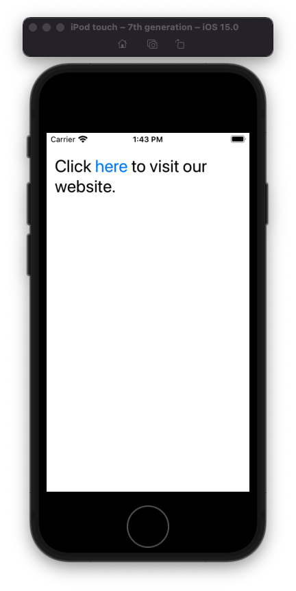
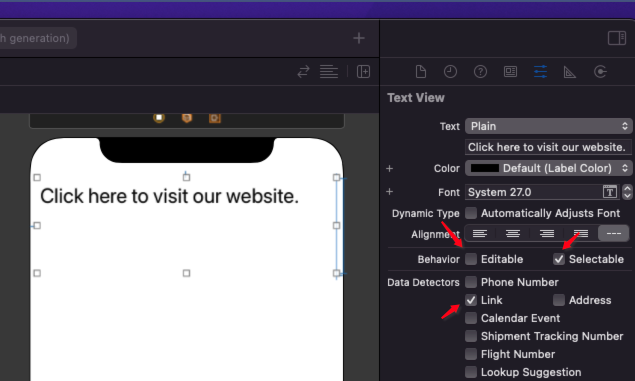
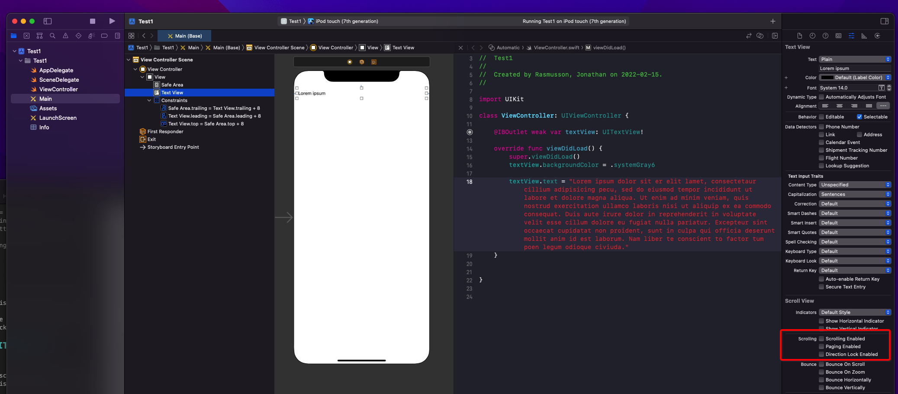
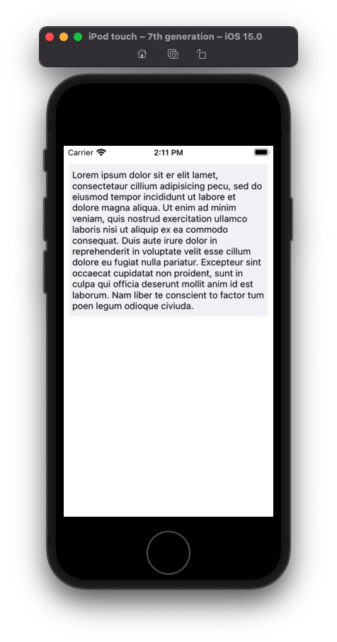

# UITextView

## How to create tappable hyper link





- Add a `UITextField`
- Under `Data Detectors` select:
 -  Editable - `false`
 -  Selectable - `true`
 -  Link - `true`

**ViewController**

```swift
import UIKit

class ViewController: UIViewController {

    @IBOutlet weak var textView: UITextView!

    override func viewDidLoad() {
        super.viewDidLoad()
        setup()
    }

    private func setup() {
        let path = "https://agilewarrior.wordpress.com/cheat-sheets/git/"
        let text = textView.text ?? ""
        let font = textView.font
        let attributedString = NSAttributedString.makeHyperlink(for: path, in: text, as: "here")
        textView.attributedText = attributedString
        textView.font = font
    }

}

extension NSAttributedString {

    static func makeHyperlink(for path: String, in string: String, as substring: String) -> NSAttributedString {
        let nsString = NSString(string: string)
        let substringRange = nsString.range(of: substring)
        let attributedString = NSMutableAttributedString(string: string)
        attributedString.addAttribute(.link, value: path, range: substringRange)
        return attributedString
    }
}
```

Discussion

- Text fields are good for this because of that link detector
- Need to save the font before the attributed text is assigned so you can assign back

## How to layout a UITextField naturally

By default, `UITextField` is scrollable and of a fixed height. Meaning if your text is too long, you won't see it on the screen.

You can fix that by disabling the scroll ability. When you do the `UITextField` will lay itself out naturally at its natural height.





 
## How to left justify multiline text


```swift
func makeChatTextView(text: String) -> UITextView {
    let textView = UITextView()
    textView.translatesAutoresizingMaskIntoConstraints = false
    textView.font = UIFont.systemFont(ofSize: 16)
    textView.textColor = .gray
    textView.textAlignment = .left
    textView.text = text
    textView.textContainer.lineFragmentPadding = 0
    textView.textContainerInset = .zero

    return textView
}
```

The last two lines get rid of the extra padding you get by default.

```swift
    textView.textContainer.lineFragmentPadding = 0
    textView.textContainerInset = .zero
```

And you autolayout it out just like any other element pinning it to the left and right sides. Note: You also need to give it an explicity height (else ambiguous). Use in `UIViewContoller` like this.

```swift
func setupViews() {
    let chatText = makeChatTextView(text: "Visit our support library to discover how to troubleshoot issues and learn about your account")
    
    addSubview(chatText)

    chatText.leadingAnchor.constraint(equalTo: self.safeAreaLayoutGuide.leadingAnchor, constant: 24).isActive = true
    chatText.trailingAnchor.constraint(equalTo: self.trailingAnchor, constant: -24).isActive = true
    chatText.topAnchor.constraint(equalTo: chatTitle.bottomAnchor, constant: 8).isActive = true
    chatText.heightAnchor.constraint(equalToConstant: 100).isActive = true // important!
}
```

### Links that help
- [How to get rid of extra padding](https://medium.com/@lawrey/swift-4-align-textview-with-uilabel-66dbc97c91c9)
- [Creating hyperlinks YouTube](https://www.youtube.com/watch?v=cxFi4rO11uk&t=600s) 
