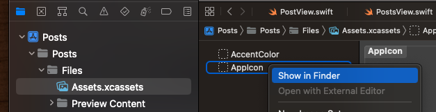
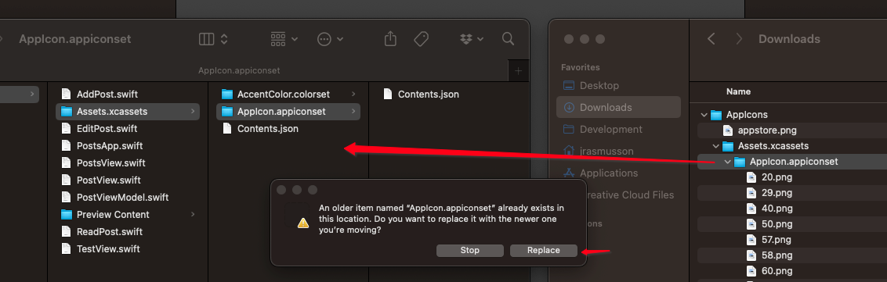
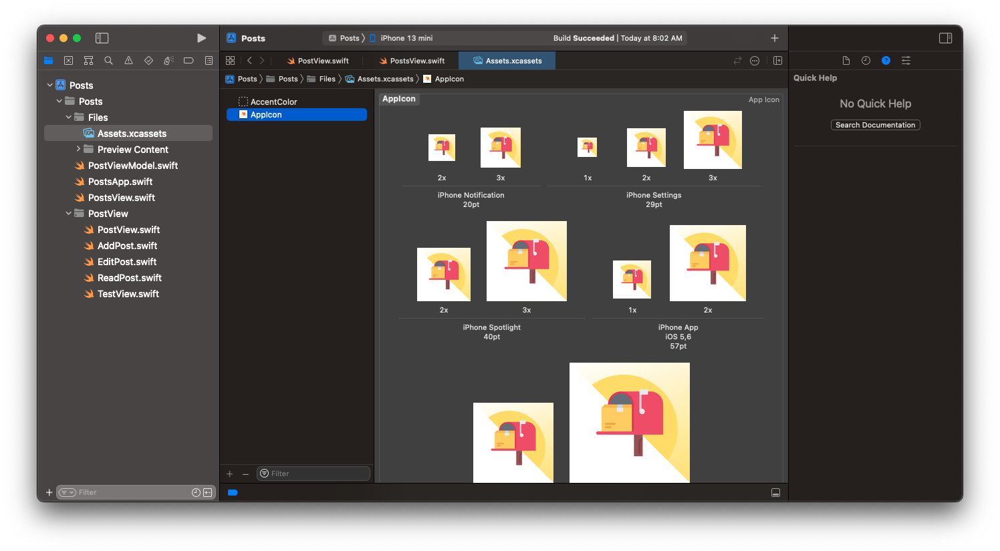

# How to create app icon

## Create your icon

- Create icon at Canva. See [Angela video](- [Anglea Udemy](https://www.udemy.com/course/ios-13-app-development-bootcamp/learn/lecture/16251000#overview)
) for example.
- Download

## Upload to App Icon Generator

- Upload the icon you just created to [App icon generator](https://appicon.co/).
- Generate and download assets.

## Import into Xcode

- Open directory to where assets live from Xcode

- Unzip icons you downloaded from icon generator
- Drag `AppIcon.appiconset` from generated dir into `Assets.xcassets` dir and have it `Replace` icons there:

Voila 🎉.

### Links that help

- [Anglea Udemy](https://www.udemy.com/course/ios-13-app-development-bootcamp/learn/lecture/16251000#overview)
- [App icon generator](https://appicon.co/)
- 