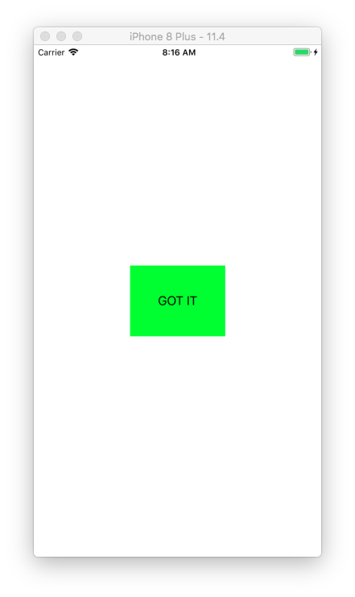

# How to increase tappable area of UIButton

## UIButton containing only text

Sometimes you want to make the tappable area of your button bigger. This is how you do it with a UIButton only containing text. It's all in the `button.contentEdgeInsets`. Ignore the `titleEdgeInsets` and `imageEdgeInsets`. That is for shifting around text and images within the button.

```swift
import UIKit

class ViewController: UIViewController {

    let button: UIButton = {
        let button = UIButton()
        button.translatesAutoresizingMaskIntoConstraints = false
        button.backgroundColor = .green
        button.setTitle("GOT IT", for: .normal)
        button.setTitleColor(.black, for: .normal)
        button.addTarget(self, action: #selector(buttonPressed), for: .touchUpInside)

//        button.titleEdgeInsets = UIEdgeInsets(top: 4, left: 4, bottom: 4, right: 4) // moves title
//        button.imageEdgeInsets = UIEdgeInsets(top: 4, left: 4, bottom: 4, right: 4) // moves image
        button.contentEdgeInsets = UIEdgeInsets(top: 40, left: 40, bottom: 40, right: 40)

        return button
    }()

    override func viewDidLoad() {
        super.viewDidLoad()

        view.backgroundColor = .white
        view.addSubview(button)

        button.centerXAnchor.constraint(equalTo: view.centerXAnchor).isActive = true
        button.centerYAnchor.constraint(equalTo: view.centerYAnchor).isActive = true
    }

    @objc func buttonPressed(sender: UIButton!) {
        print("Button tapped")
    }

}
```




