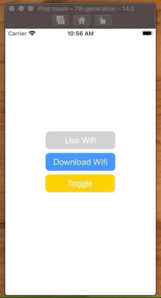

# How to key value observe

## Simple buttons

!

```swift
//
//  ViewController.swift
//  Observable
//
//  Created by Jonathan Rasmusson (Contractor) on 2020-11-13.
//

import UIKit

class ViewController: UIViewController {

    let useWifiButton = makeButton(withText: "Use Wifi")
    let downloadWifiButton = makeButton(withText: "Download Wifi")
    let toggleButton = makeButton(withText: "Toggle")

    let stackView = makeVerticalStackView()

    var viewModel = ViewModel()
    var observation: Any?

    override func viewDidLoad() {
        super.viewDidLoad()

        setup()
        layout()

        // 2 Observe it
        observation = viewModel.observe(\.shawGoWifiAppInstalled, options: [.initial, .new], changeHandler: shawGoWifiAppInstalledDidChange(viewModel:observedChange:))
    }

    // 3 Update when changed
    func shawGoWifiAppInstalledDidChange(viewModel: ViewModel, observedChange: NSKeyValueObservedChange<Bool>) {
        if viewModel.shawGoWifiAppInstalled {
            useWifiButton.backgroundColor = .systemBlue
            downloadWifiButton.backgroundColor = .systemGray3
        } else {
            useWifiButton.backgroundColor = .systemGray3
            downloadWifiButton.backgroundColor = .systemBlue
        }
    }

    func setup() {
        toggleButton.addTarget(self, action: #selector(togglePressed), for: .touchUpInside)
        toggleButton.backgroundColor = .systemYellow
    }

    func layout() {
        stackView.addArrangedSubview(useWifiButton)
        stackView.addArrangedSubview(downloadWifiButton)
        stackView.addArrangedSubview(toggleButton)

        view.addSubview(stackView)

        NSLayoutConstraint.activate([
            stackView.centerXAnchor.constraint(equalTo: view.centerXAnchor),
            stackView.centerYAnchor.constraint(equalTo: view.centerYAnchor),
        ])
    }

    @objc func togglePressed() {
        viewModel.shawGoWifiAppInstalled = !viewModel.shawGoWifiAppInstalled
    }
}

class ViewModel: NSObject {

    // 1 Make a property observable
    @objc dynamic var shawGoWifiAppInstalled: Bool = false

    override init() {
        super.init()
    }
}

func makeButton(withText text: String) -> UIButton {
    let button = UIButton()
    button.translatesAutoresizingMaskIntoConstraints = false
    button.setTitle(text, for: .normal)
    button.titleLabel?.adjustsFontSizeToFitWidth = true
    button.contentEdgeInsets = UIEdgeInsets(top: 8, left: 16, bottom: 8, right: 16)
    button.backgroundColor = .systemBlue
    button.layer.cornerRadius = 8
    return button
}

func makeVerticalStackView() -> UIStackView {
    let stack = UIStackView()
    stack.translatesAutoresizingMaskIntoConstraints = false
    stack.axis = .vertical
    stack.spacing = 8.0

    return stack
}
```

## Service

This example shows how you can observe register to observe a value on an object (`hasWifi`) and then be notified when it changes.

```swift
//
//  ViewController.swift
//  SwiftKVO
//
//  Created by Jonathan Rasmusson on 2018-11-08.
//  Copyright © 2018 Jonathan Rasmusson. All rights reserved.
//

import UIKit

class Repository: NSObject {

    let service = Service()

    // 1 Make hasWifi observable
    @objc dynamic var hasWifi = false

    func load() {
        service.fetchHasWifi { (hasWifi, error) in
            // 4 Change value
            self.hasWifi = hasWifi ?? false
        }
    }
}

struct Service {

    func fetchHasWifi(completion: @escaping (Bool?, Error?) -> ()) {
        let hasWifi = true
        completion(hasWifi, nil)
    }

}

class ViewController: UIViewController {

    @objc let repository = Repository()

    var observation: Any?

    override func viewDidLoad() {
        super.viewDidLoad()

        // 2 Register to observe
        observation = repository.observe(\.hasWifi, options: [.initial, .new]) {
            // 5 Get updated
            [unowned self] object, change in
            let boolVal = change.newValue
            print("hasWifi: \(String(describing: boolVal))")
        }

        // 3 Refresh
        repository.load()
    }

}
```

## How does it work - Key-Value Coding

KVO works because of something built into Cocoa called Key-Value Coding. KVC is the ability to set a property on an object via it's string based key and associted value.

```swift
class Child: NSObject {
    @objc dynamic var name: String!

    override init() {
        self.name = ""
        super.init()
    }
}

var child = Child()

child.setValue("Jonathan", forKey: "name")
child.name
```

This was primarily used in Cocoa on Mac for simplifying `UITableView` processing. Because `UITableView` references it's columns via `identifier`, if a datasource was not Key-Value compliant you code would look something like this:

```swift
- (id)tableView:(NSTableView *)tableview objectValueForTableColumn:(id)column row:(NSInteger)row
{
    id result = nil;
    Person *person = [self.people objectAtIndex:row];
 
    if ([[column identifier] isEqualToString:@"name"]) {
        result = [person name];
    } else if ([[column identifier] isEqualToString:@"age"]) {
        result = @([person age]);  // Wrap age, a scalar, as an NSNumber
    } else if ([[column identifier] isEqualToString:@"favoriteColor"]) {
        result = [person favoriteColor];
    } // And so on...
 
```

And everytime you added a new column you would need to update this code. Whereas a Key-Coding compliant datasource simplifies the code to this:

```swift
- (id)tableView:(NSTableView *)tableview objectValueForTableColumn:(id)column row:(NSInteger)row
{
    return [[self.people objectAtIndex:row] valueForKey:[column identifier]];
}
```

## When should you use?

KVO is handy for observing model changes. My buddy Dan best describes it like this.

> I was observing specific model changes (they are events) here, and not user and other UI events. I tend to use responder chain for user events that happen, where if you use observers on model NSObjects you don't have to write your own eventing code in your model, as it's baked in via KVO, you just listen for changes.

### Links that help

- [KVC](https://developer.apple.com/library/archive/documentation/Cocoa/Conceptual/KeyValueCoding/BasicPrinciples.html#//apple_ref/doc/uid/20002170-BAJEAIEE)


