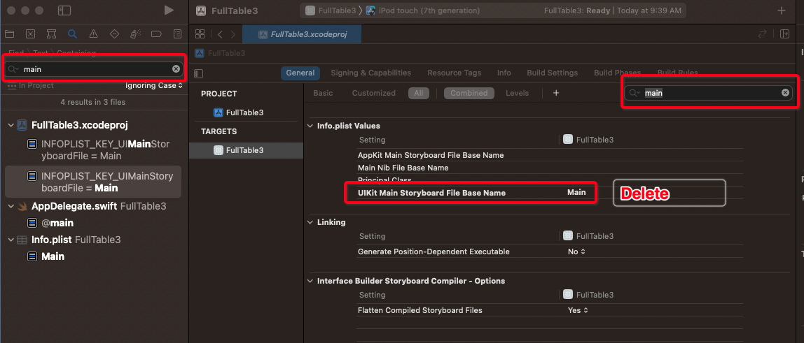
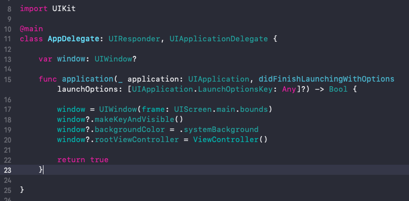
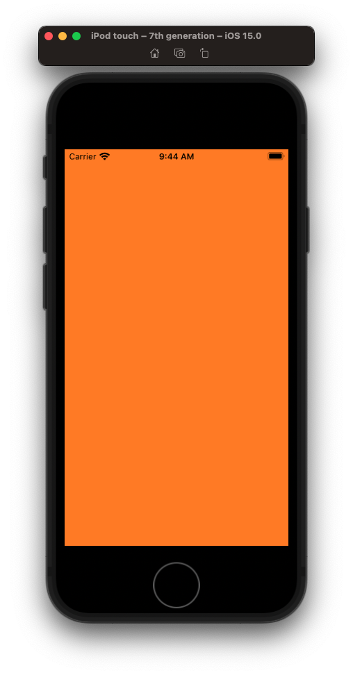
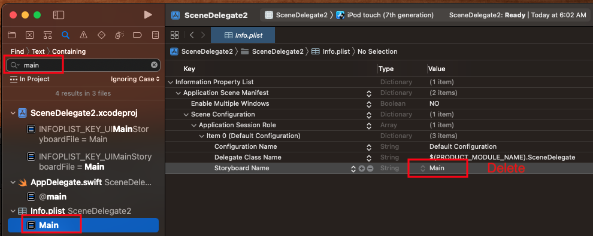
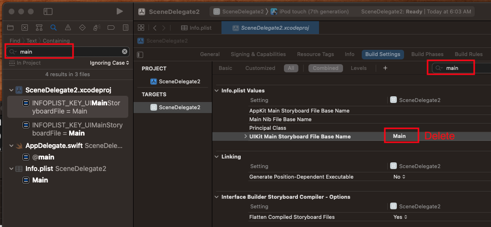

# How setup project with no storyboards

## Xcode 13

### AppDelegate








### SceneDelegate

- Delete `Main.storyboard`
- Update `Info.plist`






- Update SceneDelegate

**SceneDelegate**

```swift
func scene(_ scene: UIScene, willConnectTo session: UISceneSession, options connectionOptions: UIScene.ConnectionOptions) {
    guard let windowScene = (scene as? UIWindowScene) else { return }
    
    window = UIWindow(windowScene: windowScene)
    window?.makeKeyAndVisible()
    window?.backgroundColor = .systemOrange
    window?.rootViewController = ViewController()
}
```

## Xcode 12

```swift
    func application(_ application: UIApplication, didFinishLaunchingWithOptions launchOptions: [UIApplication.LaunchOptionsKey: Any]?) -> Bool {

        window = UIWindow(frame: UIScreen.main.bounds)
        window?.backgroundColor = .white
        window?.makeKeyAndVisible()
        window?.rootViewController = ViewController()

        return true
    }
```
Or with navigation controller

```swift
    func application(_ application: UIApplication, didFinishLaunchingWithOptions launchOptions: [UIApplication.LaunchOptionsKey: Any]?) -> Bool {
        window = UIWindow(frame: UIScreen.main.bounds)
        window?.backgroundColor = .white
        window?.makeKeyAndVisible()

        let navigatorController = UINavigationController(rootViewController: ViewController())
        window?.rootViewController = navigatorController

        return true
    }
```

Delete the storyboard from the project.

Delete `Main storyboard file base name` entry from `Info.plist`.
