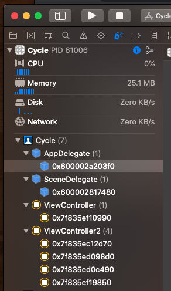

# Protocols & Delegates

An example.

```swift
protocol LogoDownloaderDelegate: AnyObject {
    func didFinishDownloading(_ sender:LogoDownloader)
} 

class LogoDownloader {

    weak var delegate: LogoDownloaderDelegate?
    
    func downloadLogo() {
    	delegate?.didFinishDownloading(self)
    }
    
} 

extension ViewController: LogoDownloaderDelegate {

    override func viewDidLoad() {
        logoDownloader?.delegate = self
    }
    
    func didFinishDownloading(_ sender: LogoDownloader) {
    } 
}

```

## Naming

There is a definite convention around naming your protocol methods. Start the name of your protocol with the name of the sender, followed by the state of the thing that changed. 

```swift
sender / state that changed
```

For example here we return the switch of the button followed by the state after. 

```swift
protocol InternetTileViewControllerDelegate: AnyObject {
    func internetTileViewController(_ viewController: InternetTileViewController, didSetInternetPackage package: InternetPackage?)
}

protocol SavedPaymentSectionViewDelegate: AnyObject {
    func savedPaymentInfoSwitch(_ infoSwitch: CheckBoxButton, didChange state: Bool)
    func savePaymentInfoButtonWasTapped(_ infoButton: UIButton)
}
```

If there is no state change, include the action with the sender in the name. Here is another.

```swift
protocol FileImporterDelegate: AnyObject {
    func fileImporter(_ importer: FileImporter,
                      shouldImportFile file: File) -> Bool

    func fileImporter(_ importer: FileImporter,
                      didAbortWithError error: Error)

    func fileImporterDidFinish(_ importer: FileImporter)
}

class FileImporter {
    weak var delegate: FileImporterDelegate?
}
```

And some, like `UITableView` use a combination of each. Naming convention is `ClassDelegate` or `ClassDataSource`.

```swift
protocol UITableViewDataSource : NSObjectProtocol {

    func tableView(_ tableView: UITableView, cellForRowAt indexPath: IndexPath) -> UITableViewCell

    func numberOfSections(in tableView: UITableView) -> Int // Default is 1 if not implemented

}

class UITableView : UIScrollView, NSCoding, UIDataSourceTranslating {
	weak open var dataSource: UITableViewDataSource?
}
```

Which every way you go, remember to make your protocol reference `weak` in your delegate class. This will avoid any cyclomatic references and retains cycles in your code.

## Class-only weak var and retain cycles

If you are defining a protcol that needs to work with a class, you need to mark your protocol `AnyObject` and make the reference a `weak var`.

```swift
protocol WeatherServiceDelegate: AnyObject {
    func didFetchWeather()
}

struct WeatherService {
    weak var delegate: WeatherServiceDelegate?
}
```

Even if you container is a `struct` using value semantics, it will still retain a strong reference to a `class` via the var. So if you push and pop this class repeatedly in a view controller, creating a new instance of `ViewController2` every time, it will leak and retain an instance of `WeatherService` even after it has been dismissed.

That doesn't mean you can't use protocol-delegate purely between two structs and not require the `weak var` - you can.

But if your protocol is going to touch any class, it needs the `weak var` - else it has the potential to leak.

This demo project shows how `ViewController2` can leak if repeatedly pushed and popped and a `weak var` on the container struct is not used.



```swift
import UIKit

class ViewController2: UIViewController {

    let button = makeButton(withText: "Pop")
    var weatherService = WeatherService()

    override func viewDidLoad() {
        super.viewDidLoad()
        view.backgroundColor = .systemRed
        weatherService.delegate = self

        button.addTarget(self, action: #selector(buttonTapped), for: .primaryActionTriggered)

        view.addSubview(button)
        
        NSLayoutConstraint.activate([
            button.centerXAnchor.constraint(equalTo: view.centerXAnchor),
            button.centerYAnchor.constraint(equalTo: view.centerYAnchor),
        ])
    }

    @objc func buttonTapped() {
        dismiss(animated: true, completion: nil)
    }
}

extension ViewController2: WeatherServiceDelegate {
    func didFetchWeather() {

    }
}

class ViewController: UIViewController {

    let button = makeButton(withText: "Push")

    override func viewDidLoad() {
        super.viewDidLoad()
        view.backgroundColor = .white

        button.addTarget(self, action: #selector(buttonTapped), for: .primaryActionTriggered)

        view.addSubview(button)

        NSLayoutConstraint.activate([
            button.centerXAnchor.constraint(equalTo: view.centerXAnchor),
            button.centerYAnchor.constraint(equalTo: view.centerYAnchor),
        ])
    }

    @objc func buttonTapped() {
        present(ViewController2(), animated: true, completion: nil)
    }
}


// GOOD
/*
protocol WeatherServiceDelegate: AnyObject {
    func didFetchWeather()
}

struct WeatherService {
    weak var delegate: WeatherServiceDelegate?
}
*/


// BAD - pattern - avoid doing this.
protocol WeatherServiceDelegate {
    func didFetchWeather()
}

struct WeatherService {
    var delegate: WeatherServiceDelegate?
}


func makeButton(withText text: String) -> UIButton {
    let button = UIButton()
    button.translatesAutoresizingMaskIntoConstraints = false
    button.setTitle(text, for: .normal)
    button.titleLabel?.adjustsFontSizeToFitWidth = true
    button.contentEdgeInsets = UIEdgeInsets(top: 8, left: 16, bottom: 8, right: 16)
    button.backgroundColor = .systemBlue
    button.layer.cornerRadius = 8
    return button
}
```
### Subtlties around language

Describing these things can sometimes be problematic. Here are some sentences to help me explain.

```
A retain cycle is created when two instances of classes reference each other.
```

This is true. But that doens't mean you still can have a memory leak between a `struct` and a `class` as we just saw above.

The best way to think of this is if you touch a class, define your protocol using `AnyObject`. If you never touch a class, go a head without, but be careful. The compiler will allow you do use a container without a `weak var` and that will leak.

So when in doubt. Make it a `weak var`.


## Links that help

- https://medium.com/@abhimuralidharan/all-about-protocols-in-swift-11a72d6ea354
- https://docs.swift.org/swift-book/LanguageGuide/Protocols.html
- https://medium.com/mackmobile/avoiding-retain-cycles-in-swift-7b08d50fe3ef
- https://riptutorial.com/swift/example/2533/reference-cycles-and-weak-references
- https://docs.swift.org/swift-book/LanguageGuide/AutomaticReferenceCounting.html#ID51


