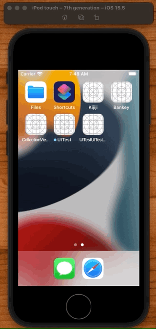

# XCUITest

## Example

```swift
import XCTest

class UITestUITests: XCTestCase {

    func testLogin() throws {

        let app = XCUIApplication()
        app.launch()

        // Default
        let usernameTextField = app.textFields["Username"]
        let passwordTextField = app.secureTextFields["Password"]

        // Accessibility
        let usernameTextField = app.textFields["LoginViewUsername"]
        let passwordTextField = app.secureTextFields["LoginViewPassword"]

        let signInButton = app.buttons["Sign In"]

        usernameTextField.tap()
        usernameTextField.typeText("")

        passwordTextField.tap()
        passwordTextField.typeText("")
        signInButton.tap()
    }
}
```

**LoginView**

```swift
import Foundation
import UIKit

class LoginView: UIView {

    let usernameTextField = UITextField()
    let passwordTextField = UITextField()
    let dividerView = UIView()

    override init(frame: CGRect) {
        accessibility()
    }

extension LoginView {

    private func accessibility() {
        usernameTextField.accessibilityIdentifier = "LoginViewUsername"
        passwordTextField.accessibilityIdentifier = "LoginViewPassword"
    }
}
```

## Page Object Model

**LoginScreen**

```swift
import Foundation
import XCTest

class LoginScreen {

    let app: XCUIApplication
    let usernameTextField: XCUIElement
    let passwordTextField: XCUIElement
    let signInButton: XCUIElement

    init(app: XCUIApplication) {
        self.app = app
        usernameTextField = app.textFields["Username"]
        passwordTextField = app.secureTextFields["Password"]
        signInButton = app.buttons["Sign In"]
    }

    func login(username: String, password: String) {
        usernameTextField.tap()
        usernameTextField.typeText(username)
        passwordTextField.tap()
        passwordTextField.typeText(password)
        signInButton.tap()
    }
}
```

**Test**

```swift
import XCTest

class UITestUITests: XCTestCase {
    func testWithScreen() throws {
        let app = XCUIApplication()
        app.launch()

        let loginScreen = LoginScreen(app: app)
        loginScreen.login(username: "mockusername", password: "mockpassword")
    }
}
```

